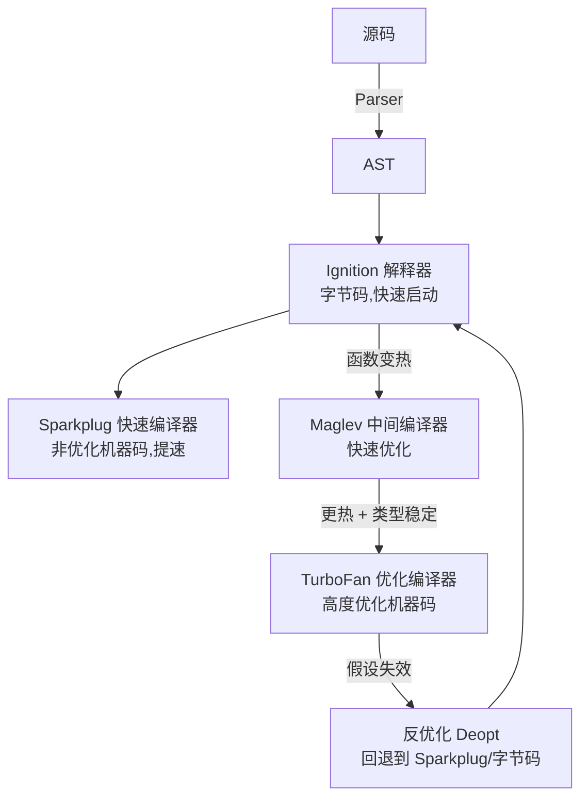
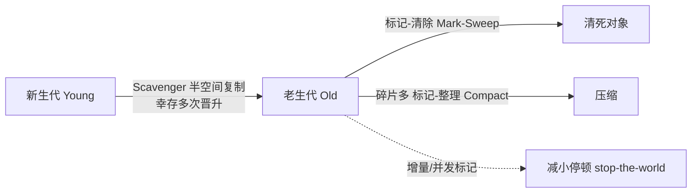

# 2.6 V8 引擎与内存(GC 与泄漏排查)

> 卷:卷二 · 浏览器工作原理
> 阅读时间:35min

---

## 引言:JS 到底怎么跑,内存怎么收

V8 是 Chrome 与 Node 共用的 JS 引擎。深挖要懂**多层编译流水线**与**三色标记 GC**,才能解释性能现象、并在内存蹭蹭涨时知道去哪查。

---

## 一、V8 编译流水线(现代分层,一图)



**为什么分层编译?** 这是"**启动快 vs 长期快**"的权衡:

- 先用**解释器**(Ignition)零等待启动
- 再上**快速编译器**(Sparkplug)把非热点代码也提点速(不追求极致)
- 只有**真热点 + 类型稳定**才上 TurboFan 深度优化
- 假设失效就**反优化**回退,避免"优化错"的代价

> 反优化的根源:**JS 是动态类型**。TurboFan 基于"这个对象的形状稳定"做内联缓存优化,一旦类型变了(反复增删属性),假设失效 → 反优化 → 变慢。所以"对象形状稳定"是 V8 性能的铁律(呼应 [1.1](/卷一-JavaScript语言内核/1.1-语言基础与类型系统))。

**隐藏类(Shape)与内联缓存(IC)的实战:**

V8 给"形状相同"的对象分配**同一个隐藏类(Shape)**,属性访问被编译成"直接内存偏移"(内联缓存),极快;形状一变,就退化成字典模式(慢)。

```js
// ✅ 形状稳定:三个对象共享同一 Shape,访问极快(单态 monomorphic)
function Point(x, y) { this.x = x; this.y = y; }
const p1 = new Point(1, 2);
const p2 = new Point(3, 4);
const p3 = new Point(5, 6);   // 同一 Shape,内联缓存命中

// ❌ 形状不稳定:动态增删属性,Shape 不断变(多态/超多态 polymorphic)
const o = {};
o.a = 1;
o.b = 2;      // Shape 变了
// delete o.a;   // Shape 又变 → 退化成字典模式,慢
```

> 实战启示:**构造函数里一次声明好所有属性**,避免运行时动态增删、保持属性顺序一致——这是 V8 性能的关键习惯。

---

## 二、内存:栈与堆

| 区域 | 存什么 | 特点 |
|------|--------|------|
| 栈 | 原始值、调用帧、引用 | 小而快,自动释放 |
| 堆 | 对象、数组、闭包环境 | 大而慢,GC 管理 |

---

## 三、分代 + 三色标记 GC



### 1. 新生代:Scavenger(半空间复制)

- 新生代分"From-Space / To-Space"两半
- GC 时把**活对象复制到 To**,清空 From,交换两半
- 快,但每轮只处理少量"大多已死"的对象

### 2. 老生代:Mark-Sweep + Mark-Compact

- **三色标记法**:白(未访)/灰(已访未扫子)/黑(已扫完)迭代标记活对象
- 标记完,**清除**白色(死)对象;碎片多了再**整理(compact)**
- **增量/并发标记**:把标记切成小片、穿插执行,或放到后台线程,减小"全停顿"

**为什么分代?** 对象"朝生暮死"是常态(大多数对象很快没用),所以新生代用"快但只处理小区域"的复制法,老生代用"全面但更重"的标记清除。按生命周期分而治之,比一刀切高效。

---

## 四、内存泄漏:识别与排查

**常见泄漏源**:全局变量 / 闭包长持大对象 / 未清理定时器监听器 / 游离 DOM 引用 / Map 无限增长。

**排查(DevTools):**

1. **Performance**:堆曲线"锯齿不回落"= 疑似泄漏
2. **Memory → Heap Snapshot**:前后快照对比 Delta
3. **Allocation instrumentation**:看谁在持续分配

> 三板斧:`定时器/监听器清理了没`、`闭包有没有长持大对象`、`缓存有没有上限`。

---

---

**WebAssembly 与端侧 AI(2026 前沿):**

**WASM(WebAssembly)** 是浏览器里的**二进制指令格式**,接近原生速度,由 JS 引擎(如 V8)直接编译执行:


- **组件模型(Component Model)**:让不同语言的 Wasm 模块**可组合、跨语言互操作**(2026 工业化普及)
- **Wasm 原生并发**:配合 Web Worker/共享内存,做浏览器端重型计算

**端侧 AI 推理(把大模型搬进浏览器):**

- 路线:**WasmEdge + WASI-NN** 在 Wasm 运行时里跑模型推理;或 **WebGPU** 直接 GPU 计算
- 障碍:GPU 算子覆盖不全(GEMM/FlashAttention)、模型格式需转 ONNX/TFLite
- 意义:隐私数据不出设备、毫秒级延迟;但显存/算力受限,适合小模型

> WASM 让浏览器能跑"接近原生"的重计算,端侧 AI 是它的明星场景——但受限于 GPU 算子与模型体积,仍在"小模型 + 特定场景"。

## 五、小结

```
V8:源码→AST→Ignition(字节码)→Sparkplug(快)→Maglev→TurboFan(热) ;类型不稳→反优化
GC:分代——新生代(Scavenger 半空间复制)→老生代(Mark-Sweep/Compact,三色标记,增量并发减停顿)
泄漏三源:全局/闭包/未清理定时器监听器 → Memory 快照对比排查
```

---

## 六、面试题

**Q1:什么是 JIT?V8 为什么不用纯解释或纯编译?**

JIT(Just-In-Time,即时编译)先用解释器**快速启动**,运行时识别**热点**编译成机器码**加速**,假设失效反优化兜底。兼顾"启动快 + 长期快"。

**Q2:什么是"反优化(Deoptimization)"?什么触发?**

TurboFan 基于"对象形状稳定/类型稳定"做优化;一旦假设失效(反复增删属性、类型改变),就**回退到未优化代码**,叫反优化,代价是性能骤降。触发是"对象形状不稳定"。

**Q3:解释三色标记法(GC)**

GC 标记阶段用"白/灰/黑"标记对象:白=未访问,灰=已访问但其子对象未扫,黑=已访问且子对象扫完。从根出发迭代,最终白色对象就是"不可达的死对象",被清除。

**Q4:为什么推荐 WeakMap 做缓存而非 Map?**

`Map` 键强引用,只要 Map 活着键对象就不回收 → 无限增长泄漏;`WeakMap` 键弱引用,键对象无引用即被 GC,缓存自动失效不堆积。

**Q5:泄漏和"内存占用高"是一回事吗?**

不是。占用高可能是合理大数据;泄漏是"本该回收却持续增长不回落"。判断靠观测:堆曲线只涨不落、快照对比对象数量异常增长。

**Q6:如何用 Chrome DevTools 定位一处内存泄漏?**

① Performance 录制,看堆曲线是否"锯齿不回落";② Heap Snapshot 在嫌疑操作前后各拍一次,对比 **Delta** 找异常增长的对象与引用链;③ Allocation instrumentation 定位持续分配的调用栈。

---

📎 参考:V8 官方博客、Chrome DevTools《Memory》、[MDN《内存管理》](https://developer.mozilla.org/zh-CN/docs/Web/JavaScript/Memory_management)、GC 三色标记相关论文

📎 权威延伸阅读:
- 《V8 官方博客》(v8.dev) https://v8.dev/blog
- 《Trash talk: the Orinoco garbage collector》(V8) https://v8.dev/blog/trash-talk
- 《Fix memory problems》(Chrome DevTools) https://developer.chrome.com/docs/devtools/memory-problems/