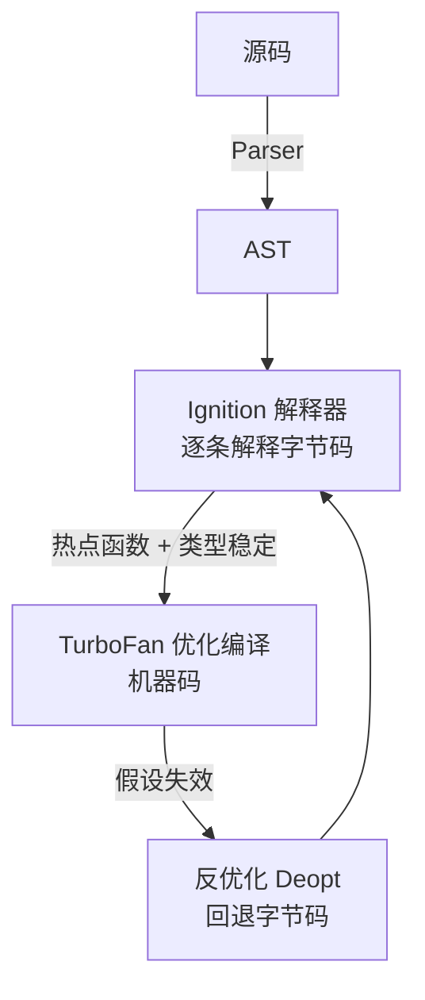

# 2.6 V8 引擎与内存(GC 与泄漏排查)

> 卷:卷二 · 浏览器工作原理
> 难度:⭐⭐⭐ 专家 | 阅读时间:25min | 状态:已深化

---

## 引言:JS 代码到底怎么"跑",内存怎么收

V8 是 Chrome 与 Node 共用的 JS 引擎。搞懂**解释 + JIT** 与**分代 GC**,能解释很多性能现象,也能在内存蹭蹭涨时知道去哪查。

---

## 一、V8 执行流程(一图)



- **不是纯解释、也不是纯编译**:先用解释器快速启动,再对热点代码 JIT 编译加速
- **隐藏类/内联缓存**:对象形状稳定时快;反复增删属性/改类型 → **反优化**变慢

```js
// 坏味道:反复换形状,破坏 V8 优化
const o = {};
o.a = 1;
o.b = 2;   // 形状不断变 → 可能反优化
```

> 工程启示:**初始化时定好字段**,保持对象形状稳定。

---

## 二、内存:栈与堆

| 区域 | 存什么 | 特点 |
|------|--------|------|
| 栈 | 原始值、调用帧、引用 | 小而快,自动释放 |
| 堆 | 对象、数组、闭包环境 | 大而慢,GC 管理 |

---

## 三、分代垃圾回收(一图)


- **新生代**:Scavenger 半空间复制,快
- **老生代**:Mark-Sweep 清死对象,Mark-Compact 整理碎片;增量/并发标记减小停顿

**为什么分代?** 大多数对象"朝生暮死",少数长命。新生代用"快但只处理活跃小对象"的复制法,老生代用"全面但更重"的标记清除——按对象生命周期**分而治之**,比一刀切更高效。

---

## 四、内存泄漏:识别与排查

**常见泄漏源:** 全局变量 / 闭包长持大对象 / 未清理定时器监听器 / 游离 DOM 引用 / Map 无限增长。

**排查(DevTools):**

1. **Performance**:堆曲线"锯齿不回落"= 疑似泄漏
2. **Memory → Heap Snapshot**:前后快照对比 Delta,看对象数量异常增长
3. **Allocation instrumentation**:看谁在持续分配

> 三板斧:`setInterval/监听器清理了没`、`闭包有没有长持大对象`、`缓存有没有上限`。

---

## 五、小结

```
V8:源码→AST→字节码(Ignition)→热点 JIT(TurboFan)→机器码;形状不稳定→反优化
GC:分代——新生代(Scavenger 复制)、老生代(Mark-Sweep/Compact,增量并发减小停顿)
泄漏三源:全局/闭包/未清理定时器监听器 → Memory 快照对比排查
```

---

## 六、面试题

**Q1:什么是 JIT?V8 为什么不用纯解释或纯编译?**

JIT:先用解释器**快速启动**(低延迟),运行时识别**热点**编译成机器码**加速**(高吞吐);假设失效则反优化兜底。兼顾"启动快 + 长期快"。

**Q2:为什么推荐 WeakMap 做缓存而非 Map?**

`Map` 键是强引用,只要 Map 活着键对象就不回收 → 无限增长泄漏;`WeakMap` 键是弱引用,键对象无其他引用即被 GC,缓存自动失效不堆积。

**Q3:泄漏和"内存占用高"是一回事吗?**

不是。占用高可能是合理大数据;泄漏是"本该回收却持续增长不回落"。判断靠观测:堆曲线只涨不落、快照对比对象数量异常增长。

---

📎 参考:V8 官方博客、Chrome DevTools《Memory》、MDN《内存管理》