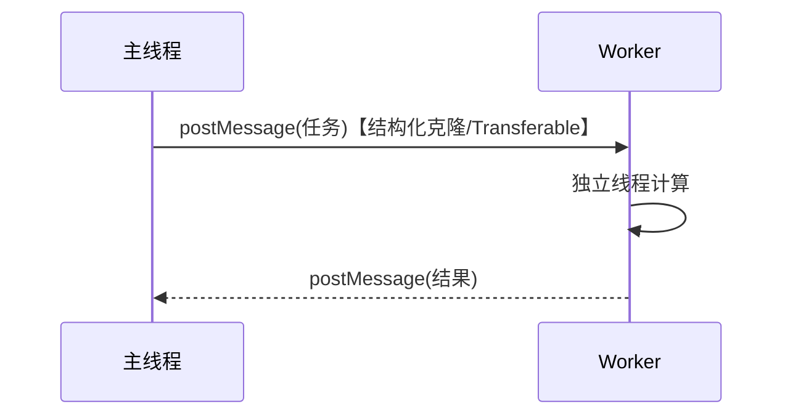

# 2.7 Web Worker 与并发

> 卷:卷二 · 浏览器工作原理
> 难度:⭐⭐ 进阶 | 阅读时间:20min | 状态:深度增强

---

## 引言:主线程被算死了,怎么办

JS 单线程,一个长循环就能让页面假死。Web Worker 让"重计算"跑独立线程。深挖要懂**结构化克隆算法**与 **SharedArrayBuffer/Atomics** 这两条"通信 vs 共享"的路径。

---

## 一、三类 Worker(一图)

| 类型 | 生命周期 | 共享范围 | 用途 |
|------|---------|---------|------|
| Web Worker(专用) | 跟随页面 | 单页面 | 大计算 |
| Shared Worker | 独立 | 同源多标签 | 多页共享状态 |
| Service Worker | 独立可离线常驻 | 拦截网络 | PWA、离线缓存 |

---

## 二、通信:postMessage + 结构化克隆



```js
const worker = new Worker("worker.js");
worker.postMessage({ type: "calc", n: 1e8 });
worker.onmessage = (e) => console.log("结果:", e.data);
worker.terminate();

// worker.js
self.onmessage = (e) => {
  let sum = 0;
  for (let i = 0; i < e.data.n; i++) sum += i;
  self.postMessage(sum);
};
```

### 结构化克隆算法(能克隆什么)

> 同一算法也用于 `structuredClone()`(见 1.1):支持循环引用、保留 Date/Map/Set/ArrayBuffer 等类型。

- ✅ 能:基本类型、Array/Object、Date、RegExp、Map/Set、ArrayBuffer、TypedArray、Blob
- ❌ 不能:函数、DOM 节点、`Error` 对象、Symbol(部分)

| 方式 | 语义 | 成本 |
|------|------|------|
| 结构化克隆(默认) | 深拷贝 | 大数据有开销 |
| Transferable | 转移所有权 | 零拷贝,传后原侧清空 |

```js
// Transferable:把 ArrayBuffer 的所有权转移(零拷贝)
const buf = new ArrayBuffer(1024);
worker.postMessage(buf, [buf]);   // 传后主线程这边 buf 已"被移走"
```

**为什么默认要结构化克隆?** Worker 与主线程**不共享内存**,各自独立。克隆做深拷贝,保证隔离、无竞争;跨线程拿到的是副本而非同一对象。

---

## 三、真正的共享:SharedArrayBuffer + Atomics(进阶)

想要"多线程共享一块内存"(接近传统多线程),用 **SharedArrayBuffer**:

```js
// 主线程创建共享缓冲区
const sab = new SharedArrayBuffer(1024);
const arr = new Int32Array(sab);
worker.postMessage(sab);          // 共享,非复制

// Atomics 提供原子操作(防止竞争)
Atomics.add(arr, 0, 1);           // 原子地 +1
Atomics.wait(arr, 0, 0);          // 等待(配合 Atomics.notify)
```

> 代价:**需要跨域隔离(COOP/COEP 头)**才允许用 SharedArrayBuffer(防 Spectre)。所以日常更多用"克隆/Transferable",真正共享内存是更高级、更需要小心(数据竞争)的方案。

---

## 四、Worker 的边界与适用

- ❌ 不能访问 `document`/`window`/DOM;不能直接用 `localStorage`
- ✅ 能:`fetch`、`FileReader`、定时器、ES Module

| 适合 | 不适合 |
|------|--------|
| 大计算(排序/加密/统计) | 简单逻辑(通信开销反更慢) |
| 大文件分片、编解码 | 频繁小任务 |
| 埋点、耗时正则 | 需 DOM 的操作 |

---

## 五、小结

```
Worker = 独立线程,治"主线程重计算卡顿"
三类:专用(计算)/ Shared(多页)/ Service(网络代理·PWA)
通信:postMessage+结构化克隆(深拷贝);Transferable 零拷贝
进阶:SharedArrayBuffer + Atomics 真共享(需 COOP/COEP 隔离)
边界:无 DOM;适合重计算,不适合轻任务
```

---

## 六、面试题

**Q1:Web Worker 和 Service Worker 的区别?**

Web Worker 为当前页面提供**并行计算**(页关即结束);Service Worker 是**网络层代理**,独立常驻、可离线拦截请求做缓存(PWA 基石)。都是独立线程,不能访问 DOM。

**Q2:postMessage 传大对象为什么慢?怎么优化?**

默认结构化克隆深拷贝,大对象成本高。优化:① 只传必要字段;② 用 `Transferable`(ArrayBuffer 转移所有权)零拷贝;③ 小任务合并,别频繁通信。

**Q3:结构克隆能传函数或 DOM 吗?为什么?**

不能。结构化克隆算法**不支持函数和 DOM 节点**——因为它们是"代码/宿主对象",跨线程无法安全地复制(函数有闭包作用域,DOM 有全局唯一性)。这也是 Worker 的边界之一。

**Q4:Worker 里能操作 DOM 吗?要更新界面怎么办?**

不能。Worker 无 `document`/`window`。要更新界面,只能在 Worker 里算完,**postMessage 把结果发回主线程**,由主线程渲染。

**Q5:SharedArrayBuffer 相比 postMessage 的优势和使用前提?**

优势:**真共享内存**,多线程读同一块数据、用 Atomics 做原子操作,省去复制开销、能做更底层并发。前提:需服务端配 **COOP/COEP 跨域隔离头**(防 Spectre 攻击),否则浏览器禁用。

**Q6:什么时候不该用 Web Worker?**

任务**很轻/很频繁**时:每次 postMessage 有"克隆 + 通信"开销,可能比直接在主线程算还慢。原则:计算重、交互弱才上 Worker;先测再上。

---

📎 参考:MDN《Web Workers API》《结构化克隆算法》《SharedArrayBuffer》