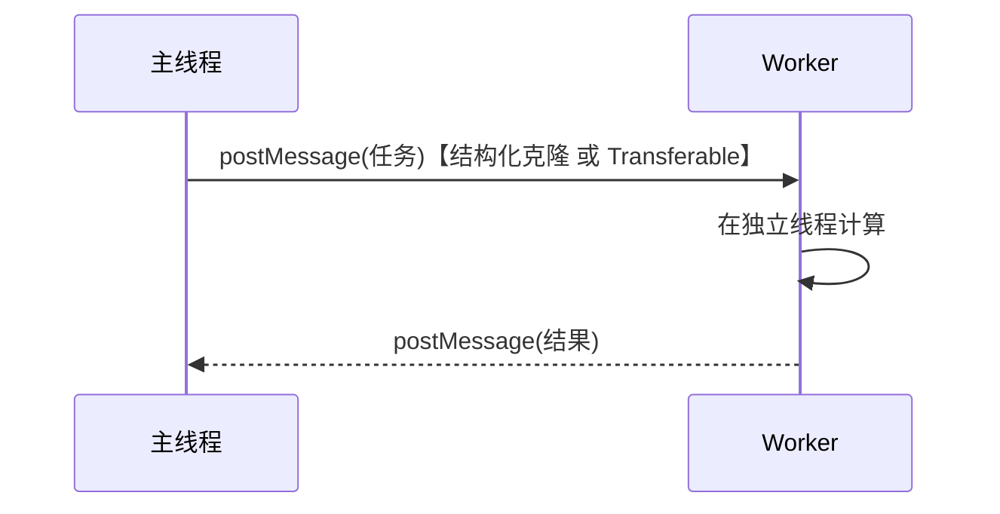

# 2.7 Web Worker 与并发

> 卷:卷二 · 浏览器工作原理
> 难度:⭐⭐ 进阶 | 阅读时间:20min | 状态:已深化

---

## 引言:主线程被算死了,怎么办

JS 单线程,一个长循环就能让页面假死。Web Worker 让"重计算"跑到独立线程,把主线程留给交互与渲染。

---

## 一、三类 Worker 对比

| 类型 | 生命周期 | 共享范围 | 典型用途 |
|------|---------|---------|---------|
| Web Worker(专用) | 跟随页面,页关它没 | 单页面 | 大计算 |
| Shared Worker | 独立 | 同源多标签 | 多页共享状态 |
| Service Worker | 独立,可离线常驻 | 拦截网络 | PWA、离线缓存、推送 |

> 三分钟记忆:专用 = 单页重计算;Shared = 多页共享;Service = 网络代理/离线。

---

## 二、通信:postMessage + 结构化克隆(一图)



```js
// main.js
const worker = new Worker("worker.js");
worker.postMessage({ type: "calc", n: 1e8 });
worker.onmessage = (e) => console.log("结果:", e.data);
worker.terminate();

// worker.js
self.onmessage = (e) => {
  const { n } = e.data;
  let sum = 0;
  for (let i = 0; i < n; i++) sum += i;
  self.postMessage(sum);
};
```

**为什么默认要"结构化克隆"而非共享内存?** Worker 与主线程**不共享内存**,各自独立。结构化克隆做**深拷贝**,保证数据隔离、无竞争;跨线程拿到的是副本而非同一对象。需要零拷贝时用 **Transferable**(ArrayBuffer 转移所有权)。

| 方式 | 语义 | 成本 |
|------|------|------|
| 结构化克隆(默认) | 深拷贝 | 大数据有开销 |
| Transferable | 转移所有权 | 零拷贝,传后原侧清空 |

---

## 三、Worker 的边界

- ❌ 不能访问 `document`/`window`/DOM
- ❌ 不能直接用 `localStorage`(可用 IndexedDB 或 postMessage 回主线程)
- ✅ 能:`fetch`、`FileReader`、定时器、ES Module

> Worker 是"**没有界面的 JS 环境**",能算能联网,不能碰页面。

---

## 四、适用场景

| 适合 | 不适合 |
|------|--------|
| 大计算(排序/加密/统计) | 简单逻辑(通信开销反更慢) |
| 大文件分片、编解码 | 频繁小任务 |
| 埋点上报、耗时正则 | 需 DOM 的操作 |

> 原则:**计算重、交互弱**才上 Worker;轻任务硬上反被"克隆+通信"拖慢。

---

## 五、小结

```
Worker = 独立线程,治"主线程重计算卡顿"
三类:专用(计算)/ Shared(多页)/ Service(网络代理·PWA)
通信:postMessage+结构化克隆(深拷贝);Transferable 零拷贝
边界:无 DOM/无 window;适合重计算,不适合轻任务
```

---

## 六、面试题

**Q1:Web Worker 和 Service Worker 的区别?**

Web Worker 为当前页面提供**并行计算**(页面关了即结束);Service Worker 是**网络层代理**,独立常驻、可离线拦截请求做缓存(PWA 基石)。两者都是独立线程,不能访问 DOM。

**Q2:postMessage 传大对象为什么慢?怎么优化?**

默认结构化克隆深拷贝,大对象成本高。优化:① 只传必要字段;② 用 `Transferable`(ArrayBuffer 转移所有权)零拷贝;③ 小任务合并,别频繁通信。

**Q3:Worker 里能不能操作 DOM?为什么?**

不能。Worker 是独立线程,没有 `document`/`window`,无法访问页面 DOM。这是"无界面 JS 环境"的定位——要更新界面,只能 `postMessage` 把结果发回主线程由主线程渲染。

---

📎 参考:MDN《Web Workers API》《使用 Transferable 对象》