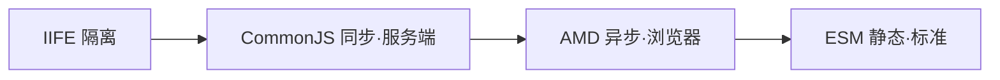

# 5.1 模块化演进(IIFE → CJS → AMD → ESM)

> 卷:卷五 · 构建与工程化
> 阅读时间:25min

---

## 引言:模块化是"工程化"的起点

没有模块化,所有 JS 挤全局作用域、变量互污染、依赖靠手动排。模块化演进史 = "**如何组织代码、隔离作用域、描述依赖**"的解题史。深挖要懂 **ESM 活引用** 与 **循环依赖**。

**四个缩写先记全称:**

- **IIFE** = Immediately Invoked Function Expression,立即执行函数
- **CJS / CommonJS** = 服务端模块规范(`require`/`module.exports`)
- **AMD** = Asynchronous Module Definition,异步模块定义(浏览器)
- **ESM / ES Module** = ECMAScript 官方模块标准(静态、可树摇)

---

## 一、四种方案演进



| 方案 | 场景 | 语法 | 特点 |
|------|------|------|------|
| IIFE | 早期浏览器 | `(function(){})()` | 隔离,依赖靠全局 |
| CommonJS | Node | `require`/`exports` | 同步,运行时 |
| AMD | 浏览器 | `define(['dep'], fn)` | 异步 |
| ESM | 现代标准 | `import`/`export` | 静态、可树摇 |

---

## 二、CommonJS vs ESM(核心对比)

| | CommonJS | ESM |
|---|----------|-----|
| 加载 | 同步、运行时 | 异步、编译期解析 |
| 导出 | **值的拷贝** | **活引用(live binding)** |
| 树摇 | ❌ 难(动态) | ✅ 易(静态) |
| `this` | `module.exports` | `undefined` |

### 活引用 vs 值拷贝

```js
// CJS:导出的是拷贝
let count = 0;
module.exports = { count, inc: () => count++ };
// main.js
const { count, inc } = require("./c");
inc(); console.log(count); // 0 ← 拷贝,不变

// ESM:导出的是活引用
export let count = 0; export const inc = () => count++;
import { count, inc } from "./c.js";
inc(); console.log(count); // 1 ← 活引用,读到最新值
```

**为什么 ESM 要"活引用"?** 静态结构 + 活引用,让打包器能在**编译期**精确分析"谁用了谁、值如何流转",从而**树摇 + 预计算**。这是 ESM 成为构建标准的原因。

---

## 三、循环依赖(深层陷阱)

```js
// a.js
import { b } from "./b.js";
export const a = "a";
console.log(b);           // undefined!b 还没初始化完

// b.js
import { a } from "./a.js";
export const b = "b";
```

> ESM 循环依赖:模块按图**先执行**,`b` 引用 `a` 时 `a` 还没执行到 export → 拿到 `undefined`。CJS 循环依赖更微妙(`require` 返回"执行到一半"的 `exports`)。**工程上尽量避免循环依赖**(可用依赖注入/抽公共模块打破)。

---

## 四、小结

```
演进:IIFE→CJS(同步服务端)→AMD(异步浏览器)→ESM(静态标准)
核心差异:CJS 值拷贝 / ESM 活引用;ESM 静态可树摇
陷阱:循环依赖(ESM 拿 undefined,CJS 拿半成品)→ 避免
```

---

## 五、面试题

**Q1:为什么 ESM 能 tree-shaking,而 CommonJS 很难?**

ESM 的 `import/export` **静态**(编译期确定),打包器能分析"谁没用"安全删;CJS 的 `require` **运行时动态**(可写进 if/循环/变量),无法静态确定,难无损摇树。

**Q2:`require` 和 `import` 能混用吗?**

能在打包器下互操作,但有坑:ESM import CJS 时 `module.exports` 变 default;CJS require ESM 要异步 `import()`。建议统一用 ESM。

**Q3:什么是"活引用(live binding)"?举一个差异例子?**

ESM 导出的是**变量本身的可变绑定**,导入方看到的是最新值;CJS 导出的是**值的快照拷贝**。例:计数器 `count++` 后,ESM 里 `count` 是 1,CJS 里仍是 0。

**Q4:ESM 循环依赖为什么拿到 undefined?**

ESM 按模块图**先执行**,`a` 引 `b`、`b` 又引 `a` 时,若 `a` 还没执行到 export 就被 `b` 引用,拿到的是**未初始化的绑定**(undefined/TDZ)。这是循环依赖的经典坑。

**Q5:为什么浏览器原生支持 ESM 了,工程上还要打包?**

① 兼容性(老浏览器要转译);② **请求数**(一个模块一个请求,上千模块打包成一个省请求);③ 能力扩展(TS/JSX、CSS、图片、分包优化)。

**Q6:IIFE 解决什么问题?它的局限?**

IIFE(`(function(){})()`)用函数作用域**隔离变量**,避免全局污染。局限:只是"隔离",不是"模块"——没有依赖声明,依赖仍靠全局变量传递,难以管理复杂依赖关系。

---

📎 参考:[MDN《JavaScript 模块》](https://developer.mozilla.org/zh-CN/docs/Web/JavaScript/Guide/Modules)、Node.js《Modules》、ESM 规范