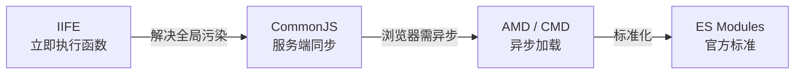

# 5.1 模块化演进(IIFE → CJS → AMD → ESM)

> 卷:卷五 · 构建与工程化
> 难度:⭐⭐ 进阶 | 阅读时间:20min | 状态:进行中

---

## 引言:模块化是"工程化"的起点

没有模块化之前,所有 JS 挤在全局作用域,变量互相污染、依赖顺序全靠手动排、一个文件几万行。模块化的演进史,就是"**如何组织代码、隔离作用域、描述依赖**"的解题史。

---

## 一、四种方案的演进



| 方案 | 时代/场景 | 核心语法 | 特点 |
|------|----------|---------|------|
| IIFE | 早期浏览器 | `(function(){...})()` | 作用域隔离,但依赖靠全局变量 |
| CommonJS | Node | `require` / `module.exports` | **同步**加载,适合服务端 |
| AMD | 浏览器 | `define(['dep'], fn)` | **异步**加载(require.js) |
| ESM | 现代标准 | `import` / `export` | **静态**、可树摇、官方标准 |

---

## 二、CommonJS(服务端之选)

```js
// math.js
const add = (a, b) => a + b;
module.exports = { add };

// main.js
const { add } = require("./math");
console.log(add(1, 2));
```

**特点与问题:**

- **同步加载**:`require` 返回前会读完整个模块(磁盘读取快,服务端 OK)
- **运行时加载**:导出的是**值的拷贝**
- ⚠️ 浏览器直接跑不了(同步会卡住页面),需要打包器转译

---

## 三、ES Modules(现代标准)

```js
// math.js
export const add = (a, b) => a + b;
export default function sum(...ns) { return ns.reduce((s, n) => s + n, 0); }

// main.js
import sum, { add } from "./math.js";
```

**ESM 的三个杀手锏:**

1. **静态结构**:`import/export` 在编译期就能确定依赖关系
2. **可树摇(tree-shaking)**:静态分析 → 没被用到的导出可直接删掉(这是 Rollup/webpack 优化的根基)
3. **导出的是"活引用"**:值变了,导入方看到的也是最新值

---

## 四、ESM vs CommonJS 核心对比(面试必考)

| | CommonJS | ESM |
|---|----------|-----|
| 加载时机 | 同步、运行时 | 异步、编译期解析(可静态分析) |
| 导出 | **值的拷贝** | **活引用(live binding)** |
| 语法 | `require`/`module.exports` | `import`/`export` |
| 树摇 | ❌ 难(动态) | ✅ 易(静态) |
| `this` | 指向 `module.exports` | `undefined` |

**"值拷贝 vs 活引用" 案例:**

```js
// counter.js (CJS)
let count = 0;
module.exports = { count, inc: () => count++ };

// main.js
const { count, inc } = require("./counter");
inc();
console.log(count); // 0  ← CJS 拷贝,snapshot 不变

// ESM 版
import { count, inc } from "./counter.js";
inc();
console.log(count); // 1  ← ESM 活引用,读到最新值
```

---

## 五、浏览器里的 ESM 与打包器

现代浏览器已原生支持 ESM,但工程上仍需打包器,原因:

1. **兼容性**:老浏览器不支持,需转译
2. **网络请求数**:一个模块一个请求,成千上万模块打成一个文件省请求
3. **能力扩展**:预编译(TS/JSX)、CSS、图片、按需分包、优化

> 所以"打包"的本质(呼应 webpack):把开发者喜欢的"多文件、语义化、模块化"代码,变成运行时喜欢的"少量文件、兼容、无冗余"产物。

---

## 六、小结

```
模块化演进:IIFE(隔离)→ CJS(同步,服务端)→ AMD(异步,浏览器)→ ESM(标准,静态)

ESM 三大优势:静态结构(可分析)/ 可树摇 / 活引用
关键对比:CJS 导出值拷贝,ESM 导出活引用 → 这是树摇与框架构建的基础
```

---

## 七、面试题

**Q1:为什么 ESM 能 tree-shaking,而 CommonJS 很难?**

ESM 的 `import/export` 是**静态**的(编译期可确定),打包器能分析"谁没被用到"并安全删除。CJS 的 `require` 是**运行时动态**的(可写进 if、循环、变量),无法静态确定依赖,所以难无损摇树。

**Q2:`require` 和 `import` 能混用吗?**

能在打包器(N 转译)下互操作,但有坑:ESM 里 `import` CJS 模块时,`module.exports` 会被当成 `default`;CJS 里 `require` ESM 则要异步(`import()`)。工程上建议**统一用 ESM**,避免混用边界问题。

---

📎 参考:MDN《JavaScript 模块》、Node.js 官方文档《Modules》、ESM 规范