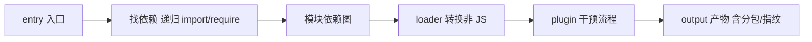

# 5.3 webpack 深入(核心能力 + 优化)

> 卷:卷五 · 构建与工程化
> 阅读时间:30min

---

## 引言:webpack 到底在做什么

一句话:**把"人喜欢的代码"(模块化/预编译/语义化)转成"机器喜欢的代码"(少量文件/兼容/无注释/短变量)**。深挖要懂 **loader/plugin 的机制区别** 与 **tapable 事件体系**。

---

## 一、核心工作流(一图)



| 概念 | 作用 |
|------|------|
| entry | 打包入口 |
| output | 产物输出(`contenthash`) |
| loader | 转换非 JS(翻译官) |
| plugin | 能力扩展(外挂) |

---

## 二、loader vs plugin(底层区别)

> **loader 是"翻译官"**:处理**单个文件**(把 JSX/CSS/图片转成 webpack 能处理的模块),链式从右往左执行。
> **plugin 是"增强外挂"**:介入**整个打包生命周期**(生成 HTML、压缩、提取 CSS),基于 **tapable** 事件钩子。

```js
module.exports = {
  module: { rules: [{ test: /\.css$/, use: ["style-loader", "css-loader"] }] },  // loader 从右往左
  plugins: [new HtmlWebpackPlugin()],   // plugin
};
```

**底层:tapable 事件体系** —— webpack 的插件机制建立在 tapable(发布-订阅/钩子)上,plugin 在 `compiler`(整个构建)/`compilation`(单次构建)的钩子上注册回调,参与各阶段。

---

## 三、核心能力:压缩 / 指纹 / 开发服务器

1. **打包压缩**:删空格注释、变量单字符化、混淆 → 减体积
2. **文件指纹(contenthash)**:内容不变指纹不变 → 命中缓存;内容变 → 新名 → 拿新文件(解决缓存更新)
3. **开发服务器(serve)**:内存打包 + Livereload/HMR,即时反馈

---

## 四、分包与 Tree Shaking

```js
optimization: {
  splitChunks: { chunks: 'all', cacheGroups: { vendor: { test: /node_modules/, name: 'vendors' } } },
}
// 动态导入:路由级分包
const Home = () => import('./Home.vue');
```

**Tree Shaking 前提**:ESM 静态结构 + `production` + `sideEffects: false`(见 5.1/5.5)。

---

## 五、优化:构建效率(补齐原稿缺失)

| 方向 | 手段 |
|------|------|
| 提速 | `cache`(持久化缓存)、`thread-loader`/并行、`resolve.extensions` 精简、`externals`+CDN、loader `include/exclude` |
| 减积 | `splitChunks`、tree shaking、`MiniCssExtract`、图片压缩/懒加载 |

> 口诀:**先测量(`--profile`/speed-measure)再优化;先提速再减积**。

---

## 六、webpack vs Vite(定位)

webpack "**全量打包再启动**"元老,生态最全;Vite "**不打包(开发)+ 预构建**",体验碾压、成新项目默认(5.4)。

---

## 七、小结

```
webpack = 入口→依赖图→loader 转换→plugin 加工→输出(指纹/分包)
loader 处理单文件(链式右→左);plugin 介入全流程(tapable 钩子)
能力:压缩 / contenthash / serve(内存+Livereload/HMR)/ 分包+树摇
优化:先测再优化;提速(缓存/并行/externals)+减积(splitChunks/树摇)
```

---

## 八、面试题

**Q1:loader 和 plugin 的区别?**

loader **翻译官**,处理**单个文件**(JSX/CSS 转模块),链式从右往左;plugin **外挂**,介入**整个生命周期**(生成 HTML/压缩/提取 CSS),基于 tapable 钩子。

**Q2:什么是 Tree Shaking?实现前提?**

编译期**删掉未使用导出**。前提:① **ESM** 静态结构;② `production`;③ `sideEffects: false`。

**Q3:如何做长缓存的最优产物策略?**

`contenthash` 指纹 + `splitChunks` 分离稳定依赖(vendor)+ `runtimeChunk` 抽 runtime。业务改一行只有业务 chunk 变,依赖 chunk 仍命中缓存。

**Q4:webpack 的 `contenthash` 解决什么问题?**

内容不变 hash 不变 → 命中强缓存;内容变 hash 变 → 新文件名 → 浏览器拿新文件。解决"旧文件被缓存、用户看不到更新"的老大难(呼应 4.3)。

**Q5:`sideEffects: false` 对 Tree Shaking 的作用?**

默认 webpack 不敢删"看似没被 import 的模块",因为可能有**副作用**(如 `import './polyfill'`)。标记 `sideEffects: false` 明确"可安全删",树摇才敢大胆移除。

**Q6:为什么 webpack 开发要"内存打包",不落盘?**

`serve` 在**内存里**打包(不写磁盘),省去磁盘 IO,构建/更新更快;配合 Livereload/HMR,改动即时可见。生产 `build` 才落盘产出静态文件。

---

📎 参考:webpack 官方文档《Concepts》《Guides》、tapable、speed-measure-webpack-plugin