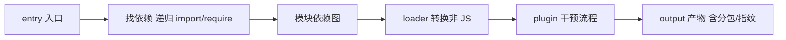

# 5.3 webpack 深入(核心能力 + 优化)

## 引言:webpack 到底在做什么

**把"人喜欢的代码"(模块化/预编译/语义化)转成"机器喜欢的代码"(少量文件/兼容/无注释/短变量)**。深挖要懂 **loader/plugin 的机制区别**、**tapable 事件体系**,以及 **module/chunk/bundle 三个概念**。

---

## 一、核心工作流与三个概念



| 概念 | 作用 |
|------|------|
| entry | 打包入口 |
| output | 产物输出(`contenthash`) |
| loader | 转换非 JS(翻译官) |
| plugin | 能力扩展(外挂) |

**module / chunk / bundle 三者区分(易混):**

| 概念 | 含义 |
|------|------|
| **module** | 一个个源文件(模块) |
| **chunk** | 打包过程的分组(按 entry/动态 import/分包规则划分) |
| **bundle** | 最终输出的产物文件(一个 chunk 对应一个 bundle) |

> 一个 `entry` 产生一个 chunk;`import()` 动态导入也各产生一个 chunk;`splitChunks` 再拆出公共 chunk。**module 是被处理的原料,chunk 是中间分组,bundle 是最终文件**。

---

## 二、loader vs plugin(底层区别)

> **loader 是"翻译官"**:处理**单个文件**(把 JSX/CSS/图片转成 webpack 能处理的模块),链式从右往左执行。
> **plugin 是"增强外挂"**:介入**整个打包生命周期**(生成 HTML、压缩、提取 CSS),基于 **tapable** 事件钩子。

```js
module.exports = {
  module: { rules: [{ test: /\.css$/, use: ["style-loader", "css-loader"] }] },  // loader 从右往左
  plugins: [new HtmlWebpackPlugin()],   // plugin
};
```

### 手写一个 loader

loader 本质是**接收源码、返回新源码的函数**:

```js
// 一个把代码里的 TODO 注释去掉的 loader
module.exports = function (source) {
  return source.replace(/\/\/\s*TODO.*$/gm, "");
};
// 用法:rules: [{ test: /\.js$/, use: "todo-loader" }]
```

### 手写一个 plugin

plugin 是**在 tapable 钩子上注册回调的类**:

```js
// 打包结束打印一句的 plugin
class MyPlugin {
  apply(compiler) {
    compiler.hooks.done.tap("MyPlugin", (stats) => {
      console.log("打包完成!");
    });
  }
}
```

**底层:tapable 事件体系** —— webpack 插件机制建立在 tapable(发布-订阅/钩子)上。`compiler` 代表**整个构建**(全程钩子),`compilation` 代表**单次构建**(本次钩子)。plugin 在这些钩子上 `tap` 注册回调,参与各阶段。

---

## 三、核心能力:压缩 / 指纹 / 开发服务器

### 3.1 打包压缩

删空格注释、变量单字符化、混淆 → 减体积。

### 3.2 文件指纹:三种 hash 区别(易混)

| 指纹 | 作用域 | 变谁谁变 |
|------|--------|---------|
| `hash` | 整个构建 | 任一文件变,所有文件名都变(缓存全失效) |
| `chunkhash` | 单个 chunk | 该 chunk 内容变才变 |
| `contenthash` | 文件内容 | 内容不变则不变(最细粒度) |

```js
output: { filename: "js/[name].[contenthash:8].js" }
```

> 实践:**JS 用 `contenthash`,CSS 用 `contenthash`,图片用 `hash`**。`contenthash` 让"内容不变、指纹不变" → 命中强缓存;内容变 → 新名 → 拿新文件(解决缓存更新,呼应 [4.3](/卷四-网络与通信/4.3-HTTP缓存与协商))。

### 3.3 开发服务器 + HMR

**HMR(Hot Module Replacement)原理:** 比"整体刷新"更进一步,**只替换改动的模块,状态不丢**:

1. **WebSocket 长连接**:dev server 与浏览器保持连接,文件变化**主动推送**
2. **模块热替换**:浏览器收到通知,HMR runtime **只替换受影响模块**
3. **状态保留**:配合框架 API(Vue 的 `import.meta.hot.accept`)替换时**保留组件状态**

> 对比:Livereload = 整页刷新(丢状态);HMR = 模块级替换(留状态)。HMR 是"外科手术",Livereload 是"重启"。

---

## 四、分包与 Tree Shaking

```js
optimization: {
  splitChunks: { chunks: "all", cacheGroups: { vendor: { test: /node_modules/, name: "vendors" } } },
  runtimeChunk: "single",   // 抽 runtime 到单独 chunk,利于长缓存
}
// 动态导入:路由级分包
const Home = () => import("./Home.vue");
```

**Tree Shaking 前提**:ESM 静态结构 + `production` + `sideEffects: false`(见 [5.1](/卷五-构建与工程化/5.1-模块化演进)/5.5)。

---

## 五、优化:构建效率

| 方向 | 手段 |
|------|------|
| 提速 | `cache`(持久化缓存)、`thread-loader`/并行、`resolve.extensions` 精简、`externals`+CDN、loader `include/exclude` |
| 减积 | `splitChunks`、tree shaking、`MiniCssExtract`、图片压缩/懒加载 |

```js
resolve: {
  extensions: [".js", ".ts"],        // 精简:少了会漏,多了拖慢解析
  alias: { "@": path.resolve("src") },
},
module: {
  rules: [{ test: /\.js$/, use: "babel-loader", include: path.resolve("src") }],  // include 缩小范围
},
cache: { type: "filesystem" },        // 持久化缓存,二次构建大提速
```

> **先测量(`--profile`/speed-measure-webpack-plugin)再优化;先提速再减积**。

---

## 六、webpack vs Vite(定位)

webpack "**全量打包再启动**"元老,生态最全;Vite "**不打包(开发)+ 预构建**",体验碾压、成新项目默认(5.4)。

---

## 七、小结

```
webpack = 入口 → 依赖图 → loader 转换 → plugin 加工 → 输出(指纹/分包)
module(源文件)/ chunk(分组)/ bundle(产物);loader 处理单文件(右→左);plugin 介入全流程(tapable)
指纹:hash(全局)/ chunkhash(chunk)/ contenthash(内容,最细)
能力:压缩 / contenthash / serve(内存+HMR)/ 分包+树摇
优化:先测再优化;提速(缓存/并行/externals/include)+减积(splitChunks/树摇)
```

---

## 八、面试题

**Q1:loader 和 plugin 的区别?**

loader **翻译官**,处理**单个文件**(JSX/CSS 转模块),链式从右往左;plugin **外挂**,介入**整个生命周期**(生成 HTML/压缩/提取 CSS),基于 tapable 钩子。

**Q2:什么是 Tree Shaking?实现前提?**

编译期**删掉未使用导出**。前提:① **ESM** 静态结构;② `production`;③ `sideEffects: false`。

**Q3:如何做长缓存的最优产物策略?**

`contenthash` 指纹 + `splitChunks` 分离稳定依赖(vendor)+ `runtimeChunk` 抽 runtime。业务改一行只有业务 chunk 变,依赖 chunk 仍命中缓存。

**Q4:`contenthash` 和 `chunkhash`、`hash` 的区别?**

`hash` 整个构建共用,任一文件变全失效;`chunkhash` 按 chunk,该 chunk 变才变;`contenthash` 按**文件内容**,内容不变则不变。缓存粒度:hash < chunkhash < contenthash。

**Q5:`sideEffects: false` 对 Tree Shaking 的作用?**

默认 webpack 不敢删"看似没被 import 的模块",因为可能有**副作用**(如 `import './polyfill'`)。标记 `sideEffects: false` 明确"可安全删",树摇才敢大胆移除。

**Q6:为什么 webpack 开发要"内存打包",不落盘?**

`serve` 在**内存里**打包(不写磁盘),省去磁盘 IO,构建/更新更快;配合 Livereload/HMR,改动即时可见。生产 `build` 才落盘产出静态文件。

**Q7:module、chunk、bundle 三者是什么关系?**

`module` 是源文件;`chunk` 是打包分组(按 entry/动态 import/分包规则);`bundle` 是最终产物文件(一个 chunk 一个 bundle)。module 是原料,chunk 是分组,bundle 是成品。

**Q8:写一个 webpack plugin 需要实现什么?基于什么机制?**

实现一个含 `apply(compiler)` 方法的类,在 `compiler`/`compilation` 的 **tapable 钩子**上用 `hooks.xxx.tap()` 注册回调。webpack 在各阶段触发钩子时调用你的逻辑。

**Q9:HMR 和 Livereload 的区别?**

Livereload **整页刷新**(丢状态);HMR **模块级热替换**(只换改动模块,保留组件状态),靠 WebSocket 推送 + HMR runtime 局部替换。HMR 体验更好。

**Q10:loader 的链式执行顺序是怎样的?为什么?**

**从右往左**(从下往上)执行,`use: ["style-loader", "css-loader"]` 先跑 `css-loader`(解析 CSS),再跑 `style-loader`(注入 style 标签)。本质是**组合函数**:右边 loader 的输出是左边 loader 的输入。

---

📎 参考:[webpack 官方文档](https://webpack.js.org/)、[tapable](https://github.com/webpack/tapable)、[speed-measure-webpack-plugin](https://github.com/stephencookdev/speed-measure-webpack-plugin)
