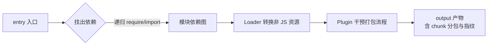

# 5.3 webpack 深入(核心能力 + 优化)

> 卷:卷五 · 构建与工程化
> 难度:⭐⭐⭐ 专家 | 阅读时间:30min | 状态:进行中

---

## 引言:webpack 到底在做什么

一句话:**把"人喜欢的代码"(模块化/预编译/语义化/注释)转换成"机器喜欢的代码"(少量文件/兼容/资源集中/无注释/短变量)**。这个转换过程就是"打包"。本章把它拆成核心能力,并补齐你之前没写完的「优化」部分。

---

## 一、核心工作流



**四大核心概念:**

| 概念 | 作用 | 示例 |
|------|------|------|
| **entry** | 打包入口 | `entry: './src/main.js'` |
| **output** | 产物输出 | `output: { filename: '[name].[contenthash].js' }` |
| **loader** | 转换非 JS(让 webpack 认识各类型) | `css-loader` / `ts-loader` |
| **plugin** | 能力扩展(作用于整个生命周期) | `HtmlWebpackPlugin` / `MiniCssExtractPlugin` |

> loader 是"翻译官"(处理单个文件),plugin 是"增强外挂"(介入打包全流程,如生成 HTML、压缩、提取 CSS)。

---

## 二、核心能力一:打包压缩

运行 `npm run build`,产物发生了什么:

- CSS:换行/空格被删、压缩
- JS:变量改成单字符、注释删除、混淆

**好处**:代码体积更小 → 网络传输更少 → 加载更快。

---

## 三、核心能力二:文件指纹(contenthash)

产物文件名里的随机串(`app.a1b2c3.js`)就是**文件指纹 = 内容 hash**:

- 内容不变 → 指纹不变 → 命中强缓存(见 4.3)
- 内容一变 → 指纹变 → 新文件名 → 浏览器拿新文件

**解决了"缓存更新"的老大难**:过去文件名不变,浏览器缓存旧文件、不重新请求,导致上线后用户看不到更新;指纹让"缓存"与"更新"两全。

```js
output: {
  filename: 'js/[name].[contenthash:8].js',  // 取 hash 前 8 位
}
```

---

## 四、核心能力三:开发服务器(webpack serve)

`build` 太慢(每次改动都要完整打包落盘),开发需要**即时反馈**:

- `webpack serve` 启动本地服务器(默认 8080)
- **在内存中打包**(不落盘),响应给浏览器
- 改动源码后自动:① 重新打包 ② 刷新浏览器(Live Reload)

> 进阶:`HMR(热模块替换)`比"整体刷新"更强——只替换改动的模块,状态不丢(而 Vite 的 HMR 速度是另一个数量级,见 5.4)。

---

## 五、核心能力四:分包与 Tree Shaking

### 1. 代码分割(Code Splitting)

```js
optimization: {
  splitChunks: {
    chunks: 'all',          // 抽公共依赖
    cacheGroups: {
      vendor: { test: /node_modules/, name: 'vendors' }
    }
  }
}
// 或动态导入(路由级分包的核心)
const Home = () => import('./Home.vue');  // 独立 chunk,按需加载
```

### 2. Tree Shaking(树摇)

依赖 ESM 的静态结构,删掉**没被用到的导出**:

```js
// 只用 add,则 sub 会被摇掉
import { add } from './math';
```

> 前提:`mode: 'production'` + ESM + 无副作用(`sideEffects: false`)。

---

## 六、优化:构建效率(你原稿缺失的部分,补齐)

| 方向 | 手段 | 说明 |
|------|------|------|
| 提速 | `cache` 持久化缓存 | 增量构建,只编译改动的 |
| 提速 | `thread-loader` / `terser` 并行 | 多线程编译/压缩 |
| 提速 | `resolve.extensions` 精简 | 减少查找 |
| 提速 | `externals` + CDN | 大库不打包,走外链 |
| 提速 | `loader` 的 `include/exclude` | 缩小处理范围 |
| 减积 | `splitChunks` 分包 | 公共依赖抽离、缓存友好 |
| 减积 | `tree shaking` | 删无用代码 |
| 减积 | `MiniCssExtract` + 压缩 | CSS 抽取压缩 |
| 减积 | 图片压缩/懒加载 | `image-webpack-loader` |

```js
module.exports = {
  cache: { type: 'filesystem' },   // 持久化缓存
  externals: { vue: 'Vue' },       // Vue 走 CDN 全局变量,不打包
};
```

> 优化口诀:**先测量(用 `webpack --profile` / speed-measure-webpack-plugin)再优化,先提速度再减体积。**

---

## 七、webpack vs Vite 的定位(承上启下)

webpack 是"**全量打包**再启动"的元老,Vite 走"**不打包(开发期)** + 预构建"的新路线,二者差异在 5.4 展开。核心结论:webpack 生态最全、能胜任复杂场景;Vite 开发体验碾压、已成新项目默认。

---

## 八、小结

```
webpack = 入口 → 依赖图 → loader 转换 → plugin 加工 → 输出(指纹/分包)

核心能力:打包压缩 / 文件指纹(contenthash,解决缓存更新)/ 开发服务器(内存打包+Livereload/HMR)/ 分包+树摇
优化:先测量再优化;提速(缓存/并行/externals)+ 减积(splitChunks/树摇/压缩)
```

---

## 九、面试题

**Q1:loader 和 plugin 的区别?**

**loader** 是"翻译官":把非 JS 文件(JSX/CSS/图片)转成 webpack 能处理的模块,**作用于单个文件**(`use: ['css-loader']`)。**plugin** 是"增强外挂":**介入打包全流程**做任意事(生成 HTML、压缩、提取 CSS),`new HtmlWebpackPlugin()`。

**Q2:什么是 Tree Shaking?实现的前提条件?**

编译期**删掉未使用的导出代码**,减小体积。前提:① 使用 **ESM** 静态结构(可静态分析依赖);② `production` 模式;③ 模块标记 `sideEffects: false`(否则可能误删有副作用的模块)。

**Q3:如何做长缓存的最优产物策略?**

`contenthash` 文件指纹(内容不变 hash 不变)+ `splitChunks` 把稳定依赖(如 vendor)与业务代码分离 + `runtimeChunk` 抽出 runtime。这样业务改一行,只有业务 chunk 的 hash 变,依赖 chunk 仍命中缓存。

---

📎 参考:webpack 官方文档《Concepts》《Guides》、webpack 性能优化指南