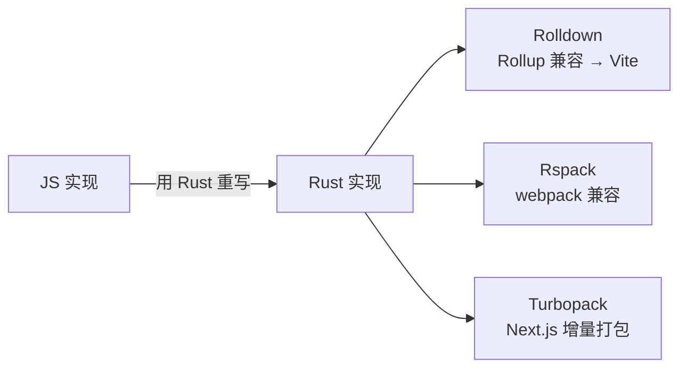

# 5.6 Rolldown / Rspack / Turbopack(Rust 系构建器)

> 卷:卷五 · 构建与工程化
> 难度:⭐⭐ 进阶(前沿) | 阅读时间:20min | 状态:进行中

---

## 引言:构建工具的第二场"语言战争"

从 Babel(JS)→ esbuild(Go)→ 现在 **Rust** 成了新宠。Rolldown、Rspack、Turbopack 都在用 Rust 重写构建器,目标是"**Rollup/webpack 的兼容 + esbuild 的速度**"。这是 2025~2026 前端工程化的前沿主线。

---

## 一、三个 Rust 构建器速览

| 工具 | 出身 | 定位 | 兼容谁 |
|------|------|------|--------|
| **Rolldown** | Vite 团队(VoidZero) | Rollup 的 Rust 重写,**Vite 未来构建内核** | Rollup |
| **Rspack** | 字节 | webpack 的 Rust 重写 | webpack(loader/插件兼容) |
| **Turbopack** | Vercel | Next.js 的增量打包器 | webpack(部分) |



---

## 二、Rolldown:Vite 的下一个引擎(重点)

**为什么需要 Rolldown?**

Vite 现在"dev 用 esbuild、build 用 Rollup",这带来两个问题:

1. **双引擎割裂**:dev 和 build 行为不一致(如冷启动仍要预构建、产物差异)
2. **Rollup 是 JS 实现**:大项目里构建越来越慢,成为瓶颈

**Rolldown 想做的事:**

- 用 **Rust** 重写 Rollup,保持 API 兼容
- 把 **esbuild(Rust/Go 系)+ Rollup** 统一成**一个 Rust 引擎**
- 让 Vite 的 dev 和 build 用**同一内核**,产物一致、全程极速

> 顺带:VoidZero 生态还推出了 **Oxc**(SWC 的 Rust 重写,做转译/lint/压缩),与 Rolldown 组成完整 Rust 工具链。

**现状(截至 2026):** Rolldown 已在 Vite 中作为可选构建引擎(`rolldown-vite`),逐步推进中;API 兼容 Rollup,现有 Rollup 插件大多可复用。

---

## 三、Rspack:webpack 的"无缝替代"

```js
// rspack 配置文件,几乎就是 webpack 的写法
module.exports = {
  entry: './src/index.js',
  module: { rules: [/* loader 兼容 */] },
  plugins: [/* 大部分 webpack 插件兼容 */],
};
```

- 目标:让现有 webpack 项目**近乎零成本迁移**,拿到 Rust 的 5~10 倍提速
- 生态策略:兼容 webpack 的 loader/插件协议

> 适合"webpack 存量项目想提速,又不想重写配置"的团队。

---

## 四、三者怎么选

| 场景 | 建议 |
|------|------|
| 新项目 / 想紧跟 Vite | 继续 Vite,关注 **Rolldown** 成熟进度 |
| 存量 webpack 项目提速 | **Rspack** 平滑迁移 |
| Next.js 重度用户 | 交给 **Turbopack**(框架内置) |
| 打 SDK/库 | 看 Rolldown 对 Rollup 的兼容成熟度 |

---

## 五、小结

```
Rust 重写构建器,三条主线:
├─ Rolldown(Vite 团队):Rollup 的 Rust 化 → 统一 Vite 的 dev/build 双引擎
├─ Rspack(字节):webpack 兼容 → 存量项目迁移提速
└─ Turbopack(Vercel):Next.js 增量打包

核心诉求:用 Rust 拿到 esbuild 级速度 + Rollup/webpack 级生态与产物质量
```

---

## 六、面试题

**Q1:为什么前端构建工具纷纷用 Rust 重写?**

JS 实现的打包器(webpack/Rollup)本身运行在 JS 引擎上,大项目越来越慢。**Rust** 是编译型语言(接近原生性能)、内存安全、并发能力强,重写后能拿到**数倍到数十倍提速**;同时通过 API 兼容保留现有生态(Rollup 插件/webpack loader)。这是"性能 + 生态"兼得的选择。

**Q2:Rolldown 和 Rollup 是什么关系?**

Rolldown 是 **Rollup 的 Rust 重写**,目标是**API 兼容 Rollup**(现有插件大多可复用),但用 Rust 实现拿到数量级提速。它由 Vite 团队打造,最终要**替代 Vite 现在"esbuild(dev)+ Rollup(build)"的双引擎**为单一内核。

**Q3:Vite 用 Rolldown 替代后,对开发者有什么实际好处?**

① 开发和构建**行为/产物一致**,减少"dev 能跑、build 报错"的困扰;② 构建速度大幅提升(冷启动、大项目打包都更快);③ 仍是 Vite,生态和心智不变,几乎无感升级。

---

📎 参考:Rolldown 官网《Why Rolldown》、Rspack 官方文档、Turbopack 文档、VoidZero 博客