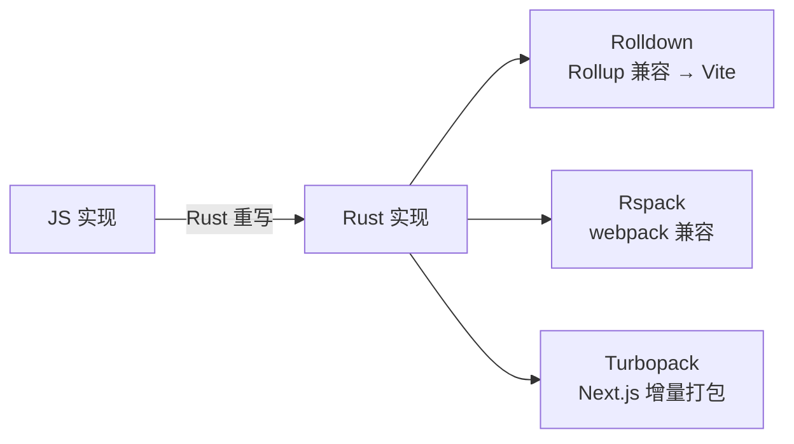

# 5.6 Rolldown / Rspack / Turbopack(Rust 系构建器)

> 卷:卷五 · 构建与工程化
> 难度:⭐⭐ 进阶(前沿) | 阅读时间:20min | 状态:深度增强

---

## 引言:构建工具的"第二场语言战争"

从 Babel(JS)→ esbuild(Go)→ 现在 **Rust** 成了新宠。Rolldown、Rspack、Turbopack 都在用 Rust 重写构建器,目标是"**Rollup/webpack 的兼容 + esbuild 的速度**"。

---

## 一、三个 Rust 构建器(一图)



| 工具 | 出身 | 定位 |
|------|------|------|
| Rolldown | Vite 团队 | Rollup 的 Rust 重写,Vite 未来内核 |
| Rspack | 字节 | webpack 的 Rust 重写 |
| Turbopack | Vercel | Next.js 增量打包器 |

---

## 二、Rolldown:Vite 的下一个引擎(重点)

**为什么需要 Rolldown?** Vite 现在"dev esbuild + build Rollup"带来两个问题:

1. **双引擎割裂**:dev 和 build 行为不一致
2. **Rollup 是 JS 实现**:大项目构建越来越慢成瓶颈

**Rolldown 想做**:用 Rust 重写 Rollup、保持 API 兼容,**统一 esbuild + Rollup 为单一 Rust 引擎**,dev/build 产物一致、全程极速。配套 **Oxc**(SWC 的 Rust 重写)做转译/lint/压缩。

---

## 三、Rspack / Turbopack

**Rspack**:webpack 的 Rust 重写,**兼容 webpack 的 loader/插件协议**,存量项目近零成本迁移提速。

**Turbopack**:Next.js 内置的增量打包器(基于 Rust)。

---

## 四、三者选型

| 场景 | 建议 |
|------|------|
| 新项目/紧跟 Vite | 关注 Rolldown 成熟度 |
| 存量 webpack 提速 | Rspack 平滑迁移 |
| Next.js 重度用户 | Turbopack(内置) |

---

## 五、小结

```
Rust 重写构建器三主线:
Rolldown(Rollup 的 Rust 化 → 统一 Vite 双引擎)/ Rspack(webpack 兼容)/ Turbopack(Next.js)
核心诉求:Rust 拿 esbuild 级速度 + Rollup/webpack 级生态与产物
```

---

## 六、面试题

**Q1:为什么前端构建工具纷纷用 Rust 重写?**

JS 实现的打包器运行在 JS 引擎上,大项目越来越慢;**Rust** 编译型(近原生性能)、内存安全、并发强,重写后拿数倍到数十倍提速,同时通过 API 兼容保留现有生态(loader/插件)。

**Q2:Rolldown 和 Rollup 是什么关系?**

Rolldown 是 **Rollup 的 Rust 重写**,API 兼容(插件大多可复用),但用 Rust 拿数量级提速。由 Vite 团队打造,目标是**替代 Vite 现在的"esbuild + Rollup"双引擎为单一内核**。

**Q3:Vite 用 Rolldown 替代后,对开发者有什么好处?**

① dev 和 build **行为/产物一致**,减少"dev 能跑 build 报错";② 构建速度大幅提升;③ 仍是 Vite,生态与心智不变,几乎无感升级。

**Q4:Rspack 相比 Rolldown 的定位差异?**

Rspack 兼容 **webpack**(loader/插件协议),目标是"存量 webpack 项目提速迁移";Rolldown 兼容 **Rollup**,目标是"Vite 的未来内核"。一个 webpack 阵营,一个 Rollup/Vite 阵营。

**Q5:Rust 相比 Go(esbuild)重写构建器,优势在哪?**

都能拿原生性能;Rust 额外以**内存安全 + 无 GC + 强并发**著称,且能通过**原生绑定(N-API/Wasm)**嵌入 JS 工具链(Oxc 生态),更适合做长期演进的构建基础设施。

**Q6:现有项目要不要立刻迁移到 Rspack/Rolldown?**

看收益:**存量 webpack 大项目、构建慢**可试 Rspack(兼容好、迁移成本低);Rolldown 仍在成熟中,新项目可观望/小范围试用。原则:**先测收益再迁移**,别为追新而追新。

---

📎 参考:Rolldown《Why Rolldown》、Rspack 文档、Turbopack 文档、VoidZero 博客