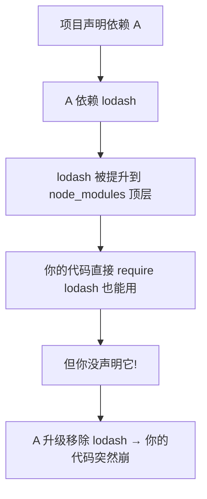

# 5.7 包管理(npm / pnpm / bun)

> 卷:卷五 · 构建与工程化
> 难度:⭐⭐ 进阶 | 阅读时间:20min | 状态:深度增强

---

## 引言:依赖这么装,为什么还会"装错"

包管理器决定"装什么、怎么存、怎么解析"。了解 npm → yarn → pnpm 演进,才能看懂"**幽灵依赖**"这个经典坑,以及 pnpm 的符号链接机制。

---

## 一、三大包管理器对比

| | npm | yarn | pnpm |
|---|-----|------|------|
| 安装方式 | 嵌套/flat | flat | **符号链接 + 内容寻址** |
| 速度 | 慢(历史) | 快 | **最快、省磁盘** |
| 严格性 | 松(幽灵依赖) | 较松 | **严格**(显式依赖) |

---

## 二、npm 的"幽灵依赖"(底层)



**幽灵依赖**:你没在 `package.json` 声明,却因 **hoisting(依赖提升)** 而间接可用的包。风险:上游一变,隐式依赖断,极其脆弱。

**pnpm 的解法**:用符号链接,让每个包只能访问**自己声明过**的依赖:

```
node_modules
├── .pnpm/            ← 真包(内容寻址存储)
└── vue -> .pnpm/vue@.../   ← 只有你声明的包才有顶层链接
```

---

## 三、pnpm 三大特性(底层)

1. **硬链接 + 内容寻址存储**:所有项目共享全局 store(`~/.pnpm-store`),同版本只存一份 → 省磁盘
2. **符号链接 node_modules**:只有显式声明的依赖可访问 → 治幽灵依赖
3. **workspace 原生支持**:Monorepo 核心工具(5.8)

> pnpm 省磁盘又快,本质是"**内容寻址 + 硬链接复用**",而非"复制"。

---

## 四、bun:运行时 + 包管理 + 打包一体

```bash
bun install        # 极快安装
bun run index.ts   # 原生跑 TS
bun build          # 内置打包
bun test           # 内置测试
```

> 用 Zig 写的运行时(对标 Node)+ 内置打包/转译;生态仍在追 Node 兼容覆盖。

---

## 五、语义化版本 + lockfile

```json
"^1.2.3"   // 兼容主版本(< 2.0.0)
"~1.2.3"   // 只升补丁(< 1.3.0)
"1.2.3"    // 精确锁定
```

**lockfile**(`package-lock.json`/`pnpm-lock.yaml`)锁死**实际解析的精确版本**,保证团队/CI 装出来一致:

```bash
pnpm install --frozen-lockfile   # CI 用,不一致就报错而非改
```

---

## 六、小结

```
演进:npm(历史)→yarn(提速)→pnpm(符号链接,治幽灵依赖,省磁盘)
幽灵依赖:没声明却间接可用 → pnpm 符号链接根治
pnpm 本质:内容寻址 + 硬链接复用;bun:运行时+包管理+打包一体
版本:^锁主/ ~锁次;lockfile 保证可复现
```

---

## 七、面试题

**Q1:什么是"幽灵依赖"?pnpm 如何解决?**

你没在 `package.json` 声明、却因 npm 的 hoisting 而**间接可用**的包。pnpm 用**符号链接**,每个包只能访问自己显式声明的依赖,不提升、无幽灵依赖。

**Q2:pnpm 为什么省磁盘且安装快?**

**内容寻址存储**:所有项目共用全局 store,同版本只存一份,项目里用**硬链接/符号链接**指向它。不重复占空间,安装也大多是"链接"而非"复制"。

**Q3:`^` 和 `~` 的区别?lockfile 有什么用?**

`^1.2.3` 允许升到 `<2.0.0`(锁主版本);`~1.2.3` 只升补丁 `<1.3.0`。lockfile 锁死精确版本,让团队/CI 安装**可复现一致**。

**Q4:为什么 CI 里推荐 `--frozen-lockfile`?**

强制**严格按 lockfile** 安装,`package.json` 与 lockfile 不一致就**报错而非悄悄改**,保证 CI 环境依赖与本地/生产完全一致、可复现。

**Q5:pnpm 的 node_modules 结构为什么是"符号链接"?**

pnpm 把真包放 `.pnpm` 目录(内容寻址),顶层 `node_modules` 只放**你显式声明依赖的符号链接**。这样既省磁盘(硬链接复用),又严格(只有声明的依赖可见),天然治幽灵依赖。

**Q6:bun 相比 Node/npm 的优势和现状?**

bun 用 Zig 写,`bun install` 极快、原生跑 TS、内置打包/测试,**一体化体验好**;但生态与兼容覆盖仍在追赶 Node,适合工具/脚本/新项目试水,关键后端仍倾向 Node。

---

📎 参考:pnpm《Motivation》《Workspace》、npm《Semver》、Bun 文档