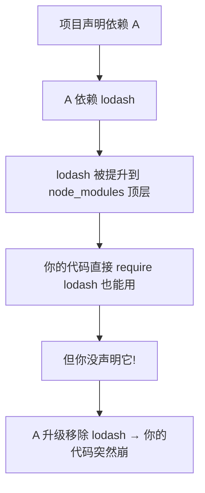

# 5.7 包管理(npm / yarn / pnpm / bun)

## 引言:依赖这么装,为什么还会"装错"

包管理器决定"装什么、怎么存、怎么解析"。了解 npm → yarn → pnpm 演进,才能看懂"**幽灵依赖**"这个经典坑,以及 pnpm 的符号链接、yarn 的 PnP 两种解法。

---

## 一、三大包管理器对比

| | npm | yarn | pnpm |
|---|-----|------|------|
| 安装方式 | 嵌套 → flat(hoisting) | flat + PnP(berry) | **符号链接 + 内容寻址** |
| 速度 | 慢(历史) | 快 | **最快、省磁盘** |
| 严格性 | 松(幽灵依赖) | PnP 严格 | **严格**(显式依赖) |

---

## 二、幽灵依赖(phamtom dependency)



**幽灵依赖**:你没在 `package.json` 声明,却因 **hoisting(依赖提升/flat 扁平化)** 而间接可用的包。风险:上游一变,隐式依赖断,极其脆弱。

> 根因:npm/yarn 早期为了**避免重复安装 + 减深层嵌套**,把所有依赖"扁平提升"到 `node_modules` 顶层,副作用就是"没声明的包也能被 require 到"。

---

## 三、两种解法:pnpm 符号链接 vs yarn PnP

### 3.1 pnpm:符号链接 + 内容寻址

```
node_modules
├── .pnpm/                        ← 真包(内容寻址存储)
│   └── vue@3.4.0/node_modules/...
└── vue -> .pnpm/vue@3.4.0/...    ← 只有你声明的包才有顶层链接
```

- 每个包只能访问**自己声明过**的依赖 → 治幽灵依赖
- 硬链接复用全局 store(`~/.pnpm-store`),同版本只存一份 → 省磁盘

### 3.2 yarn PnP(Plug'n'Play,berry)

yarn 2+ 的 PnP 方案更激进:**根本不用 `node_modules`**,依赖解析靠一份 `.pnp.cjs` 映射文件:

```js
// .pnp.cjs 直接把"包名"映射到"实际位置/zip"
"vue": { "packageLocation": "./.yarn/cache/vue-npm-3.4.0.zip/..." }
```

- ✅ 安装极快(直接解压 zip)、无 node_modules、严格(无幽灵依赖)
- ❌ 生态兼容性问题:某些"直接读 node_modules 路径"的工具可能不兼容

| 方案 | 存储 | 幽灵依赖 | 兼容 |
|------|------|---------|------|
| npm/yarn flat | node_modules 扁平 | ❌ 有 | ✅ 最好 |
| pnpm symlink | 符号链接 + store | ✅ 治 | ✅ 好 |
| yarn PnP | zip 映射 | ✅ 治 | ⚠️ 部分工具不兼容 |

---

## 四、bun:运行时 + 包管理 + 打包一体

```bash
bun install        # 极快安装
bun run index.ts   # 原生跑 TS
bun build          # 内置打包
bun test           # 内置测试
```

> 用 Zig 写的运行时(对标 Node)+ 内置打包/转译;生态仍在追 Node 兼容覆盖。

---

## 五、语义化版本 + lockfile

```json
"^1.2.3"   // 兼容主版本(< 2.0.0)
"~1.2.3"   // 只升补丁(< 1.3.0)
"1.2.3"    // 精确锁定
```

**lockfile**(`package-lock.json`/`yarn.lock`/`pnpm-lock.yaml`)锁死**实际解析的精确版本**,保证团队/CI 装出来一致:

```bash
pnpm install --frozen-lockfile   # CI 用,不一致就报错而非改
```

---

## 六、三种依赖位置

| | dependencies | devDependencies | peerDependencies |
|---|-------------|----------------|------------------|
| 含义 | 运行时依赖 | 开发/构建时依赖 | 要求**宿主**提供的依赖 |
| 消费者安装 | ✅ 自动装 | ❌ 不装 | ❌ 要求宿主装且版本匹配 |
| 例子 | vue / lodash | typescript / vitest | 插件声明宿主框架 |

```json
{
  "dependencies": { "vue": "^3.4.0" },          // 运行时需要
  "devDependencies": { "vitest": "^1.0.0" },    // 开发/测试需要
  "peerDependencies": { "react": "^18.0.0" }    // 要求宿主提供 react
}
```

> 关键:发布到 npm 后,消费者只**自动安装 `dependencies`**;`devDependencies` 不装;`peerDependencies` 是"依赖由宿主提供"(插件常用),版本不匹配会报 **peer 冲突**——这也是 React 生态里"一个项目只能有一个 react 版本"的原因。

---

## 七、小结

```
演进:npm(历史)→ yarn(提速,PnP)→ pnpm(符号链接,治幽灵依赖,省磁盘)
幽灵依赖:没声明却间接可用(hoisting 副作用);两种解法:pnpm symlink / yarn PnP
pnpm 本质:内容寻址 + 硬链接复用;bun:运行时+包管理+打包一体
版本:^锁主/ ~锁次;lockfile 保证可复现;依赖位置:dependencies/dev/peer
```

---

## 八、面试题

**Q1:什么是"幽灵依赖"?pnpm 如何解决?**

你没在 `package.json` 声明、却因 npm 的 hoisting 而**间接可用**的包。pnpm 用**符号链接**,每个包只能访问自己显式声明的依赖,不提升、无幽灵依赖。

**Q2:pnpm 为什么省磁盘且安装快?**

**内容寻址存储**:所有项目共用全局 store,同版本只存一份,项目里用**硬链接/符号链接**指向它。不重复占空间,安装也大多是"链接"而非"复制"。

**Q3:`^` 和 `~` 的区别?lockfile 有什么用?**

`^1.2.3` 允许升到 `<2.0.0`(锁主版本);`~1.2.3` 只升补丁 `<1.3.0`。lockfile 锁死精确版本,让团队/CI 安装**可复现一致**。

**Q4:为什么 CI 里推荐 `--frozen-lockfile`?**

强制**严格按 lockfile** 安装,`package.json` 与 lockfile 不一致就**报错而非悄悄改**,保证 CI 环境依赖与本地/生产完全一致、可复现。

**Q5:pnpm 的 node_modules 结构为什么是"符号链接"?**

pnpm 把真包放 `.pnpm` 目录(内容寻址),顶层 `node_modules` 只放**你显式声明依赖的符号链接**。这样既省磁盘(硬链接复用),又严格(只有声明的依赖可见),天然治幽灵依赖。

**Q6:bun 相比 Node/npm 的优势和现状?**

bun 用 Zig 写,`bun install` 极快、原生跑 TS、内置打包/测试,**一体化体验好**;但生态与兼容覆盖仍在追赶 Node,适合工具/脚本/新项目试水,关键后端仍倾向 Node。

**Q7:yarn 的 PnP 是什么?和 pnpm 有何不同?**

PnP(Plug'n'Play)是 yarn 2+ 的方案:**不用 node_modules**,靠 `.pnp.cjs` 把包名映射到 zip 位置。与 pnpm 都治幽灵依赖,但 PnP 更激进(无 node_modules),部分直接读路径的工具不兼容。

**Q8:`peerDependencies` 是干什么的?为什么会有 peer 冲突?**

声明"**本包依赖由宿主提供**"(插件场景,如 React 插件声明 `peer react`)。宿主装的版本与声明不匹配就报 **peer 冲突**——这是"一个项目只能有一个 react 版本"的约束来源,避免多份框架实例导致的状态不一致。

---

📎 参考:[pnpm《Motivation》](https://pnpm.io/motivation)、[yarn PnP](https://yarnpkg.com/features/pnp)、[npm《Semver》](https://docs.npmjs.com/about-semantic-versioning)、[Bun 文档](https://bun.sh/docs)
