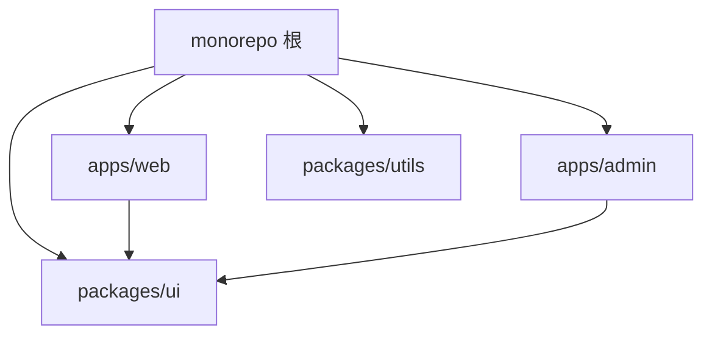
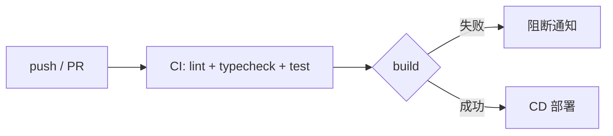
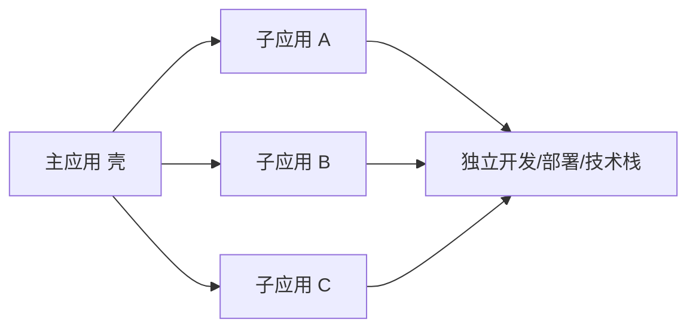

# 5.8 Monorepo 与 CI/CD

> 卷:卷五 · 构建与工程化
> 阅读时间:20min

---

## 引言:代码仓库怎么组织,是工程化的顶层设计

当项目长出"多个应用 + 多个公共库",面临 **multirepo vs monorepo** 的选择。深挖要懂 Monorepo 的**原子提交**价值与 Turborepo 的**增量缓存**机制。

---

## 一、Multirepo vs Monorepo

| | Multirepo | Monorepo |
|---|-----------|----------|
| 结构 | 每包独立仓库 | 所有包一个仓库 |
| 依赖复用 | 发 npm 包 | 源码直接引用 |
| 原子提交 | 跨仓库难 | **跨包一次提交** |
| 工具链 | 各配各 | 统一 |



> 核心取舍:**Monorepo 牺牲物理隔离,换"原子改动 + 源码复用 + 统一治理"**。

---

## 二、pnpm workspace(基础)

```yaml
# pnpm-workspace.yaml
packages: ["apps/*", "packages/*"]
```

```json
// apps/web/package.json
{ "dependencies": { "@repo/ui": "workspace:*" } }   // 指向本地 workspace 包
```

- 根统一装依赖,共享去重;跨包 `workspace:*` 直接引用源码,改完即时生效、无需发版

---

## 三、任务编排:Turborepo / Nx(底层)

```json
// turbo.json
{ "pipeline": { "build": { "dependsOn": ["^build"], "outputs": ["dist/**"] } } }
```

- `^build`:先构建依赖它的包,自动推导拓扑顺序
- **增量缓存**:没变过的包**跳过执行**,命中本地/远程缓存 → CI 大幅提速
- 并行调度

**增量缓存底层**:按"包 + 输入哈希"(代码/依赖/环境)算缓存键,没变就直接**复用上次产物**、跳过执行;远程缓存让不同 CI 机器共享。

---

## 四、CI/CD 流水线(一图)



```yaml
- run: pnpm install --frozen-lockfile
- run: pnpm lint && pnpm typecheck && pnpm test
- run: pnpm build
- run: pnpm deploy
```

> 口诀:**提交 → 自动 lint/typecheck/test/build → 通过才部署**,质量关卡前置到每次提交。

---

---

**微前端(Micro-Frontend,2026 成熟架构):**

把**一个大型前端单体**拆成**多个可独立开发、部署、运行的子应用**,由主应用(壳)统一调度:



**解决什么痛点**:单体前端 → 构建慢、团队耦合高、技术栈无法迭代、不能独立部署/灰度/回滚。

**两大主流方案:**

| 方案 | 时机 | 原理 |
|------|------|------|
| **Module Federation 2.0** | 构建时 | 模块联邦,运行时共享/加载远程模块 |
| **qiankun(乾坤)** | 运行时 | 动态加载子应用 HTML/JS + 沙箱隔离 |

**qiankun 三大隔离机制(核心难点):**

1. **JS 沙箱**:快照沙箱 → 单应用代理沙箱 → 多应用代理沙箱(Proxy 隔离)
2. **CSS 隔离**:子应用样式加前缀作用域(或 Shadow DOM)
3. **路由劫持**:主应用拦截路由,按前缀分发到对应子应用

**适用 vs 不适用:**

- ✅ 适用:门户型产品(多独立产品共享登录/菜单)、渐进式重构、多技术栈并存、独立部署灰度
- ❌ 不适用:中小单体、协同顺畅、无独立部署需求(额外通信/隔离复杂度大于收益)

> 微前端是"**前端微服务**"——解决"组织与协作"而非"性能";有团队已用它处理近 10 亿次路由请求,但它是重型架构,别为拆分而拆分。

## 五、小结

```
仓库形态:Multirepo(隔离)vs Monorepo(原子提交+源码复用+统一治理)
三件套:pnpm workspace(本地引用)/ Turborepo-Nx(拓扑+增量缓存)/ CI/CD(质量前置)
```

---

## 六、面试题

**Q1:Monorepo 相比 Multirepo 的优势?**

① **跨包一次原子提交**;② **源码级复用**(workspace:* 免发版);③ **统一治理**(一份工具链/依赖/CI);④ 依赖去重共享。代价:仓库大、需任务编排工具。

**Q2:Turborepo 的"增量缓存"为什么能加速 CI?**

按"包 + 输入哈希"缓存:包**没改动**就**复用上次产物**、跳过执行;远程缓存让多台 CI 机器共享。大仓库构建从分钟级降到秒级。

**Q3:CI 里 `--frozen-lockfile` 的作用?**

强制按 lockfile 安装,不一致就**报错而非改**,保证 CI 依赖与本地/生产一致、可复现(呼应 [5.7](/卷五-构建与工程化/5.7-包管理))。

**Q4:Monorepo 里"原子提交"意味着什么?价值?**

改公共库 + 所有消费方可以在**同一个 commit** 里一起提交,保证"公共库改动的 API 变化 + 各子包适配"永远同步、不会出现"库改了但下游没跟上"的断裂窗口。这是 multirepo 做不到的。

**Q5:`workspace:*` 协议是什么?**

pnpm 里 `"@repo/ui": "workspace:*"` 表示"依赖指向**本地 workspace 里的包**",开发时直接链接源码(改完即时生效),发布时替换成真实版本号。免去"改库→发 npm→再装"的循环。

**Q6:CI 里通常按什么顺序跑检查?为什么这个顺序?**

`install(frozen) → lint → typecheck → test → build → deploy`。**先便宜的快检查**(lint/typecheck)尽早失败、省时省钱;test 次之;build 最后;全过才部署。原则:把"最便宜的失败"放最前。

---

📎 参考:pnpm Workspace 文档、Turborepo 文档、GitHub Actions 文档