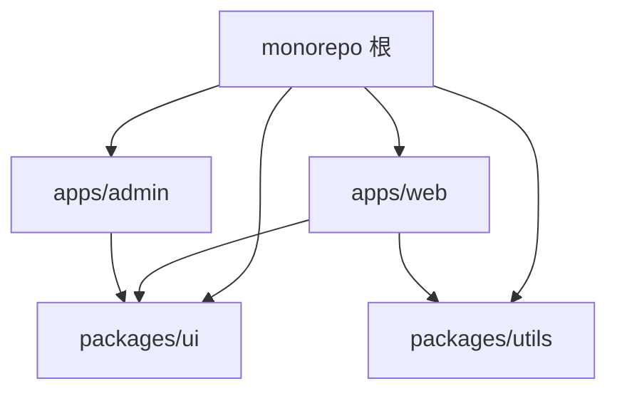
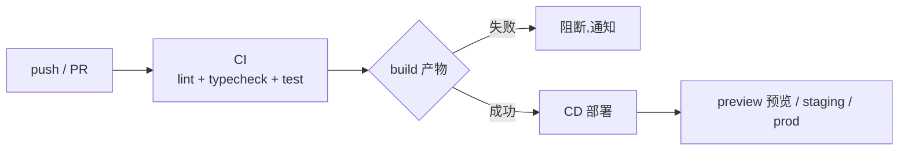

# 5.8 Monorepo 与 CI/CD

> 卷:卷五 · 构建与工程化
> 难度:⭐⭐ 进阶 | 阅读时间:20min | 状态:进行中

---

## 引言:代码仓库怎么组织,是工程化的顶层设计

当一个项目长出"多个应用 + 多个公共库"(如 `web`、`admin`、`shared`、`ui`),就面临仓库形态的选择:**多仓(multirepo)还是单仓(monorepo)**。

---

## 一、Multirepo vs Monorepo

| | Multirepo | Monorepo |
|---|-----------|----------|
| 结构 | 每个包独立仓库 | 所有包在一个仓库 |
| 依赖复用 | 靠发 npm 包 | 直接引用源码,即时生效 |
| 版本一致 | 各管各 | 统一锁定(一次改全局) |
| 原子提交 | 跨仓库难 | **跨包一次提交** |
| 工具链 | 各配各 | 统一配置、统一 CI |

> 核心取舍:**Monorepo 牺牲"物理隔离",换取"原子改动 + 源码级复用 + 统一治理"**。大型前端/库多、共享多的场景收益明显。



---

## 二、pnpm workspace(Monorepo 的内存与链接基础)

```yaml
# pnpm-workspace.yaml
packages:
  - "apps/*"
  - "packages/*"
```

```json
// apps/web/package.json
{
  "dependencies": {
    "@repo/ui": "workspace:*"   // 指向本地 workspace 包
  }
}
```

- 根目录统一装依赖:各子包共享、去重、省空间
- 跨包直接引用源码:`import { Button } from '@repo/ui'`,改完即时生效,无需发版

---

## 三、任务编排:Turborepo / Nx

包多了,构建/测试的**依赖顺序和缓存**就成了难题。Turborepo/Nx 解决:

```json
// turbo.json
{
  "pipeline": {
    "build": { "dependsOn": ["^build"], "outputs": ["dist/**"] },
    "test": { "dependsOn": ["build"] }
  }
}
```

- `^build`:先构建"依赖它的包",自动推导拓扑顺序
- **增量缓存**:没变过的包**跳过执行**,命中本地/远程缓存,CI 大幅提速
- 并行调度,充分利用多核

---

## 四、CI/CD 流水线



**典型 CI 步骤(GitHub Actions):**

```yaml
- run: pnpm install --frozen-lockfile   # 装依赖(锁定版)
- run: pnpm lint                        # 代码规范
- run: pnpm typecheck                   # 类型检查
- run: pnpm test                        # 单测
- run: pnpm build                       # 构建
- run: pnpm deploy                      # 部署(CD)
```

> 口诀:**代码提交 → 自动 lint/typecheck/test/build → 通过才部署**,把"质量关卡"前置到每一次提交。

---

## 五、小结

```
仓库形态:Multirepo(隔离) vs Monorepo(原子改动 + 源码复用 + 统一治理)

Monorepo 三件套:
├─ pnpm workspace:本地包 workspace:* 直接引用
├─ Turborepo/Nx:任务拓扑编排 + 增量缓存
└─ CI/CD:push → lint/typecheck/test/build → deploy,质量前置
```

---

## 六、面试题

**Q1:Monorepo 相比 Multirepo 有什么优势?**

① **跨包一次原子提交**(改公共库 + 所有消费方一起提交);② **源码级复用**(`workspace:*` 直接引用,无需发版即可用最新);③ **统一治理**(一份工具链、依赖版本、CI);④ **依赖去重共享**。代价是仓库更大、需要更强的任务编排工具。

**Q2:Turborepo 的"增量缓存"为什么能加速 CI?**

它按"包 + 输入哈希"缓存构建结果:某个包**没改动**(代码、依赖、环境都没变)就直接**复用上次的产物**,跳过执行。远程缓存还能让不同 CI 机器共享缓存,大仓库构建从分钟级降到秒级。

**Q3:CI 里 `--frozen-lockfile` 的作用?**

强制安装**严格按照 lockfile** 执行,若 `package.json` 与 lockfile 不一致就**报错而非悄悄改**。目的是保证 CI 环境的依赖和本地/生产**完全一致、可复现**,防止"顺手把 lockfile 改了"导致不可预知的漂移。

---

📎 参考:pnpm Workspace 文档、Turborepo 官方文档、GitHub Actions 文档