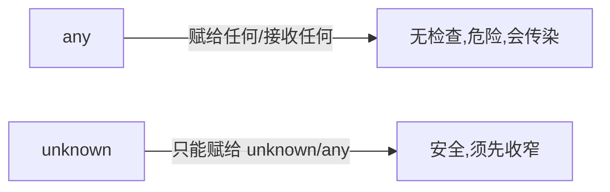

# 8.1 类型系统基础

## 引言:TS 核心是"推断 + 收窄"

TS 不是给每个变量手写类型,主线是:**尽量让编译器自动推,推不出再手动标;再用"收窄"让类型逐步精确**。深挖要懂 **any 的"传染"**、**字面量类型** 与 **类型收窄** 的机制。

---

## 一、注解 vs 推断

```ts
let a: number = 1;   // 注解(显式标注)
let b = 1;           // 推断:自动推成 number
```

> 能推断就不注解;函数参数、复杂场景、公共 API 边界才显式标注。

---

## 二、基础类型 + 字面量类型

```ts
// 基础类型
let s: string = "hi";
let n: number = 1;
let bool: boolean = true;
let big: bigint = 100n;
let sym: symbol = Symbol("x");
let nul: null = null;
let undef: undefined = undefined;

// 字面量类型(值本身作为类型)
let direction: "up" | "down" | "left" | "right" = "up";   // 只能是这四个
type HttpMethod = "GET" | "POST" | "PUT" | "DELETE";

// as const:把对象/数组变成"只读 + 字面量"类型
const config = { mode: "dark", retries: 3 } as const;
// config.mode 类型是 "dark"(不是 string),config 只读
```

> **字面量类型**让"值"本身成为类型,常用于**判别联合**的 kind 字段和精确参数约束;`as const` 把宽类型锁成字面量。

---

## 三、数组 / 元组 / 枚举

```ts
let arr: number[] = [1, 2, 3];           // 数组
let arr2: Array<string> = ["a", "b"];

let tuple: [string, number] = ["hi", 42];  // 元组:定长定类型
let [str, num] = tuple;                     // 解构带类型

enum Color { Red, Green, Blue }             // 枚举(数值)
enum Status { Active = "active", Inactive = "inactive" }  // 字符串枚举
Color.Red;   // 0
```

| 结构 | 特点 |
|------|------|
| 数组 | 同类型、变长 |
| 元组 | 定长、每项类型可不同 |
| 枚举 | 一组命名常量 |

> 元组常用于"固定结构返回值"(如 React 的 `useState` 返回 `[state, setter]`);枚举在"有限选项集合"时替代魔法数字。

---

## 四、any / unknown / never / void



| 类型 | 含义 |
|------|------|
| `any` | 任意,关闭检查(**危险、传染**) |
| `unknown` | 未知,安全(先收窄) |
| `never` | 永不存在的值(抛错/穷尽) |
| `void` | 无返回值 |

```ts
let u: unknown = "hi";
// u.toUpperCase();          // ❌ 需收窄
if (typeof u === "string") u.toUpperCase();  // ✅

function fail(msg: string): never { throw new Error(msg); }
```

**为什么 any 会"传染"?** `any` 赋值给 `T` 会让 `T` 也变 `any`(或"消除"检查),静默传递到全项目。所以:"**能用 unknown 就别用 any**"。

---

## 五、联合 | 与交叉 & + 判别联合

```ts
type ID = string | number;                    // 联合:二选一
type AB = { a: number } & { b: string };      // 交叉:同时具备

type Shape =
  | { kind: "circle"; radius: number }
  | { kind: "rect"; width: number; height: number };

function area(s: Shape) {
  switch (s.kind) {
    case "circle": return Math.PI * s.radius ** 2;   // 收窄到 circle
    case "rect": return s.width * s.height;          // 收窄到 rect
  }
}
```

> **判别联合(discriminated union)**:每个成员带一个共同的字面量字段(`kind`),靠它安全收窄。这是 TS 表达"可区分的多种状态"最常用的模式。

---

## 六、type vs interface

| | type | interface |
|---|------|-----------|
| 扩展 | `&` | `extends` |
| 声明合并 | ❌ | ✅ |
| 适用 | 联合/交叉/映射 | 对象/类契约 |

```ts
interface User { name: string }
interface User { age: number }   // ✅ 声明合并:两个 User 合并

type A = string | number;        // ✅ type 能表达联合,interface 不能
```

---

## 七、类型收窄(六种方式)

```ts
if (typeof x === "string") {}       // ① typeof(基础类型)
if (x instanceof Date) {}           // ② instanceof(类)
if ("kind" in x) {}                 // ③ in(属性存在)
switch (s.kind) {}                  // ④ 判别字段(联合)

// ⑤ 类型谓词(is):自定义收窄函数
function isString(x: unknown): x is string {
  return typeof x === "string";
}

// ⑥ 赋值收窄:赋值后类型变窄
let x: string | number = "hi";
x = 1;   // x 收窄为 number
```

> 收窄 = 依据运行时信息把宽类型**逐步缩成精确子类型**,是"unknown 能用、联合能 safe"的机制。`is` 类型谓词把"判断函数"变成"收窄工具"。

---

## 八、类型断言(as)

```ts
const el = document.getElementById("input") as HTMLInputElement;
el.value;                       // 断言成具体类型

const n = (someValue as string).toUpperCase();   // 断言后调方法

// 双重断言(慎用:强行绕开检查)
const v = (x as unknown) as string;
```

> `as` 只是"**告诉编译器你更懂**",不做运行时转换;类型不符时运行时会崩。断言应基于"你确实比编译器掌握更多信息"的场景(如 DOM 类型)。

---

## 九、小结

```
推断优先,注解兜底
字面量类型(值即类型)+ as const;数组/元组/枚举
any(危险传染)vs unknown(安全,先收窄)/ never(穷尽)/ void
联合|、交叉&;判别联合靠 kind;收窄:typeof/instanceof/in/判别/is谓词/赋值
interface 对象契约(可合并);type 别名(联合/交叉/映射);断言 as
```

---

## 十、面试题

**Q1:any 和 unknown 的区别?什么时候用哪个?**

`any` 完全关闭检查、会**传染**;`unknown` 是"安全未知",必须**先收窄**才用。处理不可信外部数据(如 JSON.parse)用 unknown + 收窄,尽量不用 any。

**Q2:type 和 interface 的主要区别?**

`interface` 可**声明合并**、`extends` 继承,专为对象;`type` 是别名,不能合并,但能表达**联合/交叉/映射**。对象用 interface,复杂类型用 type。

**Q3:什么是"类型收窄"?举两种方式。**

按运行时信息把宽类型**缩成精确子类型**。方式:`typeof`/`instanceof`/`in`/判别字段/`is` 类型谓词。

**Q4:为什么说 any 会"传染"?**

any 赋给变量/参与运算,会让结果的类型也**失去检查**(变 any),沿调用链静默扩散,一处 any 污染一片。所以应限制 any、用 unknown 替代。

**Q5:`never` 类型有什么实际用途?**

① 表示"永不返回"的函数(抛错/死循环);② **穷尽检查**(switch 联合类型,少了分支编译器报错,`default: const x: never = s`)。

**Q6:`unknown` 和 `any` 在"赋值方向"上的差异?**

`any` **双向兼容**(可赋给任何、也可接收任何);`unknown` 只能**接收**任何(任何值可赋给 unknown),但**不能赋给**其他类型(除非收窄),所以更安全。

**Q7:什么是字面量类型?`as const` 有什么用?**

字面量类型让"**值本身成为类型**"(如 `"dark"`、`3`),约束变量只能是特定值。`as const` 把对象/数组锁成**只读 + 字面量**类型(`mode: "dark"` 而非 `string`),常用于判别字段和精确常量。

**Q8:类型谓词(`is`)是什么?什么时候用?**

类型谓词 `x is T` 是自定义收窄函数的**返回类型标注**,告诉编译器"返回 true 时,x 就是 T"。用于封装复杂的类型判断(如自定义的 isString/isUser),让收窄逻辑可复用。

**Q9:数组、元组、枚举的区别?**

数组是同类型变长;元组是**定长、每项类型可不同**(固定结构);枚举是**一组命名常量**(有限选项)。元组典型如 React `useState` 的 `[state, setter]`。

**Q10:类型断言 `as` 会做运行时转换吗?什么时候该用?**

不会。`as` 只是**编译期**告诉编译器"按这个类型看",不做运行时转换、不校验。用于"你比编译器掌握更多信息"的场景(如 `getElementById` 断言成 `HTMLInputElement`),类型不符时运行时会崩。

---

📎 参考:[TypeScript Handbook《Everyday Types》](https://www.typescriptlang.org/docs/handbook/2/everyday-types.html)、[《Narrowing》](https://www.typescriptlang.org/docs/handbook/2/narrowing.html)、[《Objects》](https://www.typescriptlang.org/docs/handbook/2/objects.html)