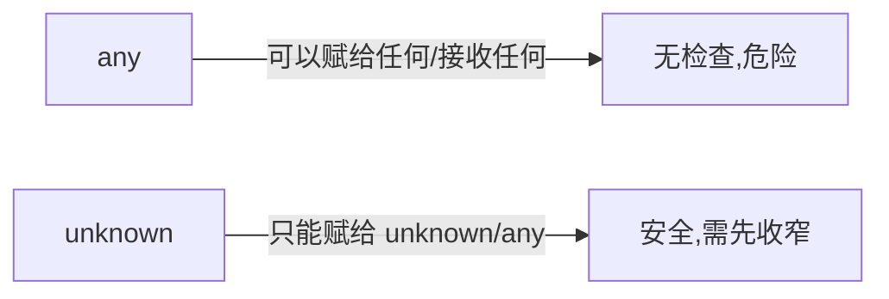

# 8.1 类型系统基础

> 卷:卷八 · TypeScript
> 难度:⭐ 基础 | 阅读时间:20min

---

## 引言:TS 的核心是"类型推导 + 类型收窄"

TS 不是给每个变量都手写类型的语言,它有一条主线:**尽量让编译器自动推,只在推不出时手动标;再用"收窄"让类型逐步精确**。

---

## 一、类型注解 vs 类型推断

```ts
let a: number = 1;    // 注解:显式标注
let b = 1;            // 推断:自动推出 number
```

> 工程建议:**能推断就不注解**,只在函数参数、复杂场景、公共 API 边界显式标注,代码更干净。

---

## 二、any / unknown / never / void

| 类型 | 含义 | 关键行为 |
|------|------|---------|
| `any` | 任意类型,关闭检查 | **危险**(会传染) |
| `unknown` | 未知类型,安全 | 必须先收窄才能用 |
| `never` | 永不存在的值 | 函数抛错/死循环/穷尽检查 |
| `void` | 无返回值 | 函数返回 undefined |



```ts
let u: unknown = "hi";
// u.toUpperCase();           // ❌ unknown 不能直接用
if (typeof u === "string") {
  u.toUpperCase();            // ✅ 收窄后可用
}

function fail(msg: string): never { throw new Error(msg); }
```

> **为什么区分 any 和 unknown?** `any` 是"放弃检查",可能把错误静默传遍全项目;`unknown` 是"确实未知但安全",逼你在使用前收窄。工程上**能用 unknown 就别用 any**。

---

## 三、联合类型 | 与交叉类型 &

```ts
type ID = string | number;        // 联合:或
type A = { a: number };
type B = { b: string };
type AB = A & B;                  // 交叉:且(两者都要)
```

**收窄联合类型(判别联合):**

```ts
type Shape =
  | { kind: "circle"; radius: number }
  | { kind: "rect"; width: number; height: number };

function area(s: Shape) {
  switch (s.kind) {            // 靠 kind 判别
    case "circle": return Math.PI * s.radius ** 2;
    case "rect": return s.width * s.height;
  }
}
```

---

## 四、type vs interface

| | `type` | `interface` |
|---|--------|-------------|
| 定义 | 类型别名(任意形状) | 接口(对象形状) |
| 扩展 | `&` | `extends` |
| 声明合并 | ❌ | ✅(同名自动合并) |
| 适用 | 联合/交叉/工具类型 | 对象、类契约 |

```ts
interface User { name: string; }
interface User { age: number; }   // ✅ 声明合并:name + age

type User2 = { name: string };
// type User2 = { age: number };  // ❌ 重复报错
```

> 经验:描述**对象/类**用 `interface`(可扩展、可合并),需要**联合/交叉/映射**用 `type`。

---

## 五、类型收窄的四种方式

```ts
// ① typeof
if (typeof x === "string") { /* string */ }

// ② instanceof
if (x instanceof Date) { /* Date */ }

// ③ in(判断属性存在)
if ("kind" in x) { /* 有 kind */ }

// ④ 判别字段(见上 area 例子)
```

---

## 小结

```
推断优先,注解兜底
any(危险)→ unknown(安全,先收窄)/ never(穷尽)/ void(无返回)
联合 |(或)、交叉 &(且);判别联合靠 kind 收窄
interface 对象契约(可合并)、type 别名(联合/交叉/映射)
```

## 面试题

**Q1:`any` 和 `unknown` 的区别?什么时候用哪个?**

`any` 完全关闭类型检查、会**传染**给用到它的地方(隐患);`unknown` 是"安全未知",必须**先收窄**才能用。处理不可信外部数据(如 `JSON.parse`)用 `unknown` + 收窄,尽量不用 `any`。

**Q2:`type` 和 `interface` 有什么主要区别?**

`interface` 可**声明合并**、用 `extends` 继承,专为对象/类契约设计;`type` 是类型别名,不能声明合并,但能表达**联合、交叉、映射**等复杂类型。通常:对象用 interface,复杂类型用 type。

**Q3:什么是"类型收窄"?举两种方式。**

把宽泛类型按运行时信息**逐步缩为更精确的子类型**。方式:`typeof`(基础类型)、`instanceof`(类)、`in`(属性存在)、判别字段(`kind === 'circle'`)。

---

📎 参考:TypeScript Handbook《Everyday Types》《Narrowing》