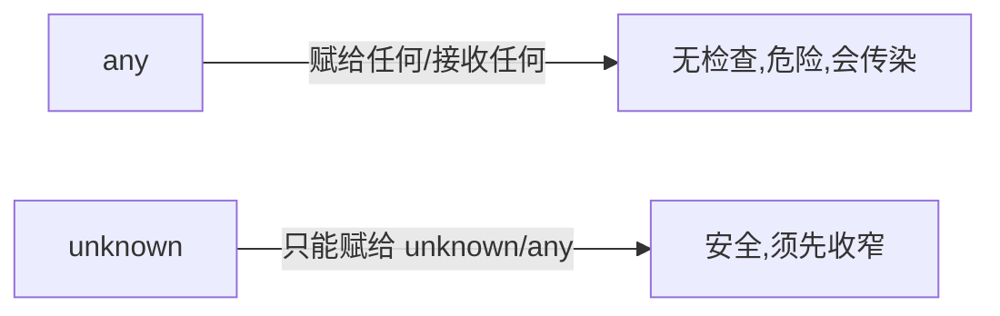

# 8.1 类型系统基础

> 卷:卷八 · TypeScript
> 阅读时间:20min

---

## 引言:TS 核心是"推断 + 收窄"

TS 不是给每个变量手写类型,主线是:**尽量让编译器自动推,推不出再手动标;再用"收窄"让类型逐步精确**。深挖要懂 **any 的"传染"** 与 **类型收窄** 的机制。

---

## 一、注解 vs 推断

```ts
let a: number = 1;   // 注解
let b = 1;           // 推断:number
```

> 能推断就不注解;函数参数、复杂场景、公共 API 边界才显式标注。

---

## 二、any / unknown / never / void



| 类型 | 含义 |
|------|------|
| `any` | 任意,关闭检查(**危险、传染**) |
| `unknown` | 未知,安全(先收窄) |
| `never` | 永不存在的值(抛错/穷尽) |
| `void` | 无返回值 |

```ts
let u: unknown = "hi";
// u.toUpperCase();          // ❌ 需收窄
if (typeof u === "string") u.toUpperCase();  // ✅

function fail(msg: string): never { throw new Error(msg); }
```

**为什么 any 会"传染"?** `any` 赋值给 `T` 会让 `T` 也变 `any`(或"消除"检查),静默传递到全项目。所以:"**能用 unknown 就别用 any**"。

---

## 三、联合 | 与交叉 & + 判别联合

```ts
type ID = string | number;          // 联合
type AB = { a: number } & { b: string };  // 交叉

type Shape =
  | { kind: "circle"; radius: number }
  | { kind: "rect"; width: number; height: number };
function area(s: Shape) {
  switch (s.kind) { ... }            // 靠 kind 判别收窄
}
```

---

## 四、type vs interface

| | type | interface |
|---|------|-----------|
| 扩展 | `&` | `extends` |
| 声明合并 | ❌ | ✅ |
| 适用 | 联合/交叉/映射 | 对象/类契约 |

---

## 五、类型收窄四种方式

```ts
if (typeof x === "string") {}     // ① typeof(基础)
if (x instanceof Date) {}         // ② instanceof(类)
if ("kind" in x) {}               // ③ in(属性存在)
switch (s.kind) {}                // ④ 判别字段(联合)
```

> 收窄 = 依据运行时信息把宽类型**逐步缩成精确子类型**,是"unknown 能用、联合能 safe"的机制。

---

## 六、小结

```
推断优先,注解兜底
any(危险传染)vs unknown(安全,先收窄)/ never(穷尽)/ void
联合|、交叉&;判别联合靠 kind;收窄:typeof/instanceof/in/判别
interface 对象契约(可合并);type 别名(联合/交叉/映射)
```

---

## 七、面试题

**Q1:any 和 unknown 的区别?什么时候用哪个?**

`any` 完全关闭检查、会**传染**;`unknown` 是"安全未知",必须**先收窄**才用。处理不可信外部数据(如 JSON.parse)用 unknown + 收窄,尽量不用 any。

**Q2:type 和 interface 的主要区别?**

`interface` 可**声明合并**、`extends` 继承,专为对象;`type` 是别名,不能合并,但能表达**联合/交叉/映射**。对象用 interface,复杂类型用 type。

**Q3:什么是"类型收窄"?举两种方式。**

按运行时信息把宽类型**缩成精确子类型**。方式:`typeof`/`instanceof`/`in`/判别字段。

**Q4:为什么说 any 会"传染"?**

any 赋给变量/参与运算,会让结果的类型也**失去检查**(变 any),沿调用链静默扩散,一处 any 污染一片。所以应限制 any、用 unknown 替代。

**Q5:`never` 类型有什么实际用途?**

① 表示"永不返回"的函数(抛错/死循环);② **穷尽检查**(switch 联合类型,少了分支编译器报错,`default: const x: never = s`)。

**Q6:`unknown` 和 `any` 在"赋值方向"上的差异?**

`any` **双向兼容**(可赋给任何、也可接收任何);`unknown` 只能**接收**任何(任何值可赋给 unknown),但**不能赋给**其他类型(除非收窄),所以更安全。

---

📎 参考:[TypeScript Handbook](https://www.typescriptlang.org/docs/handbook/)《Everyday Types》《Narrowing》