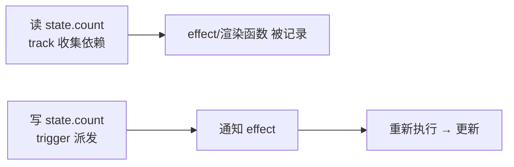

# 6.1 Vue3 响应式系统原理(Proxy / 依赖收集 / ref / reactive)

> 卷:卷六 · 框架核心 · Vue3
> 难度:⭐⭐⭐ 专家 | 阅读时间:35min | 状态:深度增强

---

## 引言:响应式 = "数据变,视图自动变"

理解响应式,才能解释"为什么改 `ref.value` 视图就更新""为什么 reactive 解构丢响应"。深挖要懂 **effect 栈与 scheduler** 这两个关键机制。

---

## 一、目标:数据 → 视图联动(一图)



---

## 二、Vue2 defineProperty → Vue3 Proxy

| | Vue2 | Vue3 |
|---|------|------|
| 拦截 | 逐属性 getter/setter | **整对象**代理 |
| 新增/删除属性 | ❌ 需 Vue.set | ✅ 天然 |
| 数组 | 下标/长度监听不到 | ✅ 原生拦截 |

**为什么 Proxy 更优?** `defineProperty` 只能盯死已有属性,新增/删除/数组是盲区;`Proxy` 在**对象层面**拦截所有操作(读/写/删/`has`/`in`),一劳永逸。

---

## 三、核心 API:reactive 与 ref

```js
const state = reactive({ count: 0 });
state.newKey = 1;              // ✅ Proxy 支持新增

const { count } = reactive({ count: 0 });  // ❌ 解构丢响应
const count = ref(0);
count.value++;                 // ✅ ref 用 .value
```

- `reactive`:只对对象,解构丢响应(需 `toRefs`)
- `ref`:任意值(原始值包对象),模板自动解包,取值要 `.value`

---

## 四、依赖收集与派发(底层:effect 栈 + scheduler)

```js
let activeEffect;                          // 当前执行的 effect
const targetMap = new WeakMap();           // target → key → Set<effect>

function reactive(obj) {
  return new Proxy(obj, {
    get(target, key, receiver) { track(target, key); return Reflect.get(target, key, receiver); },
    set(target, key, value, receiver) {
      const res = Reflect.set(target, key, value, receiver);
      trigger(target, key); return res;
    },
  });
}
function track(target, key) {
  let m = targetMap.get(target); if (!m) targetMap.set(target, (m = new Map()));
  let s = m.get(key); if (!s) m.set(key, (s = new Set()));
  if (activeEffect) s.add(activeEffect);
}
function trigger(target, key) {
  targetMap.get(target)?.get(key)?.forEach((e) => e());
}
function effect(fn) { activeEffect = fn; fn(); activeEffect = null; }
```

**两个深层点:**

1. **effect 栈**:`activeEffect` 要能处理**嵌套 effect**(effect 里再 effect),所以真实实现用 **栈** 存当前 effect,push/pop,而非单个变量。
2. **scheduler(调度器)**:Vue 触发更新不是"立刻执行 effect",而是有个 `scheduler`——多次修改会**合并成一次异步更新**(进微任务队列,如 `nextTick`),这就是"你连续改 3 次 count,视图只更新 1 次"的原因。

---

## 五、computed 与 watch(建立在响应式上)

```js
const c = computed(() => state.count * 2);   // 缓存:依赖不变不重算
watch(() => state.count, (nv, ov) => {});    // 侦听变化回调
```

- `computed`:惰性求值 + 缓存,本质是"可缓存的 effect"
- `watch`:显式侦听,可 deep/immediate

---

## 六、小结

```
响应式 = 读时 track + 写时 trigger
底层:Proxy 整对象代理;WeakMap(依赖账本);effect 栈(嵌套);scheduler(合并异步更新)
reactive(对象)vs ref(任意值,.value);解构丢响应 → toRefs
```

---

## 七、面试题

**Q1:Vue3 为什么用 Proxy 替代 Object.defineProperty?**

① 拦截**新增/删除/数组下标长度**等 defineProperty 管不到的;② **整对象**代理,初始化不用递归遍历每个属性;③ 省掉 Vue.set/Vue.delete 补丁,心智统一。

**Q2:reactive 解构后为什么丢失响应式?**

响应式在**代理对象**上,解构是"读取那一刻取出普通值",后续改这个普通变量不走 `setter`。解决:`toRefs` 转成 `ref`。

**Q3:为什么连续修改多次响应式数据,视图只更新一次?**

因为 **scheduler**:触发更新不是立刻同步执行 effect,而是进**微任务队列批量合并**(`nextTick`),一轮只重渲染一次。

**Q4:`ref` 和 `reactive` 的本质区别?各自适用?**

`ref` 包**任意值**(原始值包成对象,靠 `.value` 读写),模板自动解包;`reactive` 只对**对象**、`Proxy` 代理。单个原始值用 ref,对象可用 reactive 或 ref(内部会转 reactive)。

**Q5:嵌套 effect 里 `activeEffect` 为什么要用"栈"?**

因为 effect 可以**嵌套**(外层 effect 执行中又触发内层 effect),执行完内层要恢复到外层的 activeEffect。单变量会丢外层,用栈 push/pop 才能正确恢复。

**Q6:`computed` 的缓存是怎么实现的?**

computed 内部是"惰性 effect + 脏标记(dirty)":依赖不变时不重算、直接返回缓存值;依赖变了标记 dirty,下次访问才重算。这就是"computed 比 method 高效"的原因。

---

📎 参考:Vue 官方文档《Reactivity in Depth》、Vue reactivity 源码