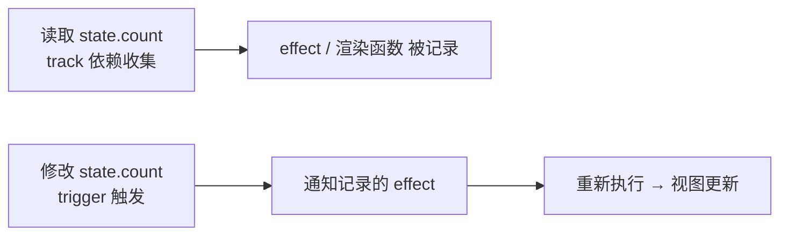

# 6.1 Vue3 响应式系统原理(Proxy / 依赖收集 / ref / reactive)

> 卷:卷六 · 框架核心 · Vue3
> 难度:⭐⭐⭐ 专家 | 阅读时间:30min | 状态:进行中

---

## 引言:响应式 = "数据变,视图自动变"

Vue 的招牌能力就是**响应式**。理解它,才能解释"为什么改了 `ref.value` 视图就更新""为什么 `reactive` 解构会丢响应"。这一章拆到底层:**Proxy + 依赖收集 + 派发更新**。

---

## 一、目标:数据 → 视图 的自动联动

```js
const state = reactive({ count: 0 });
// 渲染里读了 state.count          ← 步骤① 读时:记录"谁依赖了 count"
state.count++;                     ← 步骤② 写时:通知依赖者重新执行
// 视图自动更新
```

**三步核心:**



---

## 二、Vue2 的 Object.defineProperty → Vue3 的 Proxy

| | Vue2(defineProperty) | Vue3(Proxy) |
|---|----------------------|-------------|
| 拦截 | 逐属性 `getter/setter` | **整对象**代理,任意属性 |
| 新增属性 | ❌ 需 `Vue.set` | ✅ 天然支持 |
| 删除属性 | ❌ 需 `Vue.delete` | ✅ 天然支持 |
| 数组 | 改下标/长度监听不到(需 hack) | ✅ 原生拦截 |
| 性能 | 初始化时递归遍历所有属性 | 惰性,用到才代理 |

**为什么 Proxy 更优?** `defineProperty` 只能"盯死已有属性",新增/删除/数组下标都是盲区,必须打补丁;`Proxy` 在**对象层面**拦截所有操作(读、写、删、`has`、`in`、`Reflect`),一劳永逸。

---

## 三、核心 API:reactive 与 ref

### 1. reactive(对象 → 响应式代理)

```js
import { reactive } from "vue";
const state = reactive({ count: 0, list: [] });
state.count++;              // 触发更新
state.newKey = 1;           // ✅ Proxy 支持新增
```

**限制(易错):** `reactive` 只对**对象**生效,且**解构会丢失响应**:

```js
const { count } = reactive({ count: 0 });
// ❌ count 现在是普通值,改了不触发更新
```

### 2. ref(任意值 → 响应式)

```js
import { ref } from "vue";
const count = ref(0);
count.value++;              // 通过 .value 读写
```

- `ref` 能包**原始值**(数字/字符串)
- 内部:原始值会被包进一个对象,再走 `getter/setter`
- 模板里自动解包:`<div>{{ count }}</div>`(不用写 `.value`)

> 记忆:`reactive` 管对象,`ref` 管单个值(尤其原始值);Vue3 内部 `ref` 用到对象时也会转 `reactive`。

---

## 四、依赖收集与派发更新(简化实现)

```js
// 一个极简响应式(帮助理解原理)
let activeEffect;                       // 当前正在执行的 effect
const targetMap = new WeakMap();        // 对象 → 属性 → 依赖集合

function reactive(obj) {
  return new Proxy(obj, {
    get(target, key, receiver) {
      track(target, key);               // ① 读:收集依赖
      return Reflect.get(target, key, receiver);
    },
    set(target, key, value, receiver) {
      const res = Reflect.set(target, key, value, receiver);
      trigger(target, key);             // ② 写:派发更新
      return res;
    },
  });
}

function track(target, key) {
  let depsMap = targetMap.get(target);
  if (!depsMap) targetMap.set(target, (depsMap = new Map()));
  let deps = depsMap.get(key);
  if (!deps) depsMap.set(key, (deps = new Set()));
  if (activeEffect) deps.add(activeEffect);
}

function trigger(target, key) {
  const deps = targetMap.get(target)?.get(key);
  deps?.forEach((effect) => effect());
}

function effect(fn) {
  activeEffect = fn;
  fn();                              // 执行中读到的响应式数据会收集到 fn
  activeEffect = null;
}
```

> 关键理解:`WeakMap<target, Map<key, Set<effect>>>` 这座三层结构,就是 Vue 响应式的"账本"——记录"哪个对象的哪个属性被哪些副作用依赖"。

---

## 五、依赖收集的"为什么"

**为什么运行时收集,而不是编译时静态分析?**

> 因为 JS 是动态语言,无法静态确定"这段代码会访问哪些响应式属性"。Vue 的选择是**运行时追踪**:`effect` 执行时,凡是被 `get` 到的响应式数据,都自动登记为该 `effect` 的依赖。这样依赖关系**永远准确**,且天然支持条件、循环等动态访问。

---

## 六、computed 与 watch(建立在响应式之上)

```js
import { computed, watch } from "vue";

const c = computed(() => state.count * 2);  // 缓存:依赖不变不重算
watch(() => state.count, (nv, ov) => {});   // 侦听变化回调
```

- `computed`:**惰性求值 + 缓存**,本质也是一个"可缓存的 effect"
- `watch`:**显式侦听**,可深度(`deep`)、可配置 `immediate`

---

## 七、小结

```
响应式 = 读时 track(收集依赖)+ 写时 trigger(派发更新)

底层:Proxy 整对象代理(优于 Vue2 的 defineProperty:新增/删除/数组都拦截)
结构:WeakMap<target, Map<key, Set<effect>>>
reactive:对象;ref:任意值(靠 .value,模板自动解包)
易错:reactive 解构丢响应;ref 取值要 .value
```

---

## 八、面试题

**Q1:Vue3 为什么用 Proxy 替代 Object.defineProperty?**

① 能拦截**新增、删除、数组下标/长度**等 defineProperty 管不到的操作;② **整对象**代理,不用初始化时递归遍历每个属性(惰性、更快);③ 省掉了 Vue2 的 `Vue.set`/`Vue.delete` 补丁,心智更统一。

**Q2:`reactive` 对象结构解构后为什么丢失响应式?**

`reactive` 的响应式在**代理对象**上,解构是在读取那一刻取出了**普通值**(`getter` 只返回了原始值),后续改这个普通变量不再走 `setter`,自然不触发更新。解决:用 `ref` 或用 `toRefs` 把每个属性转成 `ref`(`const { count } = toRefs(state)`)。

**Q3:简述 `computed` 和 `watch` 的区别和各自适用场景?**

`computed` 是**有缓存的派生值**,依赖不变不重算,适合"由已有状态计算出的值"(如合计、过滤列表);`watch` 是**副作用回调**,侦听变化执行任意逻辑(如请求数据、写日志、手动操作),适合"变化后要做一件事"。可用 `computed` 就别用 `watch` 去追值。

---

📎 参考:Vue 官方文档《Reactivity in Depth》《Reactivity API》、Vue 响应式源码(reactivity 包)