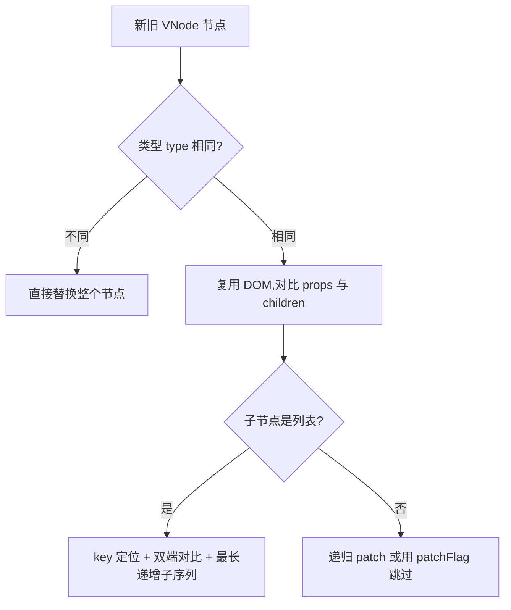

# 6.2 编译与渲染机制(VNode / Diff / 静态提升)

> 卷:卷六 · 框架核心 · Vue3
> 难度:⭐⭐⭐ 专家 | 阅读时间:30min | 状态:进行中

---

## 引言:模板怎么变成 DOM,VNode 又怎么高效更新

Vue 的 `<template>` 不是直接给浏览器的,要经过**编译 → 渲染函数 → VNode → Diff → patch**一整条流水线。理解它,才能明白 Vue3 相比 Vue2 快在哪,以及 `v-for` 的 `key` 为什么重要。

---

## 一、整条流水线


---

## 二、编译:模板 → 渲染函数

```html
<div id="app">{{ msg }}</div>
```

```js
// 编译出的 render 函数(简化)
function render(ctx) {
  return createElementVNode("div", { id: "app" }, ctx.msg);
}
```

- `<template>` 是**编译期**产物,运行时跑的是 render
- 用**构建时编译**(配合 Vite),而不是运行时解析,所以更快、更好优化

---

## 三、VNode:虚拟 DOM

**VNode** 是"用 JS 对象描述 DOM"的轻量表示:

```js
const vnode = {
  type: "div",              // 节点类型
  props: { id: "app" },     // 属性
  children: "...",          // 子节点
  // patchFlag、动态内容标记等(编译优化)
};
```

**为什么需要 VNode?**

> 直接操作真实 DOM **昂贵**(一次增删改都触发回流)。VNode 让框架在"**内存里的 JS 对象**"上先算好差异,再**一次性、最小化**地更新真实 DOM(呼应卷二 2.4:减少重排)。

---

## 四、Diff 算法:新旧 VNode 找差异

### 1. 核心思想:同层比较 + 只比较"可能变化"的



### 2. 列表 Diff:为什么 `key` 决定生死

```html
<li v-for="item in list" :key="item.id">{{ item.name }}</li>
```

- **有 key**:按 key 精确复用/移动 DOM,**最小更新**
- **无 key(或用 index)**:靠位置对比,列表插入/删除会导致**大量节点原地改**,甚至状态错乱(如输入框内容串位)

> `key` 是 Diff 复用节点的"身份证"。**列表一定用稳定唯一 key(如 id),别用 index**。

### 3. 优化:最长递增子序列(LIS)

Vue3 对"需要移动的节点"用 **LIS** 算法:找出"已经保持顺序的最长一段",只移动**不在**这段里的节点,把移动次数降到最低——这是 Vue3 Diff 相对 Vue2 的关键提速之一。

---

## 五、编译期优化(静态提升 / patchFlag / Block Tree)

Vue3 编译器在**编译期**就给 VNode 埋好优化信息:

### 1. 静态提升(Hoist)

```html
<div>这段文字永远不变</div>
```

不会变的 VNode 被**提到渲染函数外,只创建一次**,后续更新直接复用,不重创建。

### 2. patchFlag(动态标记)

```html
<div id="app" :class="cls">{{ msg }}</div>
<!-- 编译器标记:这个节点只有 class 和文本是动态的 -->
```

patchFlag 告诉运行时"**这个节点只有哪些部分可能变**",patch 时**跳过无关部分**,只对比动态点 → 大幅减少对比工作量。

### 3. Block Tree

把"动态节点"单独收集成一个数组,更新时**跳过整棵静态子树**,只在动态节点数组里 Diff——把 Diff 复杂度从"整棵树"降到"只有动态节点"。

> 三者合起来 = Vue3 "**编译期就把活干了一半**",运行期 Diff 只碰动态节点。

---

## 六、小结

```
流水线:template → 编译(render)→ VNode → Diff → patch → 真实 DOM

VNode:JS 对象描述 DOM,先在内存算差异再最小化更新
Diff:同层比较;列表靠 key 复用;LIS 减少移动
编译优化:静态提升(复用)/ patchFlag(只比动态)/ Block Tree(跳过静态子树)
key 铁律:稳定唯一 id,别用 index
```

---

## 七、面试题

**Q1:简述 Vue3 的 Diff 算法相比 Vue2 的优化?**

① 引入**静态提升**与 **Block Tree**,Diff 只针对"可能变化的动态节点",跳过静态子树;② 列表对比用**最长递增子序列(LIS)**把移动次数降到最低;③ 通过 **patchFlag** 精准标记动态点,减少无效对比。整体从"整树对比"退化为"精准最小更新"。

**Q2:为什么 `v-for` 的 key 要用唯一 id,而不是 index?**

Diff 用 key 判断"新旧节点是否同一节点"。用 `index` 时,列表头部插入/删除会导致**后续所有 index 变化**,节点被错误复用 → 输入框内容串位、状态错乱。用稳定 id,能精确复用与移动正确节点。

**Q3:虚拟 DOM 一定比直接操作 DOM 快吗?**

**不一定。** 虚拟 DOM 的价值是"**批量、最小化**更新 + 开发体验(声明式)";对**单次、精准**的 DOM 操作,直接改 DOM 更快。它本质是用"diff 计算开销"换"减少真实 DOM 开销",在大规模视图更新时收益显著;框架里常会配合编译优化(静态提升等)逼近"直接改 DOM"的性能。

---

📎 参考:Vue 官方文档《Rendering Mechanism》、Vue 3 Reactivity/Runtime 源码、尤雨溪关于 Diff 的分享