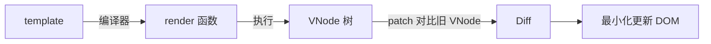
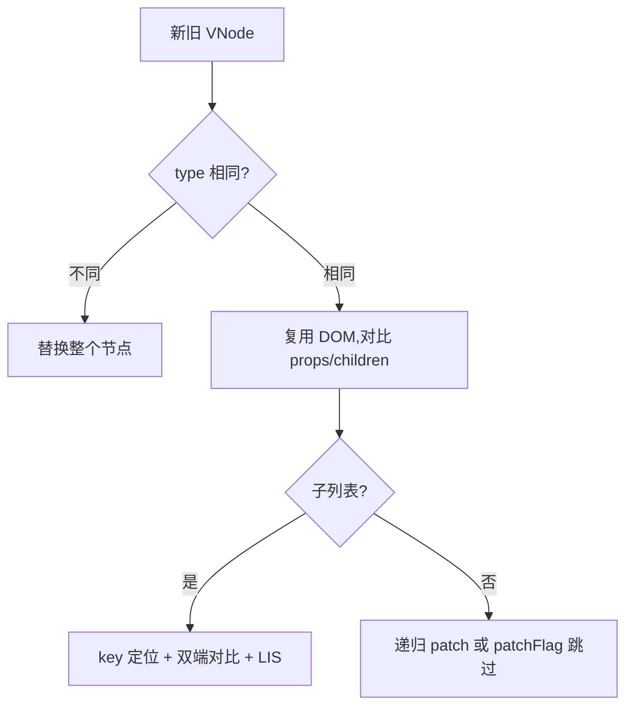

# 6.2 编译与渲染机制(VNode / Diff / 静态提升)

> 卷:卷六 · 框架核心 · Vue3
> 阅读时间:30min

---

## 引言:模板怎么变成 DOM,VNode 怎么高效更新

Vue 的 `<template>` 要经**编译 → 渲染函数 → VNode → Diff → patch** 整条流水线。深挖要懂 **patchFlag 位运算** 与 **Block Tree** 的跳过机制。

---

## 一、流水线



---

## 二、编译:模板 → 渲染函数

```html
<div id="app">{{ msg }}</div>
```

```js
function render(ctx) { return createElementVNode("div", { id: "app" }, ctx.msg); }
```

- `<template>` 是**编译期**产物,运行时跑 render
- 构建时编译(配合 Vite),更快、可优化

---

## 三、VNode:虚拟 DOM

**VNode(Virtual Node,虚拟节点)** 是"用 JS 对象描述 DOM"的轻量表示:

**为什么需要 VNode?** 直接操作真实 DOM 昂贵,VNode 让框架在**内存对象上先算差异**,再**一次性、最小化**更新真实 DOM(减少重排,呼应 [2.4](/卷二-浏览器工作原理/2.4-重排与重绘))。

---

## 四、Diff:新旧 VNode 找差异



- **key** 是 Diff 复用节点的"身份证",用稳定唯一 id,别用 index
- **LIS(最长递增子序列)**:只移动"不在已排序序列"里的节点,移动次数降到最低

---

## 五、编译期优化(底层:patchFlag 的位运算)

### 1. 静态提升(Hoist)

不变的 VNode 提到渲染函数外,只创建一次。

### 2. patchFlag(动态标记,位运算)

```html
<div :class="cls" id="app">{{ msg }}</div>
```

编译器给 VNode 打 **patchFlag**——一个**位标志**,标记"这个节点有哪些动态点"(class=1, text=2 等)。patch 时**按位判断**,只对比动态点,跳过无关部分。

> **为什么用位运算?** 一个数字的多位各自代表不同动态类型,`vnode.patchFlag & PatchFlags.TEXT` 这种**位与运算**极快地判断"是否有某类动态",省去逐个属性比对的开销。

### 3. Block Tree

把"动态节点"收集成一个数组,更新时**跳过整棵静态子树**,只在动态节点数组里 Diff——把复杂度从"整棵树"降到"只有动态节点"。

---

## 六、小结

```
流水线:template→编译(render)→VNode→Diff→patch→DOM
VNode:内存对象,先算差异再最小更更新
Diff:同层比较,key 复用,LIS 减移动
编译优化:静态提升 / patchFlag(位运算标记动态)/ Block Tree(跳过静态子树)
```

---

## 七、面试题

**Q1:简述 Vue3 Diff 相比 Vue2 的优化?**

① **静态提升 + Block Tree**,Diff 只针对动态节点,跳过静态子树;② 列表用 **LIS** 把移动降到最少;③ **patchFlag** 精准标记动态点。从"整树对比"退化为"精准最小更新"。

**Q2:为什么 v-for 的 key 要用唯一 id 而非 index?**

Diff 用 key 判断"新旧是否同一节点";用 index 时列表头插/删会导致后续 index 全变,节点被**错误复用**(输入框内容串位、状态错乱)。稳定 id 才能精确复用与移动。

**Q3:虚拟 DOM 一定比直接操作 DOM 快吗?**

不一定。虚拟 DOM 的价值是"**批量、最小化**更新 + 声明式体验";对**单次精准**操作,直接改 DOM 更快。它用"diff 开销"换"减少真实 DOM 开销",配合编译优化逼近"直接改 DOM"。

**Q4:patchFlag 是什么?为什么能提速?**

patchFlag 是编译期打在 VNode 上的**位标志**,标记"有哪些动态部分"。patch 时**位运算快速判断**只需对比动态点,跳过静态部分,大幅减少 diff 工作量。

**Q5:什么是 Block Tree?解决什么问题?**

编译器把**动态节点收集成一个数组(block)**,更新时直接在数组里 diff、跳过整棵静态子树。把 diff 复杂度从"整棵树"降到"只有动态节点",这是 Vue3 大型模板的性能关键。

**Q6:静态提升(hoist)如何减少开销?**

把"完全不变的 VNode"提到渲染函数外**只创建一次**,每次更新直接复用同一对象、跳过它的 diff。减少重复创建与对比,特别利于"大量静态内容 + 少量动态"的模板(Vapor 方向进一步发挥这点,见 [6.7](/卷六-框架核心Vue3/6.7-Vue3.5新特性与VaporMode))。

---

📎 参考:Vue 官方文档《Rendering Mechanism》、Vue runtime-core 源码