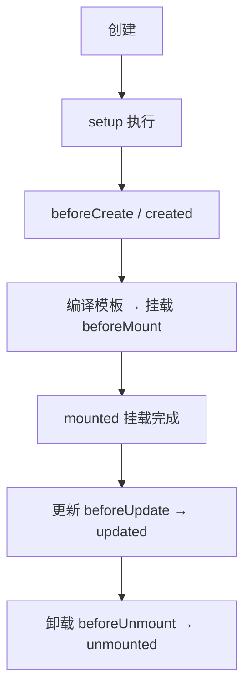

# 6.3 组合式 API 与生命周期

> 卷:卷六 · 框架核心 · Vue3
> 难度:⭐⭐ 进阶 | 阅读时间:25min | 状态:进行中

---

## 引言:从"散落各处的选项"到"按逻辑聚合"

Vue2 的 Options API 把同一功能的代码拆到 `data`/`methods`/`computed`/`watch` 各处,功能一大就"东一榔头西一棒槌"。组合式 API(Composition API)把**同一个逻辑相关的代码写在一起**,可复用、可推导、更易组织。

---

## 一、为什么需要组合式 API

**Options API 的痛点:**

```js
// 一个"搜索"功能散落在四个选项里
export default {
  data() { return { keyword: "", results: [] }; },
  methods: { async doSearch() { /* ... */ } },
  computed: { hasResult() { return this.results.length > 0; } },
  watch: { keyword() { this.doSearch(); } },
};
```

功能少还好,功能一多(搜索 + 分页 + 筛选…),每个选项越拉越长,相关代码被强制分离。

**组合式 API 的解法:**

```js
import { ref, computed, watch } from "vue";

function useSearch() {                // 一个组合函数,逻辑聚合
  const keyword = ref("");
  const results = ref([]);
  const hasResult = computed(() => results.value.length > 0);
  async function doSearch() { /* fetch(keyword.value) */ }
  watch(keyword, doSearch);
  return { keyword, results, hasResult, doSearch };
}

// 组件里
const { keyword, hasResult, doSearch } = useSearch();
```

> **关键词:按"逻辑关注点"组织,而不是按"选项类型"组织。**

---

## 二、setup 与 `<script setup>`

组合式 API 的入口是 `setup()`,现代写法用 `<script setup>`(编译期糖):

```vue
<script setup>
import { ref } from "vue";
const count = ref(0);
// 这里声明的变量/函数,模板里可直接用,自动暴露
</script>
<template>
  <button @click="count++">{{ count }}</button>
</template>
```

> `<script setup>` 是"编译宏",比手写 `setup() { return {...} }` 更省事,也支持**响应式 props 解构**(Vue 3.5+,见 6.7)。

---

## 三、核心 API 速查

| API | 用途 |
|-----|------|
| `ref` / `reactive` | 声明响应式数据(见 6.1) |
| `computed` | 缓存派生值 |
| `watch` | 侦听变化做副作用 |
| `watchEffect` | 自动追踪依赖执行副作用,无需手动列依赖 |
| `onMounted` 等 | 生命周期钩子 |

```js
watchEffect(() => {
  console.log(count.value);  // 自动追踪 count,变了就重跑
});
```

---

## 四、生命周期:选项式 ↔ 组合式对照



| 选项式 | 组合式 |
|--------|--------|
| `beforeCreate` | 无需(setup 即此时机) |
| `created` | 无需(setup 即此时机) |
| `beforeMount` | `onBeforeMount` |
| `mounted` | `onMounted` |
| `beforeUpdate` | `onBeforeUpdate` |
| `updated` | `onUpdated` |
| `beforeUnmount` | `onBeforeUnmount` |
| `unmounted` | `onUnmounted` |

> 关键词:组合式**去掉了 `beforeCreate/created`**(因为 `setup` 本身就在这两个之间执行),其余加 `on` 前缀。

---

## 五、组合函数(Composables):复用的真谛

把"一个功能的响应式逻辑"抽成函数,跨组件复用(比 mixin 更清晰、无命名冲突):

```js
// useMouse.js
import { ref, onMounted, onUnmounted } from "vue";
export function useMouse() {
  const x = ref(0), y = ref(0);
  const update = (e) => { x.value = e.pageX; y.value = e.pageY; };
  onMounted(() => window.addEventListener("mousemove", update));
  onUnmounted(() => window.removeEventListener("mousemove", update));
  return { x, y };
}
```

> 组合函数优于 mixin 的点:**命名空间清晰(需显式解构)、来源可追踪、无"暗箱合并"冲突**。这也是 Vue3 复用的主流范式。

---

## 六、小结

```
组合式 API 核心:按"逻辑关注点"组织代码(setup + 组合函数)

vs Options API:相关代码聚合、可复用、类型推导更好
生命周期:on 前缀,无 beforeCreate/created(setup 本身即此时机)
组合函数:跨组件复用逻辑,优于 mixin(清晰、可追踪)
```

---

## 七、面试题

**Q1:为什么 Vue3 引入组合式 API?它比 Options API 好在哪里?**

① **逻辑聚合**:同一功能的代码写在一起,不再散落 data/methods/computed;② **可复用**:抽成组合函数跨组件复用(优于 mixin);③ **类型推导更好**(TS 下 setup 更友好);④ **可维护性**:功能复杂时不会"选项越长越乱"。代价是有一定学习成本。

**Q2:`watch` 和 `watchEffect` 的区别?**

`watch` 需要**显式指定**侦听源,可以拿到**新旧值**、配置 `immediate`/`deep`;`watchEffect` **自动追踪**回调里用到的所有响应式依赖,无需手动列,但不直接给旧值、且立即执行一次。能用 `watchEffect` 写清就用它,需要旧值/精确控制用 `watch`。

**Q3:组合式 API 里如何做"组件销毁时清理"?**

用 `onUnmounted`(或 `onBeforeUnmount`)注册清理;`watch`/`watchEffect` 的返回是停止函数,也可在清理里调用。典型如移事件监听、清定时器——保证组件卸载后无泄漏(呼应卷二 2.6 内存泄漏)。

---

📎 参考:Vue 官方文档《Composition API FAQ》《Lifecycle Hooks》《Composables》