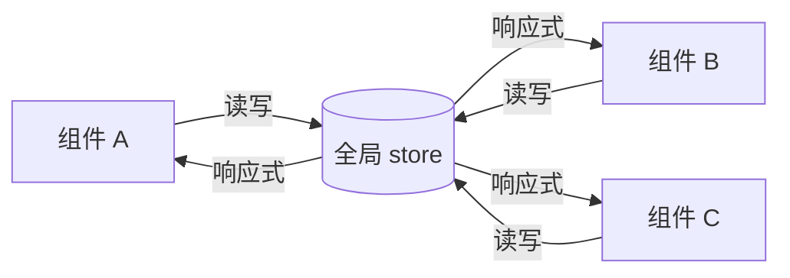

# 6.4 状态管理(Pinia)

> 卷:卷六 · 框架核心 · Vue3
> 难度:⭐⭐ 进阶 | 阅读时间:20min | 状态:进行中

---

## 引言:跨组件共享状态,靠"传 props"会疯

当多个组件都要读写同一份状态(用户信息、购物车、主题),靠 `props` + `emit` 层层传递会变成"prop drilling"。状态管理库就是为"**全局共享 + 可预测更新**"而生。Vue3 官方推荐 **Pinia**(Vuex 的继任者)。

---

## 一、为什么需要状态管理



- **多个组件共享**同一状态,直接读 store、无需层层传
- **集中管理**:状态变化来源单一、可追踪(DevTools 时间旅行)

---

## 二、Vuex vs Pinia

| | Vuex 4 | Pinia |
|---|--------|-------|
| 语法 | 繁琐(mutations/actions 分离) | **简洁**(直接改 state) |
| 类型支持 | 弱 | **原生极致**(TS 友好) |
| 模块 | 嵌套 modules(笨重) | **扁平 store(+combine)** |
| Mutation | 必须有 | **去掉了 mutation** |
| 体积/心智 | 重 | 轻 |

> Pinia 直接干掉 mutation,`state` 可被直接改(内部交给响应式),心智大幅简化。
>
> **为什么去掉 mutation?** Vuex 的 mutation 是"同步专属修改口"?初衷是让每个状态变更可追溯;但实际它增加了样板代码、又无法阻止你在 action 里做异步。既然 Vue3 的响应式已经能追踪到 `state.xxx = y` 的每条变更,再单独搞一层 mutation 就是纯仪式——所以 Pinia 删掉它,靠 DevTools 从响应式层面追踪即可。

---

## 三、定义 store 的两种写法

### 1. Setup Store(推荐,贴合组合式)

```js
import { defineStore } from "pinia";
import { ref, computed } from "vue";

export const useCartStore = defineStore("cart", () => {
  const items = ref([]);

  const total = computed(() => items.value.reduce((s, i) => s + i.price, 0));

  function add(item) { items.value.push(item); }

  return { items, total, add };
});
```

### 2. Option Store(更接近 Vuex)

```js
export const useCartStore = defineStore("cart", {
  state: () => ({ items: [] }),
  getters: { total: (s) => s.items.reduce((a, i) => a + i.price, 0) },
  actions: { add(item) { this.items.push(item); } },
});
```

---

## 四、在组件里用

```vue
<script setup>
import { storeToRefs } from "pinia";
import { useCartStore } from "./cart";

const cart = useCartStore();
const { items, total } = storeToRefs(cart); // 解构不丢响应(相比 reactive 的坑)
// 方法直接解构:const { add } = cart;
</script>
<template>
  {{ total }} 件商品,调用 add()...
</template>
```

> **易错点:** `store` 的属性直接解构会丢响应(同 6.1 的 reactive 坑),所以要 `storeToRefs`;`actions` 是普通函数,可直接解构。

---

## 五、小结

```
状态管理 = 解决"跨组件共享 + 集中管理"
Pinia(官方推荐,取代 Vuex):去 mutation、TS 友好、扁平 store

定义 defineStore(两种写法:setup store / option store)
使用 useCartStore();解构用 storeToRefs(留响应)
```

---

## 六、面试题

**Q1:Pinia 相比 Vuex 有哪些改进?**

① 去掉了 `mutation`,`state` 可直接改(内部仍响应式);② **TS 类型推导向好**;③ 扁平化 store,不再层层嵌套 modules;④ 支持**两种写 store 的方式**(setup/option);⑤ API 更简洁、体积更轻。

**Q2:为什么 `store` 解构时要用 `storeToRefs`?**

store 的属性是响应式的,若直接 `const { items } = store` 解构,拿到的是**普通值**,失去响应(与 `reactive` 解构同理)。`storeToRefs` 把每个 `state`/`getter` 转成 `ref`,解构后仍响应;`actions` 是函数,可直接解构。

**Q3:什么时候需要状态管理,什么时候不需要?**

**需要**:多个不相关组件共享同一份可变状态(用户/购物车/全局主题),且状态更新要可追踪。**不需要**:只在父子间传、或组件局部状态(用组件内 `ref` 就好)——**能局部就别全局**,滥用全局 store 反而难维护。

---

📎 参考:Pinia 官方文档《Getting Started》《Setup Stores》