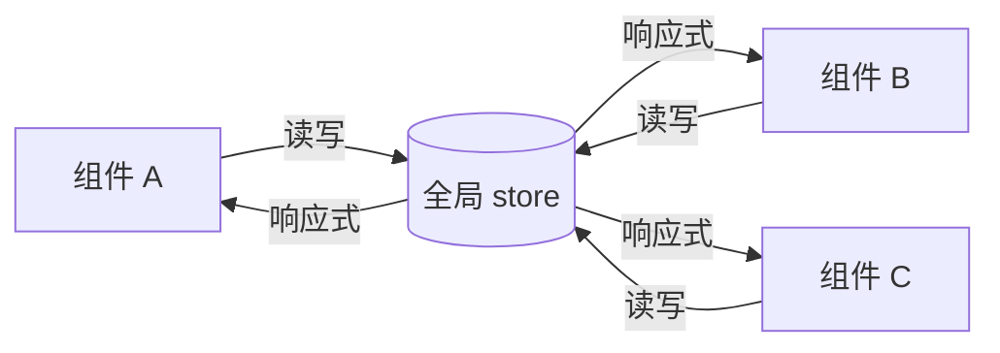

# 6.4 状态管理(Pinia)

## 引言:跨组件共享状态,靠"传 props"会疯

当多组件读写同一份状态,props 层层传会变 "prop drilling"。状态管理库为"**全局共享 + 可预测更新**"而生。Pinia 是官方推荐的 Vuex 继任者。深挖要懂 **storeToRefs 为什么必要**。

---

## 一、为什么需要状态管理



---

## 二、Vuex vs Pinia

| | Vuex 4 | Pinia |
|---|--------|-------|
| 语法 | 繁琐(mutation/action 分离) | **简洁**(直接改 state) |
| 类型 | 弱 | **原生极致** |
| 模块 | 嵌套 modules | **扁平 store** |

**为什么去掉 mutation?** Vuex 的 mutation 初衷是"变更可追溯",但增加样板、又拦不住 action 里异步。Vue3 响应式已能追踪 `state.x=y` 的每次变更,再单设 mutation 就是纯仪式——所以 Pinia 删掉它,靠 DevTools 从响应式层面追踪。

---

## 三、两种 store 写法 + 使用

::: code-group

```js [Setup Store(推荐)]
export const useCart = defineStore("cart", () => {
  const items = ref([]);
  const total = computed(() => items.value.reduce((s, i) => s + i.price, 0));
  function add(item) { items.value.push(item); }
  return { items, total, add };
});
```

```js [Option Store]
export const useCart = defineStore("cart", {
  state: () => ({ items: [] }),
  getters: { total: (s) => s.items.reduce((a, i) => a + i.price, 0) },
  actions: { add(item) { this.items.push(item); } },
});
```

:::

```vue
<script setup>
import { storeToRefs } from "pinia";
const cart = useCart();
const { items, total } = storeToRefs(cart);  // 解构不丢响应
const { add } = cart;                          // actions 可直接解构
</script>
```

**为什么解构要 storeToRefs?** store 的属性是响应式的,直接 `const { items } = store` 拿到的是**普通值**(失去响应,同 reactive 解构的坑);`storeToRefs` 把 state/getter 转成 ref,解构后仍响应;actions 是普通函数,可直接解构。

---

## 四、小结

```
状态管理 = 解决"跨组件共享 + 集中管理"
Pinia:去 mutation(响应式已可追踪)、TS 友好、扁平 store
定义:defineStore(setup/option);使用 useXxx();解构用 storeToRefs
```

---

## 五、面试题

**Q1:Pinia 相比 Vuex 有哪些改进?**

① 去掉 mutation,state 可直接改;② **TS 类型推导向好**;③ 扁平 store,不嵌套 modules;④ 两种写 store 方式;⑤ API 更简洁、体积更轻。

**Q2:为什么 store 解构要 storeToRefs?**

store 属性是响应式的,直接解构拿到普通值、失去响应(同 reactive 坑);`storeToRefs` 转成 ref 保留响应;actions 是函数可直接解构。

**Q3:什么时候需要状态管理,什么时候不需要?**

需要:多个不相关组件共享同一份可变状态,且更新要可追踪。不需要:父子传、组件局部状态(用 ref 就好)——**能局部就别全局**,滥用难维护。

**Q4:Setup Store 和 Option Store 的区别?选哪个?**

Setup Store 用**组合式**(ref/computed/函数),更贴合 `<script setup>`、类型更好,推荐;Option Store 用 state/getters/actions,更接近 Vuex,迁移顺手。两者功能等价。

**Q5:Pinia 的 store 为什么是"扁平"的,没有嵌套 modules?**

扁平 store 让每个 store 独立、可直接 `useXxx()` 引入,避免 Vuex 嵌套模块的"命名空间 + 多层 this"心智负担。要组合可用 `store1` 里调 `useStore2()`,更灵活。

**Q6:Pinia 如何做到"可时间旅行/可追踪"?**

虽然去掉了 mutation,但响应式系统 + DevTools 的追踪仍能记录 `state` 的每次变更与调用栈,实现与 Vuex 类似的调试/回放能力——所以删除 mutation 不损失可追踪性。

---

📎 参考:Pinia 官方文档《Getting Started》《Setup Stores》