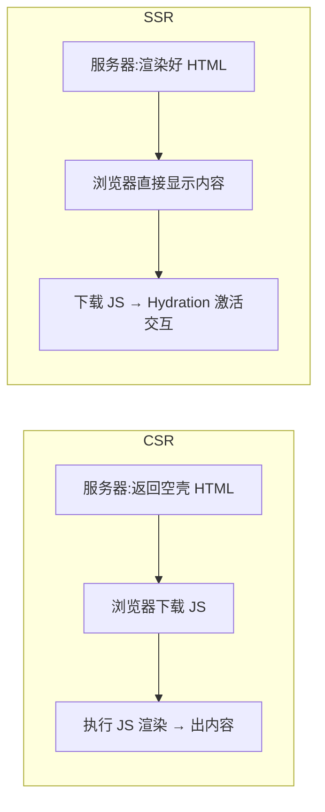

# 6.6 服务端渲染与 Nuxt(SSR / SSG / Hydration)

> 卷:卷六 · 框架核心 · Vue3
> 难度:⭐⭐⭐ 专家 | 阅读时间:25min | 状态:进行中

---

## 引言:CSR 的"空白首屏",SSR 来救

纯 CSR(客户端渲染)下,首屏是一个**空 HTML + 一堆 JS**,要等 JS 下载执行完才出内容。SSR(服务端渲染)在服务器就把 HTML 渲染好,首屏"秒出内容"。本章讲原理、Hydration,以及 Nuxt 这个 Vue 全家桶框架。

---

## 一、CSR vs SSR 的本质差异



| | CSR | SSR |
|---|-----|-----|
| 首屏 | 空白 → 内容(慢) | **直接有内容(快)** |
| SEO | 差(爬虫难解 JS) | **好**(HTML 带内容) |
| JS 阻塞体验 | "白屏等待" | "有内容的等待" |
| 服务器压力 | 低(静态托管) | 高(每次渲染) |

> SSR 不是"消除 JS 阻塞",而是**提前提供内容**,把"白屏煎熬"变成"有内容的等待"。

---

## 二、Hydration(水合):SSR 的关键一步

SSR 返回的 HTML 是**静态的**(没事件),Hydration 就是:

```
服务端渲染的 HTML(有内容、无交互)
        ↓ 浏览器下载同款 JS
在已渲染的 DOM 上"激活"组件(绑定事件、建立响应式)
        ↓
变成可交互的 Vue 应用
```

> Hydration 要求**客户端渲染结果与 SSR 完全一致**,否则会报 hydration mismatch(常见于用了 `Math.random()`/`localStorage`/时间等非确定值)。

---

## 三、SSR / SSG / ISR:三种渲染模式

| 模式 | 何时渲染 | 适用 |
|------|---------|------|
| **SSR** | 每次请求都渲染 | 个性化、实时数据 |
| **SSG** | 构建时渲染(静态) | 博客、文档、营销页 |
| **ISR** | 构建 + 定时/按需再生成 | 更新不频繁的内容站 |

> 记忆:SSR"**每请求渲染**",SSG"**构建时渲染**",ISR"**构建后按需再渲染**"——都为了"内容提前就绪 + SEO 友好"。

---

## 四、Nuxt:Vue 的全栈框架

Nuxt 在 Vue 之上封装了**约定式路由、自动导入、SSR/SSG、数据获取、服务端 API**:

```
nuxt-app/
├── pages/          ← 文件即路由(约定式)
│   └── index.vue
├── server/         ← 服务端 API(可选)
├── composables/    ← 自动导入组合函数
└── nuxt.config.ts  ← 配置(渲染模式等)
```

```ts
// nuxt.config.ts
export default defineNuxtConfig({
  // 默认 SSR;可切 ssr: false 或生成静态站
  ssr: true,
});
```

- **`useFetch` / `$fetch`**:服务端/客户端统一的数据获取
- **自动导入**:组件、组合函数免手动 import
- **Nitro 引擎**:统一部署到 Node/Serverless/边缘

---

## 五、小结

```
CSR:服务器给空壳 + JS 白屏;SSR:服务器给内容 + Hydration 激活

Hydration:在 SSR 静态 HTML 上"激活"交互;要求两端渲染一致(避免 mismatch)
三模式:SSR(每请求)/ SSG(构建时)/ ISR(按需再生成)
Nuxt:约定式路由 + 自动导入 + Nitro,+ useFetch 统一数据
适用:内容站/SEO 强 → SSR/SSG;后台/强交互 → CSR
```

---

## 六、面试题

**Q1:SSR 相比 CSR 的优缺点?**

**优点**:① 首屏快(服务端就绪 HTML);② **SEO 好**(爬虫直接拿到内容);③ 弱网下有内容可见。**缺点**:① **服务器压力大**(每次渲染);② 复杂度高(两端环境差异、Hydration);③ 部署与监控成本上升。适合内容站/营销页,不适合重交互后台。

**Q2:什么是 Hydration?为什么要求"两边渲染一致"?**

Hydration 是"在 SSR 输出静态 HTML 上,用同款 JS 绑定事件、建立响应式"的过程。要求客户端渲染结果与 SSR **一致**,是避免 DOM 结构对不上(比如 SSR 里 `count` 是 0,客户端却算出 1)→ 触发 hydration mismatch 报错或重复渲染。所以要避免 `random`/`Date.now`/`localStorage` 等非确定值直接进首屏。

**Q3:SSR、SSG、ISR 分别指什么?**

SSR 每次请求都在服务器渲染(个性化/实时);SSG 构建时生成静态 HTML(博客/文档,CDN 托管);ISR 介于两者:构建后按需/定时再生成部分页面(更新不频繁内容)。三者都追求"内容提前就绪 + SEO 友好"。

---

📎 参考:Vue SSR 官方指南、Nuxt 官方文档《Rendering Modes》