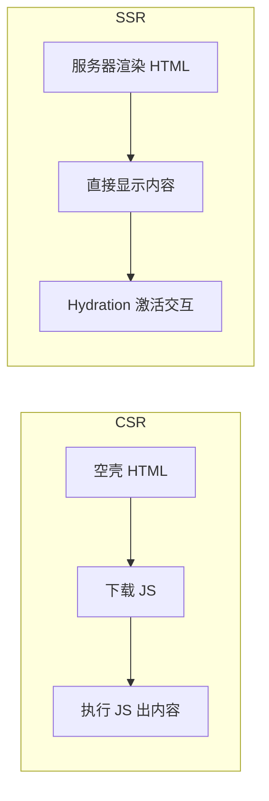
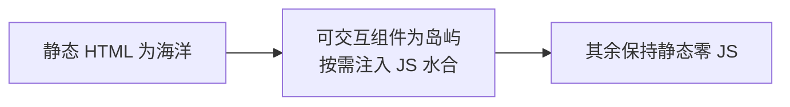

# 6.6 服务端渲染与 Nuxt(SSR / SSG / Hydration)

> 卷:卷六 · 框架核心 · Vue3
> 阅读时间:25min

---

## 引言:CSR(Client-Side Rendering,客户端渲染)的"空白首屏",SSR(Server-Side Rendering,服务端渲染)来救

纯 CSR 首屏是"空 HTML + 一堆 JS";SSR 在服务器把 HTML 渲染好,首屏"秒出内容"。深挖要懂 **Hydration 的一致性问题** 与三种渲染模式的取舍。

---

## 一、CSR vs SSR



| | CSR | SSR |
|---|-----|-----|
| 首屏 | 慢(白屏) | **快** |
| SEO | 差 | **好** |
| 服务器压力 | 低 | 高 |

---

## 二、Hydration:水合

SSR 返回的 HTML 是**静态的**(无事件),Hydration 就是:

```
SSR 静态 HTML(有内容、无交互)
  ↓ 下载同款 JS
在已渲染 DOM 上"激活"组件(绑事件、建响应式)
  ↓
变成可交互应用
```

**为什么要求"两端渲染一致"?** Hydration 用"已有 DOM"做基准,**客户端渲染结果必须与 SSR 一致**,否则 DOM 结构对不上 → hydration mismatch。所以要避免 `random`/`Date.now`/`localStorage` 等非确定值直接进首屏。

---

## 三、SSR / SSG / ISR(三模式)

| 模式 | 何时渲染 | 适用 |
|------|---------|------|
| SSR | 每次请求 | 个性化、实时 |
| SSG | 构建时 | 博客、文档 |
| ISR | 构建 + 按需再生成 | 更新不频繁内容 |

> SSR"每请求",SSG"构建时",ISR"构建后按需再渲染"。全称:SSG = Static Site Generation(静态站点生成);ISR = Incremental Static Regeneration(增量静态再生成)。

---

**Islands 岛屿架构(HTML-first + 局部水合,2026 前沿):**



> 相比 SPA/SSR 的"**整树水合**",Islands 只对**可交互的部分**水合,其余保持纯静态 HTML → 首屏 JS 极小。代表框架 **Astro**(用 `client:*` 指令控制每个组件的加载/水合策略):

- `client:load` 立即水合;`client:idle` 空闲时;`client:visible` 进入视口时;`client:only` 纯客户端
- 与 RSC(见 7.7)同属"**服务端优先 + 按需交互**"的演进方向;与 SSG 的区别是"**组件级**控制水合"而非整页

---

## 四、Nuxt:全栈框架

```
nuxt-app/
├── pages/          ← 文件即路由(约定式)
├── server/         ← 服务端 API
├── composables/    ← 自动导入
└── nuxt.config.ts  ← 渲染模式配置
```

```ts
export default defineNuxtConfig({ ssr: true });
```

- **约定式路由 + 自动导入**:免手写路由、免 import
- **Nitro 引擎**:统一部署到 Node/Serverless/边缘
- `useFetch`/`$fetch`:服务端/客户端统一数据获取

---

## 五、小结

```
CSR(白屏)vs SSR(首屏内容 + Hydration 激活)
Hydration:在静态 HTML 上激活交互;要求两端渲染一致(避 mismatch)
三模式:SSR(每请求)/SSG(构建时)/ISR(按需)
Nuxt:约定式路由 + 自动导入 + Nitro
```

---

## 六、面试题

**Q1:SSR 相比 CSR 的优缺点?**

优点:① 首屏快;② **SEO 好**;③ 弱网有内容。缺点:① 服务器压力大;② 复杂度高(两端环境 + Hydration);③ 部署监控成本。适合内容站,不适合重交互后台。

**Q2:什么是 Hydration?为什么要求"两边渲染一致"?**

在 SSR 静态 HTML 上用同款 JS**绑定事件、建立响应式**的过程。要求一致是避免 DOM 对不上(如 SSR 里 count=0、客户端算成 1)→ hydration mismatch 报错/重复渲染。

**Q3:SSR、SSG、ISR 分别指什么?**

SSR 每次请求都服务器渲染;SSG 构建时生成静态 HTML;ISR 构建后按需/定时再生成部分页面。都追求"内容提前就绪 + SEO 友好"。

**Q4:哪些场景适合 CSR 而非 SSR?**

**后台管理系统、强交互应用**(在线 IDE、编辑器)——首屏快感不敏感、SEO 不敏感,SSR 的服务器成本与复杂度不划算,CSR 更简单高效。

**Q5:Nuxt 相比"纯 Vue + 手搭 SSR"的优势?**

开箱即用:约定式路由、自动导入、渲染模式配置、Nitro 部署、统一数据获取,省大量配置与胶水代码,是 Vue 做 SSR 的首选全家桶。

**Q6:SSR 里如何避免 Hydration mismatch?**

保证**首屏渲染的结果不依赖客户端非确定环境**:不用 `Math.random`/`Date.now`/`localStorage` 直接渲染首屏;SSR 与客户端用同一数据(如 `onServerPrefetch` 统一取数);或在 `onMounted`(客户端才执行)里做依赖浏览器的操作。

---

📎 参考:Vue SSR 官方指南、Nuxt 文档《Rendering Modes》