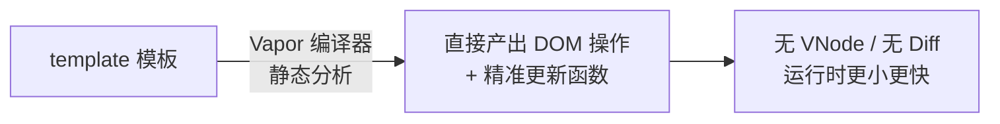

# 6.7 Vue 3.5+ 新特性 / Vapor Mode / Vue 4 前瞻

## 引言:Vue 在"更少内存、更快"上继续卷

3.x 持续小版本迭代,而 **Vapor Mode** 是方向级探索——**去掉虚拟 DOM**,编译期直接产出"精准更新真实 DOM"的代码。深挖要懂 Vapor 与"编译期优化"的延续关系。

---

## 一、Vue 3.5 关键新特性

| 特性 | 说明 |
|------|------|
| **响应式 props 解构** | 直接解构 props 仍响应(编译器改写) |
| `useId()` | 生成 SSR/CSR 一致的唯一 id |
| `useTemplateRef()` | 更清晰的模板 ref |
| `onWatcherCleanup` | 注册 watch 清理 |

```vue
<script setup>
const { count = 0 } = defineProps({ count: Number });  // 3.5:解构仍响应
const inputRef = useTemplateRef("input");
onMounted(() => inputRef.value.focus());
</script>
```

---

## 二、Vapor Mode:去虚拟 DOM



| | 现在(VNode) | Vapor |
|---|-------------|-------|
| 运行时 | 响应式 + Diff + VNode | 仅响应式 |
| 更新 | 运行时 Diff | **编译期生成精准更新** |
| 体积 | 较大 | **更小** |

---

## 三、底层:Vapor 是"编译期优化"的延续

> Vapor 不是凭空来的,它是 Vue3 已有的**静态提升、patchFlag、Block Tree**(6.2)走到极致的形态:既然模板是静态可分析的,就把原本运行时做的 Diff **整个搬到编译期**,直接生成"改这一个节点"的更新函数。本质 = **"能确定的事都在构建时算好"**,与 Svelte 的编译思路一脉相承。

**对开发者几乎无感**:仍写 `<template>` + 组合式 API,只是编译产物不同。

---

## 四、现状与定位

- 作为**可选编译模式**逐步落地,组件级可切换
- 目标:纯模板 + 不依赖 vDOM 的场景获得"更小、更快"
- 心智无变化,编译产物不同

---

---

**Vue 4.0 前瞻:分层渲染(2026 最新):**

2026 年 7 月 Vue&ViteConf 上,尤雨溪正式宣布 **Vue 4.0 进入开发**。两个关键边界:

- **3.6 是 4.0 的铺垫版**:3.6 搭载的底层重构、性能优化、新语法(含 Vapor 稳定化),全是给 4.0 铺路
- **4.0 无断崖式破坏性更新**:底层重写,但**上层 API 完全兼容**(区别于 Vue2→Vue3 的大断层),老项目迁移成本极低

**"分层渲染(Layered Rendering)"才是终极答案:**

Vapor Mode 性能已直逼 Solid/Svelte 5(官方基准:1 万组件初始渲染 125ms→32ms 快 4 倍;单属性更新 8ms→0.8ms 快 10 倍;首次 JS 体积降 2/3)。但 Vue 的未来**不是用 Vapor 取代 vDOM**,而是**分层渲染的混合架构**——按场景选择不同的性能优化层,所有层无缝协作:

```
高交互/动态组件 → 传统 vDOM 层(灵活)
纯模板/静态为主 → Vapor 层(极致性能)
        └── 两层可混用,按组件粒度切换
```

> Vapor 是"新起点"不是"终点";Vue 4 的本质是把"vDOM 的灵活"和"编译的极致"做成分层可选的架构。

## 五、小结

```
3.5+:响应式 props 解构 / useId / useTemplateRef / onWatcherCleanup
Vapor:去 VNode/Diff,编译器直出精准更新;运行时更小更快
底层:静态提升/patchFlag/Block Tree 的极致——编译期把 Diff 算完
```

---

## 六、面试题

**Q1:Vue 3.5 的"响应式 props 解构"解决了什么?**

之前解构 props 丢响应(需 toRefs);3.5 起编译器**自动改写**解构为 `props.x` 的响应式访问,直接解构也响应、还能类型推导默认值。

**Q2:Vapor Mode 是什么?和现在渲染有何本质不同?**

Vapor 是**无虚拟 DOM 的编译模式**:利用模板静态可分析,在**编译期**直接生成"精准更新真实 DOM"的代码,运行时**去掉 VNode 与 Diff**,换更小体积、更快更新。开发者仍写模板。

**Q3:为什么说 Vapor 是"编译期优化"趋势的代表?**

它把运行时要做的事(Diff、找差异)**提前到编译期算好**,运行时只留必要逻辑。与静态提升、patchFlag、Block Tree、以及 Svelte 思路一脉相承:**能确定的都在构建时解决**。

**Q4:Vapor 会不会改变开发者写代码的方式?**

基本**不会**——还是写 `<template>` + 组合式 API,v-for/指令/key 仍可用,只是编译策略变了。这是它"无感升级"的设计目标。

**Q5:`useTemplateRef` 相比传统字符串 ref 有什么好处?**

传统写法靠"同名 ref 变量 + 隐式绑定",容易搞混;`useTemplateRef("input")` 显式、类型推断更好,避免命名冲突。

**Q6:Vapor 模式对"模板 + 依赖虚拟 DOM 的场景"有限制吗?**

Vapor 面向**纯模板、不依赖 vDOM 的场景**生效;需要 vDOM 能力的(如渲染函数、动态组件库)仍用现有模式。它以**可选/可切换**方式推进,而非强制替换。

---

📎 参考:Vue 官方博客《Vue 3.5 released》、Vapor Mode RFC