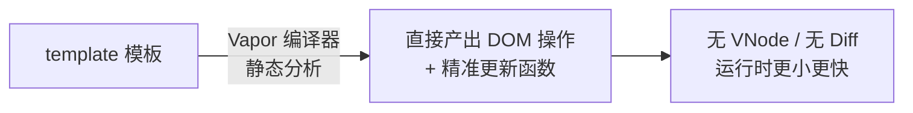

# 6.7 Vue 3.5+ 新特性与 Vapor Mode

> 卷:卷六 · 框架核心 · Vue3
> 难度:⭐⭐ 进阶(前沿) | 阅读时间:20min | 状态:进行中

---

## 引言:Vue 在"更少内存、更快"上继续卷

Vue 3.x 发布后持续小版本迭代(3.4、3.5…),每版都在补响应式、DX、性能;而 **Vapor Mode** 是方向级的探索——**去掉虚拟 DOM**,用编译期直接产出"精准更新真实 DOM"的代码。

---

## 一、Vue 3.5 的关键新特性(挑高频)

| 特性 | 说明 |
|------|------|
| **响应式 props 解构** | 直接解构 props 仍保持响应式(编译器魔法) |
| `useId()` | 生成 SSR/CSR 一致的唯一 id |
| `useTemplateRef()` | 更清晰的模板 ref 获取(取代字符串 ref) |
| `reactive` 的 watch | `watch` 直接接收 `getter` 之外的简化 |
| `onWatcherCleanup` | 注册 watch 清理回调 |

### 1. 响应式 props 解构(最实用)

```vue
<script setup>
// Vue 3.3 之前:解构 props 会丢响应
// Vue 3.5+:默认支持,且用 Props 类型推导默认值
const { count = 0 } = defineProps({ count: Number });
// count 仍是响应式的(自动走了 props.count.value 的编译改写)
</script>
```

### 2. useTemplateRef

```vue
<script setup>
import { useTemplateRef, onMounted } from "vue";
const inputRef = useTemplateRef("input");
onMounted(() => inputRef.value.focus());
</script>
<template><input ref="input"></template>
```

> 相比旧写法 `ref(null)` + 同名 template ref 的隐式绑定,`useTemplateRef` 更显式、类型更好。

---

## 二、Vapor Mode:去虚拟 DOM 的编译模式

### 1. 它要解决什么

Vue 的运行时(响应式 + Diff)有固定体积和计算开销;Vapor 想:"既然模板是**静态可分析**的,能不能**编译期**就生成'直接操作 DOM 的精准更新'代码,连虚拟 DOM 都省掉?"

### 2. 核心思路



**对比:**

| | 现在(VNode 模式) | Vapor Mode |
|---|------------------|------------|
| 运行时 | 响应式 + Diff + VNode | 仅响应式(无 Diff/VNode) |
| 更新 | 运行时 Diff | **编译期生成精准更新** |
| 体积 | 较大 | **更小** |
| 心智 | 无需关心 | 对开发者无感(仍写模板) |

### 3. 现状与定位

- 作为 **可选编译模式**逐步落地(实验/渐进),组件级可切换
- 目标:**纯模板 + 不依赖虚拟 DOM 的场景**获得"更小、更快"
- 对开发者**心智几乎无变化**(还是写 `<template>` + 组合式 API),只是编译产物不同

> 有意思的是:`key`、`v-for`、指令在 Vapor 下仍可用,只是编译策略变了。它代表 Vue 在"IE 已死、现代浏览器主导"背景下的**编译期极致优化**方向。

---

## 三、小结

```
Vue 3.5+:响应式 props 解构 / useId / useTemplateRef / onWatcherCleanup
(都是 DX 与响应式的收尾优化)

Vapor Mode:去 VNode/Diff,编译器直出"精准更新真实 DOM"的代码
├─ 收益:运行时更小、更新更快
├─ 前提:静态模板可分析(现代浏览器,JIT/编译期优化)
└─ 对开发者无感(仍写模板 + 组合式 API)
```

---

## 四、面试题

**Q1:Vue 3.5 的"响应式 props 解构"解决了什么问题?**

之前 `<script setup>` 里解构 props(`const { name } = props`)会**丢失响应式**,大家常用 `toRefs(props)` 绕。3.5 起编译器**自动改写解构**为走 `props.name.value` 的响应式访问,直接解构也能响应、还能从类型推导默认值——DX 更顺。

**Q2:Vapor Mode 是什么?它和现在的 Vue 渲染有何本质不同?**

Vapor 是**无虚拟 DOM 的编译模式**:利用模板静态可分析,在**编译期**直接生成"精准更新真实 DOM"的代码,运行时**去掉 VNode 与 Diff**,换来更小体积、更快更新。现在的模式是"运行时 VNode + Diff"。对开发者仍是写模板,只是编译产物不同。

**Q3:为什么说 Vapor Mode 是"编译期优化"趋势的代表?**

它把原本运行时要做的事(Diff、找差异)**提前到编译期**算好(生成精准更新函数),运行时只保留必要逻辑。这与 Vue3 已有的**静态提升、patchFlag、Block Tree**(6.2)、以及 Svelte 的编译思路一脉相承:能确定的信息,都在构建时解决。

---

📎 参考:Vue 官方博客《Vue 3.5 released》、Vapor Mode RFC、Vue RFC 仓库