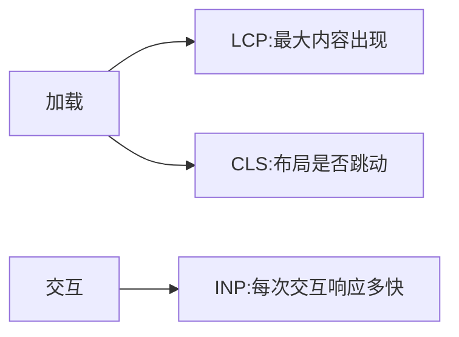

# 10.1 性能指标与 Core Web Vitals

> 卷:卷十 · 性能优化与工程质量
> 难度:⭐⭐ 进阶 | 阅读时间:20min

---

## 一、先看什么指标(而非凭感觉)

性能优化**先测量再动手**,否则就是瞎优化。核心指标分两类:**加载**与**交互**。

## 二、Core Web Vitals(三大核心指标)

| 指标 | 全称 | 测什么 | 良好阈值 |
|------|------|--------|---------|
| **LCP** | Largest Contentful Paint | 最大内容绘制(加载) | ≤ 2.5s |
| **INP** | Interaction to Next Paint | 交互响应延迟 | ≤ 200ms |
| **CLS** | Cumulative Layout Shift | 布局偏移(稳定性) | ≤ 0.1 |

> 注意:**INP 已取代 FID**(First Input Delay),因为它全程衡量"每次交互",不是只看第一次。



## 三、其他常用指标

| 指标 | 含义 |
|------|------|
| FCP | 首次内容绘制(第一个像素内容) |
| TTFB | 首字节时间(服务器响应) |
| TTI | 可交互时间 |
| FMP | 首次有意义绘制 |

> 记忆链:TTFB(服务器)→ FCP(有内容)→ LCP(主要内容)→ INP(能交互)→ CLS(别乱跳)。

## 四、怎么测

- **Lighthouse**:跑分 + 建议(开发态)
- **Chrome DevTools → Performance**:火焰图定位
- **web-vitals 库**:生产环境打点上报
- **CrUX / 性能平台**:真实用户数据(RUM)

## 小结

```
三核心:LCP(加载≤2.5s)/ INP(交互≤200ms,替代FID)/ CLS(稳定≤0.1)
先测再优化;web-vitals 打点 + Lighthouse 定位
```

## 面试题

**Q1:LCP 优化的大方向有哪些?**

① 减少**资源体积**(压缩/代码分割);② 让最大内容**尽早加载**(预加载、关键请求内联);③ 提升**服务器响应(TTFB)**;④ 减少渲染阻塞(CSS/JS);⑤ 用 CDN + 缓存。

**Q2:什么是 CLS?如何避免布局偏移?**

CLS 衡量页面元素**意外位移**的累积。避免:给图片/video **预留尺寸**(`aspect-ratio`/宽高),字体加载用 `font-display`,动态插入内容别顶走稳定内容,避免对已有元素做无过渡的位移。

---

📎 参考:Web.dev《CWV》、web-vitals 文档