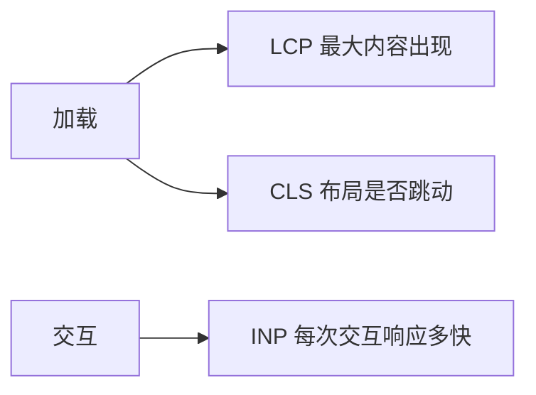

# 10.1 性能指标与 Core Web Vitals

> 卷:卷十 · 性能优化与工程质量
> 阅读时间:20min

---

## 引言:先看什么指标,而非凭感觉

性能优化**先测量再动手**。深挖要懂 **INP 为何取代 FID** 与三大 CWV 的测量维度。

---

## 一、Core Web Vitals(三大核心)

| 指标 | 全称 | 测什么 | 良好 |
|------|------|--------|------|
| **LCP** | Largest Contentful Paint | 最大内容绘制(加载) | ≤ 2.5s |
| **INP** | Interaction to Next Paint | 交互响应延迟 | ≤ 200ms |
| **CLS** | Cumulative Layout Shift | 布局偏移(稳定) | ≤ 0.1 |



**为什么 INP 取代 FID(底层)?** FID 只看"**第一次**输入的延迟",漏掉后续所有交互;INP 衡量"**全程每次**交互的响应",更真实反映"页面卡不卡"。这是 CWV 从"首输入"升级到"全交互"的演进。

---

## 二、其他常用指标

| 指标 | 含义 |
|------|------|
| FCP | 首次内容绘制 |
| TTFB | 首字节时间 |
| TTI | 可交互时间 |

> TTFB(服务器)→ FCP(有内容)→ LCP(主要内容)→ INP(能交互)→ CLS(别乱跳)。

---

## 三、怎么测

- **Lighthouse**:跑分 + 建议(开发态)
- **DevTools Performance**:火焰图定位
- **web-vitals 库**:生产打点上报
- **CrUX/性能平台**:真实用户数据(RUM)

**为什么不能只看 Lighthouse(底层)?** Lighthouse 是**本地/实验室**合成测试,不代表真实用户(网络/设备/地域差异)。要用 **RUM(真实用户监控)** 采集生产数据:Lighthouse 定位问题,RUM 验证真实体感。

---

## 四、小结

```
三核心:LCP(加载≤2.5s)/ INP(交互≤200ms,替代 FID)/ CLS(稳定≤0.1)
先测再优化;web-vitals 打点 + Lighthouse 定位
```

---

## 五、面试题

**Q1:LCP 优化的大方向有哪些?**

① 减少资源体积(压缩/分割);② 让最大内容尽早加载(预加载/关键内联);③ 提升 TTFB;④ 减少渲染阻塞(CSS/JS);⑤ CDN + 缓存。

**Q2:什么是 CLS?如何避免布局偏移?**

衡量元素**意外位移**的累积。避免:图片/video **预留尺寸**(aspect-ratio)、字体 `font-display`、动态插入别顶走稳定内容、避免无过渡位移。

**Q3:INP 为什么取代 FID?**

FID 只看"**第一次**输入延迟",漏掉后续交互;INP 衡量"**全程每次**交互响应",更真实。是 CWV 从"首输入"到"全交互"的升级。

**Q4:Lighthouse 和 RUM(真实用户监控)的区别?为什么两者都要?**

Lighthouse 是**本地合成测试**(可控、可复现、定位问题);RUM 是**真实用户数据**(真实网络/设备分布)。前者发现问题、后者验证真实体感——合成测试快但不代表真用户。

**Q5:如何用 web-vitals 库打点上报?**

```js
import { onLCP, onINP, onCLS } from "web-vitals";
onLCP((m) => report("LCP", m.value));
onINP((m) => report("INP", m.value));
onCLS((m) => report("CLS", m.value));
```

**Q6:TTFB 和 FCP 的区别?各自反映什么?**

TTFB(首字节时间)反映**服务器/网络**响应速度;FCP(首次内容绘制)反映"**浏览器何时画出第一个内容**"。前者偏后端/网络,后者偏前端渲染启动。

---

📎 参考:[Web.dev](https://web.dev/)《CWV》、web-vitals 文档