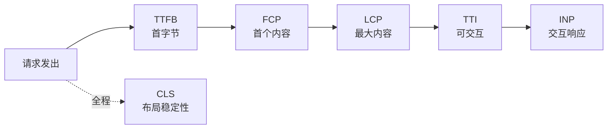

# 10.1 性能指标与 Core Web Vitals

## 引言:先看什么指标,而非凭感觉

性能优化**先测量再动手**。这一章把前端要盯的指标讲透:从"页面加载"到"用户交互"的完整时间线,再到三大 Core Web Vitals 的测量与优化。

---

## 一、性能指标全景时间线

一次页面加载,指标按时间顺序串成一条线:



- **TTFB**(Time To First Byte):服务器响应出第一个字节
- **FCP**(First Contentful Paint):浏览器画出第一个内容(文字/图片)
- **LCP**(Largest Contentful Paint):**最大**内容元素画出来
- **TTI**(Time To Interactive):页面可稳定交互
- **INP**(Interaction to Next Paint):**每次**交互的响应延迟
- **CLS**(Cumulative Layout Shift):布局偏移累积(全程)

> 记忆顺序:**TTFB(服务器)→ FCP(有内容)→ LCP(主要内容)→ TTI(能交互)→ INP(交互快)→ CLS(别乱跳)**。

---

## 二、Core Web Vitals 三大核心

Google 精选出最影响用户体验的三个指标,作为"页面健康"的基准:

| 指标 | 全称 | 测什么 | 良好 |
|------|------|--------|------|
| **LCP** | Largest Contentful Paint | 最大内容绘制(加载) | ≤ 2.5s |
| **INP** | Interaction to Next Paint | 交互响应延迟 | ≤ 200ms |
| **CLS** | Cumulative Layout Shift | 布局偏移(稳定) | ≤ 0.1 |

### 2.1 LCP:加载快不快

**LCP 元素**通常是首屏里最大的那张图、标题、或文本块。测量的是"**最大那个内容元素何时画出来**"——因为它通常是用户最关心的主内容。

**影响因素(哪些拖慢 LCP):**

| 阶段 | 拖慢原因 | 优化 |
|------|---------|------|
| TTFB | 服务器慢、网络慢 | 服务端优化、CDN |
| 资源加载 | LCP 图片大、加载晚 | 压缩、预加载、`fetchpriority` |
| 渲染 | JS/CSS 阻塞 | `defer`/`async`、关键 CSS 内联 |

**优化手段:**

```html
<!-- 关键 LCP 图片:预加载 + 优先 -->
<link rel="preload" as="image" href="hero.webp" fetchpriority="high">

```

> LCP 图片别懒加载(`loading="lazy"` 反而推迟它),要尽早、给高优先级、预留尺寸。

### 2.2 INP:交互快不快(取代 FID)

**INP** 衡量"从用户交互(点击/输入)到浏览器画出响应"的延迟,取**全程交互的较坏值**(通常是 P75)。

**为什么 INP 取代 FID?** FID 只看"**第一次**输入的延迟",漏掉后续所有交互;INP 看"**全程每次**交互",更真实反映"页面是否一直卡"。这是 CWV 从"首输入"到"全交互"的演进。

**INP 的三大来源:**

| 来源 | 说明 |
|------|------|
| 长任务 | 单个任务 >50ms,阻塞交互 |
| 输入延迟 | 主线程正忙,输入事件排队 |
| 渲染开销 | 交互触发的重排/重绘慢 |

**优化 INP = 拆长任务**(见 10.3):时间切片、`setTimeout` 让出主线程、重计算丢 Web Worker。

### 2.3 CLS:布局稳不稳

**CLS** 衡量"元素**意外位移**"的累积。位移越大,用户越容易"点错"或"看错"。

**典型导致 CLS 的场景:**

```html
<!-- ❌ 图片没预留尺寸:加载后把下面内容顶下去 -->
  <!-- 无 width/height -->

<!-- ✅ 预留尺寸 + aspect-ratio -->

```

| 场景 | 避免 |
|------|------|
| 图片/视频无尺寸 | 预留 width/height 或 `aspect-ratio` |
| 字体加载跳变 | `font-display: swap` / `optional` |
| 广告/iframe 动态插入 | 预留占位空间 |
| 无过渡的位移 | 用 transform(不触发布局) |

---

## 三、其他常用指标

| 指标 | 含义 | 关注点 |
|------|------|--------|
| FCP | 首次内容绘制 | 比 LCP 早,首个"有东西" |
| TTFB | 首字节时间 | 偏服务器/网络 |
| TTI | 可交互时间 | 偏"能稳定响应" |
| FID | 首次输入延迟 | 已被 INP 取代 |
| TBT | 总阻塞时间 | 长任务总和(INP 的代理指标) |

> 生产上**优先盯 LCP / INP / CLS 三个**,其余作为辅助定位。

---

## 四、怎么测

| 工具 | 类型 | 用途 |
|------|------|------|
| Lighthouse | 合成测试 | 开发态跑分 + 建议 |
| DevTools Performance | 本地录制 | 火焰图定位长任务 |
| web-vitals 库 | 真实打点 | 生产采集上报 |
| CrUX / 性能平台 | RUM | 真实用户分布 |

**为什么不能只看 Lighthouse?** Lighthouse 是**本地/实验室**合成测试(固定网络、固定设备),不代表真实用户的网络/设备/地域差异。要用 **RUM(真实用户监控)** 采生产数据:**Lighthouse 定位问题,RUM 验证真实体感**——两者结合才是完整闭环。

```js
// web-vitals 生产打点
import { onLCP, onINP, onCLS } from "web-vitals";
onLCP((m) => report("LCP", m.value));
onINP((m) => report("INP", m.value));
onCLS((m) => report("CLS", m.value));
```

---

## 五、小结

```
时间线:TTFB → FCP → LCP → TTI → INP(CLS 全程)
三核心:LCP(加载≤2.5s)/ INP(交互≤200ms,取代 FID)/ CLS(稳定≤0.1)
测量:合成(Lighthouse)+ 真实(web-vitals/RUM)两者结合
优化:先定位(Performance/Lighthouse)再动手
```

---

## 六、面试题

**Q1:LCP 优化的大方向有哪些?**

① 减少资源体积(压缩/分割);② 让最大内容尽早加载(预加载/`fetchpriority`/关键内联);③ 提升 TTFB(服务端/CDN);④ 减少渲染阻塞(CSS/JS);⑤ LCP 图片别懒加载。

**Q2:什么是 CLS?如何避免布局偏移?**

衡量元素**意外位移**的累积。避免:图片/video **预留尺寸**(`aspect-ratio`)、字体 `font-display`、动态插入别顶走稳定内容、用 transform 做无布局位移的动画。

**Q3:INP 为什么取代 FID?**

FID 只看"**第一次**输入延迟",漏掉后续交互;INP 衡量"**全程每次**交互响应"(取较坏值),更真实。是 CWV 从"首输入"到"全交互"的升级。

**Q4:Lighthouse 和 RUM 的区别?为什么两者都要?**

Lighthouse 是**本地合成测试**(可控、可复现、定位问题);RUM 是**真实用户数据**(真实网络/设备分布)。前者发现问题、后者验证真实体感——合成测试快但不代表真用户。

**Q5:如何用 web-vitals 库打点上报?**

```js
import { onLCP, onINP, onCLS } from "web-vitals";
onLCP((m) => report("LCP", m.value));
onINP((m) => report("INP", m.value));
onCLS((m) => report("CLS", m.value));
```

**Q6:TTFB 和 FCP 的区别?各自反映什么?**

TTFB(首字节时间)反映**服务器/网络**响应速度;FCP(首次内容绘制)反映"**浏览器何时画出第一个内容**"。前者偏后端/网络,后者偏前端渲染启动。

**Q7:为什么 INP 比 FID 更难优化?**

INP 看的是**全程所有交互**,任何一个长任务(>50ms)、一次渲染卡顿都会拉高 INP;而 FID 只看第一次输入,相对容易"碰巧达标"。所以 INP 逼着你系统性拆长任务、优化渲染。

**Q8:长任务(>50ms)和 INP 的关系?**

INP 的主要来源就是**长任务**:单个任务 >50ms 会阻塞主线程,期间的输入都排队等待,直接抬高 INP。所以"拆长任务"是优化 INP 的核心手段(见 10.3)。

---

📎 参考:[Web.dev](https://web.dev/)《Core Web Vitals》、[web-vitals](https://github.com/GoogleChrome/web-vitals)、Chrome UX Report