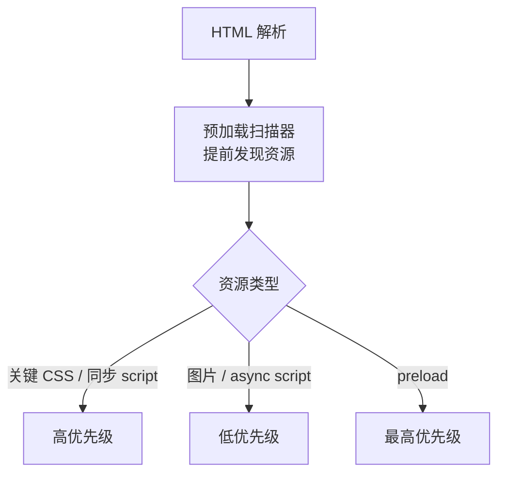

# 10.2 加载性能(代码分割 / 懒加载 / 预加载)

## 引言:加载性能的本质 = "少传 + 早到"

两个方向:**少传**(体积小)+ **早到**(关键资源优先)。这一章把代码分割、预加载四件套、图片/字体优化讲成可落地的清单。

---

## 一、浏览器如何决定"先加载谁"(优先级)

浏览器不是"谁先写谁先下",而是有**资源优先级**机制:



> 预加载扫描器(见 [2.2](/卷二-浏览器工作原理/2.2-导航与资源加载))会提前扫 HTML 发现 `<link>`/``/`<script>`,让资源加载与解析并行——这正是"早到"的底层机制。

**所以"少传 + 早到"落到实践就是:**
1. 首屏**关键资源**给最高优先级(`preload`/内联)
2. 非首屏资源**延迟/分割**(懒加载/代码分割)

---

## 二、代码分割与懒加载(少传核心)

### 1. 路由级懒加载

```js
const User = () => import("./User.vue");           // Vue
const User = lazy(() => import("./User"));          // React
```

首屏只加载当前页,其余按需。配合 `splitChunks` 抽公共依赖:

```js
// webpack splitChunks:抽 node_modules 到独立 vendor chunk
optimization: {
  splitChunks: {
    chunks: "all",
    cacheGroups: { vendor: { test: /node_modules/, name: "vendors" } },
  },
},
```

### 2. 动态 import 的 chunk 命名

```js
// 命名 chunk,便于观察与缓存
const Home = () => import(/* webpackChunkName: "home" */ "./Home.vue");
```

> 好处:① 首屏体积骤降;② 每个路由独立缓存(改一个页面不影响其他页面缓存);③ 配合 contenthash 长缓存。

### 3. 三方库按需引入

```js
import { debounce } from "lodash-es";   // ✅ 按需,摇掉没用的
import _ from "lodash";                 // ❌ 整包,几十 KB 全进来
```

---

## 三、预加载四件套(早到核心)

```html
<link rel="preload" as="script" href="critical.js">
<link rel="prefetch" href="next-page.js">
<link rel="preconnect" href="https://api.example.com">
<link rel="dns-prefetch" href="//cdn.example.com">
```

| 方式 | 时机 | 优先级 | 用途 |
|------|------|--------|------|
| `preload` | 立即 | **最高** | 本页必需资源 |
| `prefetch` | 空闲 | 低 | 下页可能用 |
| `preconnect` | 尽早 | 建连 | 确定的 API/字体源 |
| `dns-prefetch` | 尽早 | 只 DNS | 第三方域名 |

**preload vs prefetch:** `preload` 是"**当前页必需**",立即高优先级拉取;`prefetch` 是"未来可能用",空闲时低优先级预取。一个"现在就要",一个"待会儿可能用"。

**preconnect vs dns-prefetch:** `preconnect` 完成 **DNS + TCP + TLS** 全握手(更彻底,适合确定要用的源);`dns-prefetch` 只解析 DNS(更轻,适合可能的第三方域名)。

---

## 四、图片优化(通常占体积大头)

### 1. 响应式图片 + 格式

```html
<!-- srcset:按设备像素/宽度选合适尺寸 -->

```

| 格式 | 特点 |
|------|------|
| JPEG | 照片,有损 |
| **WebP** | 更小,主流支持 |
| **AVIF** | 更小,较新 |
| SVG | 矢量,图标/插画 |

### 2. 懒加载

```html
   <!-- 视口外不加载 -->
```

> 但 **LCP 图片别懒加载**(它会推迟主内容,见 [10.1](/卷十-性能优化与工程质量/10.1-性能指标与CoreWebVitals))。

### 3. 压缩

用 `imagemin`/`sharp` 等构建期压缩;别让设计师原图直接上线。

---

## 五、字体优化(避免 FOIT/FOUT)

**字体加载的三个坑:**
- **FOIT**(Flash of Invisible Text):字体加载期间文字不可见
- **FOUT**(Flash of Unstyled Text):先用系统字体、再切换
- **布局跳变**:字体切换导致 CLS

**解法:**

```css
@font-face {
  font-family: "Custom";
  src: url("custom.woff2") format("woff2");
  font-display: swap;   /* 先用系统字体,加载完再切换(避免 FOIT) */
}
```

| `font-display` | 行为 |
|----------------|------|
| `swap` | 立即用系统字体,加载完切换(推荐) |
| `optional` | 短时间加载失败就用系统字体 |
| `block` | 短暂 FOIT,然后系统字体 |
| `fallback` | 短暂隐藏,然后系统字体 |

> 配合:字体 `preload`(关键字体)+ 子集化(只加载用到的字符,中文尤其重要)。

---

## 六、资源优化清单(速查)

| 资源 | 手段 |
|------|------|
| 代码 | 压缩、tree-shaking、`contenthash` 长缓存、按需引入 |
| 图片 | WebP/AVIF、`srcset`、`loading="lazy"`、构建期压缩 |
| 字体 | `font-display: swap`、`preload`、子集化、woff2 |
| 视频 | `preload="none"`、首帧图片 |
| HTTP | 缓存 + CDN + gzip/brotli + HTTP/2 多路复用 |

---

## 七、小结

```
少传:代码分割/懒加载/tree-shaking/按需引入/压缩
早到:preload(必需高优先)/prefetch(预取)/preconnect(建连)/dns-prefetch(DNS)
资源:图片(WebP+lazy+srcset)/ 字体(swap+preload+子集化)/ 长缓存 contenthash
核心:浏览器有资源优先级,首屏关键资源给最高优先,其余延迟/分割
```

---

## 八、面试题

**Q1:preload 和 prefetch 的区别?**

`preload` 是**当前页必需**的资源,**立即高优先级**拉取(关键 JS/字体);`prefetch` 是**未来可能用**的资源,**空闲时低优先级**预取(下一页)。

**Q2:如何做首屏优化?**

① 路由懒加载减入口;② preload 关键资源 + CDN;③ 图片懒加载 + 压缩 + 响应式;④ 长缓存 + contenthash;⑤ SSR/SSG 提前出内容;⑥ 关键 CSS 内联,非关键延迟。

**Q3:preconnect 和 dns-prefetch 的区别?**

`preconnect` 提前完成 **DNS + TCP + TLS** 全握手;`dns-prefetch` 只提前**解析 DNS**。前者更彻底(适合确定要用的 API/字体源),后者更轻。

**Q4:为什么图片要 `loading="lazy"`?**

让**视口外的图片**不立即加载,滚到附近才加载,减少首屏请求与带宽,提升首屏速度。

**Q5:字体加载为什么推荐 `font-display: swap`?**

`swap` 让**先用系统字体渲染文本、字体加载完再切换**,避免"文字不可见期(FOIT)"——用户先看到内容,字体后替换。

**Q6:为什么说"内容哈希 + 长缓存"是加载性能的关键?**

`contenthash` 让"内容不变则文件名不变"→ 强缓存命中、零请求;内容变则新名 → 自然更新。加载性能上"能缓存就不请求"收益最大(呼应 [4.3](/卷四-网络与通信/4.3-HTTP缓存与协商))。

**Q7:动态 import 的代码分割,和 `splitChunks` 有什么区别?**

动态 `import()` 是**你主动**把某个路由/模块切成独立 chunk(按需加载);`splitChunks` 是**打包器自动**把公共依赖(如 node_modules)抽成独立 chunk(缓存友好)。两者常配合:动态 import 切页面,splitChunks 抽公共库。

**Q8:为什么 LCP 图片不要用 `loading="lazy"`?**

`loading="lazy"` 会让视口外的图片延迟加载,但 **LCP 图片通常是首屏主内容**,延迟它 = 推迟最大内容绘制 = 直接拉高 LCP。所以 LCP 图应给 `fetchpriority="high"` + 预加载,而非懒加载。

---

📎 参考:[Web.dev](https://web.dev/)《Fast load times》、[Vite 预加载](https://vitejs.dev/guide/build.html)、MDN《responsive images》