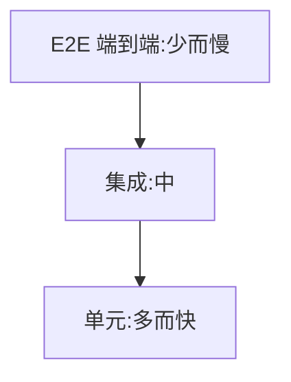

# 10.6 单元测试(Vitest)

> 卷:卷十 · 性能优化与工程质量
> 阅读时间:20min

---

## 引言:测试金字塔——多而快在底层

深挖要懂 **测试金字塔** 的取舍逻辑与 mock 的边界。

---

## 一、测试金字塔(底层)



> 为什么"单元为主、E2E 为辅"?**成本与速度**:单元快、便宜、稳定(多写);E2E 慢、脆、贵(少写)。金字塔倒置(只写 E2E)会又慢又脆。

---

## 二、Vitest 基础

```js
import { expect, test, describe, vi } from "vitest";
import { sum } from "./sum";
describe("sum", () => {
  test("1+2=3", () => { expect(sum(1, 2)).toBe(3); });
});
```

```bash
vitest run; vitest; vitest --coverage
```

---

## 三、Mock(隔离依赖,边界)

```js
vi.mock("./api", () => ({ fetchData: vi.fn().mockResolvedValue({ id: 1 }) }));
```

- **mock 函数**:`vi.fn()` 记录调用、控制返回
- **mock 模块**:替换外部依赖,隔离网络/副作用

**为什么 mock 要克制(底层):** mock 过度会让测试"**只测了 mock 自己**",失去意义。原则:**mock 边界而非实现**,优先测真实逻辑。

---

## 四、覆盖率

| 指标 | 含义 |
|------|------|
| 语句/行 | 执行到的代码比例 |
| 分支 | if/else 是否都测到 |
| 函数 | 函数是否被调用 |

> 覆盖率是**下限**不是目标:100% ≠ 测得好;关键是**关键分支与边界**。

---

## 五、小结

```
金字塔:单元(多快)> 集成 > E2E(少慢)
Vitest:test/expect/describe/vi.mock
mock 隔离外部依赖(边界而非实现);覆盖率看分支边界,不追数字
```

---

## 六、面试题

**Q1:toBe 和 toEqual 的区别?**

`toBe` **严格相等**(Object.is,适合原始值);`toEqual` **深度相等**(递归比较对象/数组结构)。

**Q2:什么时候需要 mock?会不会过度?**

隔离**不可控/昂贵依赖**时 mock(网络、时间、随机、第三方)。过度 mock 让测试"只测 mock 自己";原则 **mock 边界而非实现**。

**Q3:测试金字塔为什么"单元多、E2E 少"?**

成本速度:单元快便宜稳定(多写),E2E 慢脆贵(少写)。倒置会又慢又脆。

**Q4:为什么覆盖率 100% 不等于测试质量高?**

覆盖率只说明"**代码被跑到**",不说明"断言有意义/边界覆盖全"。质量看**关键分支 + 边界 + 断言质量**。

**Q5:`vi.fn()` 能做哪些事?**

记录调用(次数/参数)、控制返回值(`mockReturnValue`/`mockResolvedValue`)、模拟实现(`mockImplementation`)、断言调用。

**Q6:单元测试里如何隔离"时间"(如 setInterval)?**

用 **fake timers**:`vi.useFakeTimers()` + `vi.advanceTimersByTime(...)`,让时间可控、不用真等,测定时器逻辑更稳更快。

---

📎 参考:Vitest 官方文档