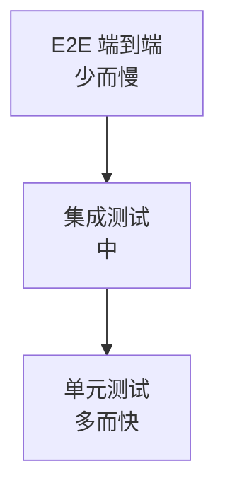

# 10.6 单元测试(Vitest)

## 引言:测试金字塔——多而快在底层

深挖要懂 **测试金字塔** 的取舍逻辑与 mock 的边界。这一章把 Vitest 的断言、组织、mock、覆盖率讲成能直接上手的样子。

---

## 一、测试金字塔



> 为什么"单元为主、E2E 为辅"?**成本与速度**:单元快、便宜、稳定(多写);E2E 慢、脆、贵(少写)。金字塔倒置(只写 E2E)会又慢又脆。

---

## 二、Vitest 基础

```js
import { expect, test, describe } from "vitest";
import { sum } from "./sum";

describe("sum", () => {
  test("1+2=3", () => { expect(sum(1, 2)).toBe(3); });
});
```

```bash
vitest            # watch 模式(开发)
vitest run        # 跑一次(CI)
vitest --coverage # 覆盖率
```

### 常用断言 API

```js
expect(x).toBe(3);            // 严格相等(Object.is)
expect(obj).toEqual({a:1});   // 深度相等(对象/数组)
expect(arr).toContain(1);     // 包含
expect(str).toMatch(/abc/);   // 正则匹配
expect(fn).toThrow("错误");   // 抛异常
expect(x).toBeTruthy();       // 真值
expect(x).toBeUndefined();    // undefined
expect(x).not.toBe(3);        // 取反
```

| 断言 | 含义 |
|------|------|
| `toBe` | 严格相等(原始值) |
| `toEqual` | 深度相等(对象/数组) |
| `toContain` / `toMatch` | 包含 / 正则 |
| `toThrow` | 抛异常 |
| `toBeTruthy` / `toBeFalsy` | 真值 / 假值 |

---

## 三、测试组织与 setup/teardown

```js
import { describe, test, expect, beforeEach, afterEach, beforeAll, afterAll } from "vitest";

describe("用户模块", () => {
  let user;

  beforeEach(() => { user = createUser(); });        // 每个 test 前执行
  afterEach(() => { cleanup(); });                   // 每个 test 后执行
  beforeAll(() => { connectDB(); });                 // 整个 describe 前执行一次
  afterAll(() => { disconnectDB(); });

  test("新建用户", () => { expect(user.id).toBeDefined(); });
  test("默认角色", () => { expect(user.role).toBe("user"); });
});
```

> `beforeEach/afterEach` 保证每个测试**独立**(不共享状态),避免"上一个测试改了状态影响下一个"。

### 参数化测试(test.each)

```js
test.each([
  [1, 2, 3],
  [2, 3, 5],
  [-1, 1, 0],
])("sum(%i, %i) = %i", (a, b, expected) => {
  expect(sum(a, b)).toBe(expected);
});
```

---

## 四、Mock(隔离依赖,边界)

### 1. mock 函数 vi.fn()

```js
const fn = vi.fn();
fn.mockReturnValue(42);          // 固定返回值
fn.mockResolvedValue({ id: 1 }); // 固定 Promise 返回值
fn.mockImplementation((a) => a * 2); // 自定义实现

fn(1); fn(2);
expect(fn).toHaveBeenCalledTimes(2);
expect(fn).toHaveBeenCalledWith(1);
```

### 2. mock 模块

```js
vi.mock("./api", () => ({ fetchData: vi.fn().mockResolvedValue({ id: 1 }) }));
```

### 3. spy(部分 mock,保留原实现)

```js
import * as math from "./math";
const spy = vi.spyOn(math, "add");   // 只 spy 一个方法,其余保留原实现
math.add(1, 2);
expect(spy).toHaveBeenCalled();
spy.mockRestore();                   // 恢复
```

| 方式 | 用途 |
|------|------|
| `vi.fn()` | 造一个假函数 |
| `vi.mock()` | 整体替换一个模块 |
| `vi.spyOn()` | 只 spy 某个方法,保留其余 |

**为什么 mock 要克制?** mock 过度会让测试"**只测了 mock 自己**",失去意义。原则:**mock 边界而非实现**——mock 网络/时间/随机这些"边界",但别 mock 你要测的核心逻辑。

---

## 五、快照测试(UI/大对象回归)

```js
import { expect, test } from "vitest";

test("组件结构不变", () => {
  const tree = renderComponent();
  expect(tree).toMatchSnapshot();   // 首次生成快照,之后对比
});
```

> 适合**结构/大对象**的回归;但别滥用——快照太"敏感"(改一点就失败),只对稳定结构用。

---

## 六、覆盖率

| 指标 | 含义 |
|------|------|
| 语句/行 | 执行到的代码比例 |
| 分支 | if/else 是否都测到 |
| 函数 | 函数是否被调用 |

```bash
vitest --coverage        # 生成覆盖率报告
# vitest.config 里可设 thresholds(阈值):
coverage: {
  provider: "v8",
  thresholds: { lines: 80, branches: 70 },
}
```

> 覆盖率是**下限**不是目标:100% ≠ 测得好;关键是**关键分支与边界**。

---

## 七、小结

```
金字塔:单元(多快)> 集成 > E2E(少慢)
Vitest:test/describe/beforeEach/expect/vi.fn/vi.mock/vi.spyOn
mock 边界而非实现;fake timers 控时间;覆盖率看分支边界,不追数字
```

---

## 八、面试题

**Q1:toBe 和 toEqual 的区别?**

`toBe` **严格相等**(Object.is,适合原始值);`toEqual` **深度相等**(递归比较对象/数组结构)。

**Q2:什么时候需要 mock?会不会过度?**

隔离**不可控/昂贵依赖**时 mock(网络、时间、随机、第三方)。过度 mock 让测试"只测 mock 自己";原则 **mock 边界而非实现**。

**Q3:测试金字塔为什么"单元多、E2E 少"?**

成本速度:单元快便宜稳定(多写),E2E 慢脆贵(少写)。倒置会又慢又脆。

**Q4:为什么覆盖率 100% 不等于测试质量高?**

覆盖率只说明"**代码被跑到**",不说明"断言有意义/边界覆盖全"。质量看**关键分支 + 边界 + 断言质量**。

**Q5:`vi.fn()` 能做哪些事?**

记录调用(次数/参数)、控制返回值(`mockReturnValue`/`mockResolvedValue`)、模拟实现(`mockImplementation`)、断言调用(`toHaveBeenCalledWith`)。

**Q6:单元测试里如何隔离"时间"(如 setInterval)?**

用 **fake timers**:`vi.useFakeTimers()` + `vi.advanceTimersByTime(...)`,让时间可控、不用真等,测定时器逻辑更稳更快。

**Q7:`vi.mock` 和 `vi.spyOn` 的区别?**

`vi.mock` **整体替换**一个模块(该模块所有导出都变假);`vi.spyOn` 只**替换某个对象上的一个方法**,其余保留原实现。要"全假"用 mock,要"只假一个方法"用 spyOn。

**Q8:什么是快照测试?有什么优缺点?**

把组件的**输出结构**存成快照文件,之后每次跑都对比,不一致就失败。优点:快速发现"意外变化";缺点:太敏感(合理改动也失败)、易被"无脑 update"滥用。适合稳定结构,别滥用。

---

📎 参考:[Vitest 官方文档](https://vitest.dev/)