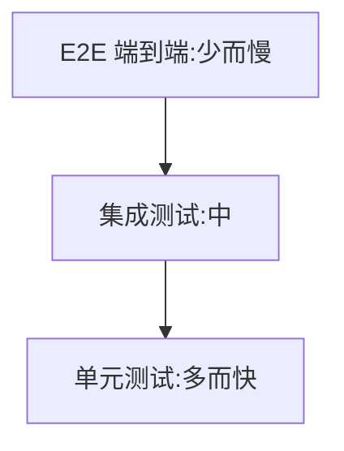

# 10.6 单元测试(Vitest)

> 卷:卷十 · 性能优化与工程质量
> 难度:⭐ 基础 | 阅读时间:20min

---

## 一、测试金字塔



> 原则:**单元测试为主(多、快),E2E 为辅(少、慢)**。金字塔倒置(只写 E2E)会又慢又脆。

## 二、Vitest 基础(Vite 生态,推荐)

```js
// sum.js
export const sum = (a, b) => a + b;

// sum.test.js
import { expect, test, describe, vi } from "vitest";
import { sum } from "./sum";

describe("sum", () => {
  test("1+2=3", () => { expect(sum(1, 2)).toBe(3); });
});
```

```bash
vitest run          # 跑一次
vitest              # watch 模式
vitest --coverage   # 覆盖率
```

## 三、Mock(隔离依赖)

```js
vi.mock("./api", () => ({ fetchData: vi.fn().mockResolvedValue({ id: 1 }) }));
```

- **mock 函数**:`vi.fn()` 记录调用、控制返回
- **mock 模块**:替换外部依赖,隔离网络/副作用

## 四、覆盖率与质量

| 指标 | 含义 |
|------|------|
| 语句/行 | 执行到的代码比例 |
| 分支 | 每个 if/else 是否都测到 |
| 函数 | 函数是否被调用 |

> 覆盖率是"**下限**"不是目标:100% 覆盖 ≠ 测得好;关键是**测到关键分支与边界**。

## 小结

```
金字塔:单元(多快)> 集成 > E2E(少慢)
Vitest:test/expect/describe/vi.mock
mock 隔离外部依赖;覆盖率看分支与边界,不追求数字
```

## 面试题

**Q1:`toBe` 和 `toEqual` 的区别?**

`toBe` 是**严格相等**(`Object.is`,适合原始值);`toEqual` 是**深度相等**(递归比较对象/数组结构,值相同即通过)。

**Q2:什么时候需要 mock?mock 会不会过度?**

需要隔离**不可控或昂贵的依赖**时 mock:网络、时间、随机、第三方。过度 mock 会让测试"只测了 mock 自己",失去意义——原则:**mock 边界而非实现**,优先测真实逻辑。

---

📎 参考:Vitest 官方文档