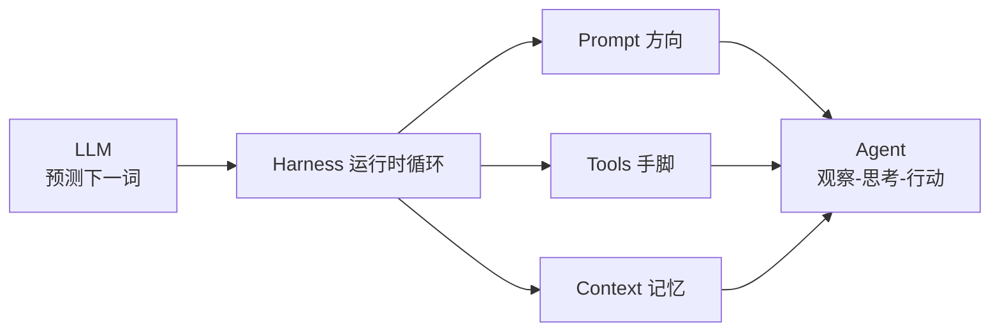

# 11.1 从 LLM 到 Agent:底层心智

> 卷:卷十一 · AI Agent Harness 与提示词工程
> 阅读时间:35min

---

## 引言:先放下"AI 会思考"的直觉,回到一个反直觉的事实

理解 Agent、Harness、提示词工程的一切,要从一个反直觉事实出发:**大语言模型(LLM)的本质不是"回答问题",而是"预测下一个 token"**。这一章把这个底层心智立住,后面七章全建立在此之上。

---

## 一、LLM 的本质:自回归的"下一词预测器"

LLM 数学上只做一件事:

```
输入文本(context)→ 输出"下一个 token 的概率分布"→ 采样一个
```

反复执行(把生成的 token 追加回上下文),就是**自回归(autoregressive)**。

**为什么"预测下一个词"能显得"智能"?** 预训练在海量文本上学"给定上文,什么词最可能出现"。语料足够大时,这种条件概率里**被压缩进了大量世界知识、语法、逻辑、常识**——因为要预测好"下个词",就必须"隐式理解"上文。所以"补全"和"理解"是一体两面。

---

## 二、采样:为什么同样 prompt 有不同答案

| 参数 | 作用 | 影响 |
|------|------|------|
| `temperature` | 分布陡/平 | 低=确定保守,高=发散创意 |
| `top_p` | 只从累积概率前 N 采 | 收窄候选 |
| `top_k` | 只取概率前 K | 硬截断 |

> 工程启示:要稳定可复现(代码/格式)→ 低温甚至 0;要多样创意(文案/头脑风暴)→ 调高。

---

## 三、两个关键行为特性

### 1. 上下文学习(ICL)

不更新权重就学会新任务,靠 prompt 里**给示例(few-shot)**。这就是"提示词即编程"的根源。

### 2. 幻觉(Hallucination)

模型用概率补全,不是查数据库,会自信地编造事实。

> **工程启示:一切外部事实靠工具/检索锚定,不靠模型"记忆"——Agent 工程第一铁律。**

---

## 四、从"聊天"到"Agent"的心智跃迁



**贯穿全卷的比喻:**

> - LLM = 发动机;Prompt = 方向盘;Tools = 手脚;Context = 记忆;Harness = 车身 + 车手(把一切串成循环)

**没有 Harness,LLM 就是一次性的"文本补全函数";有了 Harness,才成为能千步循环、调用工具、自我纠错的 Agent。**

---

## 五、LLM 的能力边界

| 边界 | 化解 |
|------|------|
| 上下文窗口有限 | 记忆压缩/检索(11.4) |
| 知识有截止 | 工具检索实时数据 |
| 单次无状态 | harness 持久化上下文 |
| 非确定性 | 低温 + 约束格式 + 重试 |
| 不能真正执行 | tools 把文本指向真实动作 |

---

## 六、小结

```
LLM 本质 = 自回归 next-token 预测 + 采样(temperature/top_p)
智能来源 = 预训练把知识压缩进条件概率 → 涌现 + 上下文学习
关键特性:ICL(提示词即编程)、幻觉(概率补全≠查库)
Agent = LLM + Prompt + Tools + Context + Harness(循环)
铁律:外部事实靠工具/检索锚定;稳定靠低温+格式约束
```

---

## 七、思考题(自测理解)

**Q1:为什么说"LLM 会补全"和"LLM 会理解"是同一件事?**

要**预测好下一个 token**,模型必须在权重里学出对上下文的**深层理解**(语法、逻辑、世界知识)。"补全"是表面动作,"理解"是达成补全所必需的隐式能力,一体两面。

**Q2:如何让"只会下一词预测"的模型执行"查天气并写进文件"?**

① 模型输出结构化"动作"(如 `get_weather(city)`);② harness 解析并**真执行工具**;③ 结果作为新上下文喂回;④ 循环直到"完成"。模型负责决策,工具/harness 负责执行。

**Q3:temperature 对输出有什么影响?什么时候用低温?**

temperature 控制采样分布的"陡峭度":**低**→ 候选集中、确定保守(代码生成、格式化输出、事实问答);**高**→ 候选发散、多样创意(文案、头脑风暴)。要稳定可复现用低温(甚至 0)。

**Q4:上下文学习(ICL)和微调(FT)的本质区别?**

ICL **不更新权重**,只在 prompt 里给示例,即学即用、零训练成本但受窗口限制;FT **更新权重**,需数据与算力,能持久固化能力但成本高。ICL 是"提示词工程"能成立的根本。

**Q5:LLM 的"幻觉"根源是什么?工程上如何缓解?**

根源:模型是**概率补全**,不是查库,且缺乏"我不知道"的强概念。缓解:① 外部事实靠**工具/检索(RAG)锚定**;② 约束输出格式 + 低温;③ "不知道就说不知道"(负面约束,11.6);④ 关键结果人工核验。

**Q6:Agent 相比"单次 LLM 调用"多了哪几样东西?**

多了 **Tools(能行动)、Context(有记忆)、循环(能观察-思考-行动多轮)** 三者,由 Harness 串起来。单次调用只有"一次文本补全",Agent 是"多轮、有手脚、有记忆的任务执行系统"。

---

📎 参考:[Anthropic](https://www.anthropic.com/)《Building Effective Agents》、[OpenAI 文档](https://platform.openai.com/docs)、Attention Is All You Need 与 RLHF 相关论文