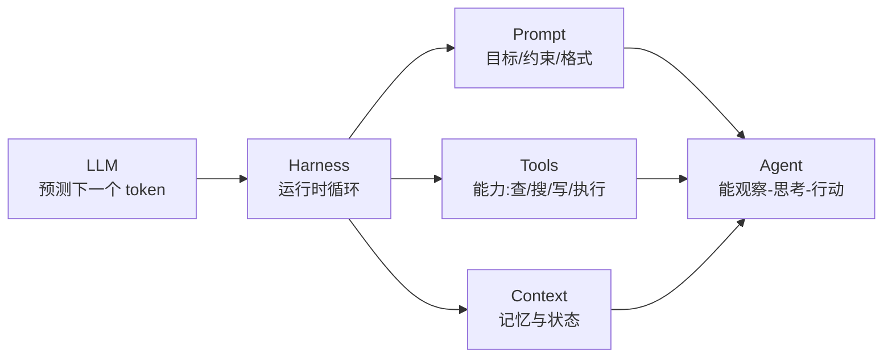

# 11.1 从 LLM 到 Agent:底层心智

> 卷:卷十一 · AI Agent Harness 与提示词工程
> 难度:⭐⭐⭐ 专家 | 阅读时间:30min

---

## 引言:先忘掉"AI 会思考",记住"AI 会补全"

理解 Agent、Harness、提示词工程的一切,要从一个反直觉的事实出发:**大语言模型(LLM)的本质不是"回答问题",而是"预测下一个 token"**。这一章把这个底层心智立住,后面七章全部建立在此之上。

---

## 一、LLM 的本质:自回归的"下一词预测器"

LLM 在数学上做的事只有一件:

```
输入一段文本(context),输出"下一个 token 的概率分布",再从中采样一个
```

把它反复执行(每次把刚生成的 token 追加回上下文),就得到了连贯的输出。这个过程叫**自回归(autoregressive)**。

```
P(下一个词 | 之前所有词)
```

**为什么"预测下一个词"能显得"智能"?**

> 预训练阶段,模型在海量文本上学"**给定上文,什么词最可能出现**"。当语料足够大,这种条件概率里**被压缩进去了大量世界知识、语法、逻辑、常识**——因为要预测好"下个词",就必须"隐式理解"上文在说什么。所以"补全"和"理解"是一体两面。

---

## 二、采样:为什么同样的 prompt 会有不同答案

模型输出的是**概率分布**,不是唯一答案。从中"采样"的方式决定结果风格:

| 参数 | 作用 | 影响 |
|------|------|------|
| `temperature` | 分布"陡/平" | 低=确定保守,高=发散创意 |
| `top_p` | 只从累积概率前 N 的候选里采 | 收窄候选 |
| `top_k` | 只取概率前 K 个 | 硬截断 |

```python
# temperature=0 → 近似贪心,几乎确定;temperature=1 → 按原分布采样
```

> **工程启示**:要稳定、可复现(代码生成、格式化输出)→ 用低温甚至 0;要多样、创意(文案、头脑风暴)→ 适当调高。这直接关联 11.6 里"为什么 prompt 要约束输出格式"。

---

## 三、两个关键行为特性

### 1. 上下文学习(In-Context Learning, ICL)

模型**不更新权重**就能学会新任务,方法是在 prompt 里**给几个示例**(few-shot):

```
把句子翻译成英文:
"你好" → "Hello"
"谢谢" → "Thank you"
"再见" →    ← 模型看示例就"学会了格式与任务"
```

> 这就是"提示词即编程"的根源:你不需要训练,只需要**在上下文里把任务和格式讲清楚**。

### 2. 幻觉(Hallucination)与不确定性

模型是"用概率补全",不是"查数据库"。它**本质上没有"我不知道"的强概念**,所以会自信地编造事实、引用不存在的函数、给出看似合理实则错误的结果。

> **工程启示**:一切外部事实都要**靠工具/检索来锚定**(11.4/11.5),而不是相信模型的"记忆"——这是 Agent 工程的第一铁律。

---

## 四、从"聊天"到"Agent"的一次心智跃迁

**聊天模型**:你一句我一句,模型只能"说"。

**Agent(智能体)**:给它**工具**(能调用外部世界)+ **循环**(能持续行动)+ **环境**(能观察结果),它就从一个"只会说话的模型"变成"能执行任务的系统"。



**一个贯穿全卷的比喻(先记住):**

> - **LLM** = 发动机(只提供"预测下一个词"的动力)
> - **Prompt** = 方向盘(告诉它往哪走、怎么走)
> - **Tools** = 手脚(让它能碰外部世界)
> - **Context** = 记忆(它记得什么、持有什么状态)
> - **Harness** = 车身 + 车手(把上面这些**串成一个能持续运转的循环**)

**没有 Harness,LLM 就只是一次性的"文本补全函数";有了 Harness,它才成为能千步循环、调用工具、自我纠错的 Agent。** 这正是本卷叫 "AI Agent **Harness** Engineering" 的原因。

---

## 五、LLM 的能力边界(必须清醒)

| 边界 | 含义 | 化解 |
|------|------|------|
| 上下文窗口有限 | 不能无限塞历史 | 记忆压缩/检索(11.4) |
| 知识有截止 | 不知道"最新事实" | 用工具检索实时数据 |
| 单次调用是"无状态"的 | 不记得上次对话 | harness 持久化上下文 |
| 非确定性 | 同 prompt 可能不同答 | 低温 + 约束格式 + 重试 |
| 不能真正"执行" | 只能输出文本 | 用 tools 把文本指向真实动作 |

> 一句话总结边界:**LLM 是"能算会写"的引擎,但"记得住、碰得到、做得了"这些都要靠外围工程补齐。**

---

## 六、小结

```
LLM 本质 = 自回归 next-token 预测 + 采样(temperature/top_p)
智能来源 = 预训练把知识/能力压缩进条件概率 → 涌现 + 上下文学习
关键特性:上下文学习(提示词即编程)、幻觉(概率补全≠查库)
Agent = LLM(引擎)+ Prompt(方向盘)+ Tools(手脚)+ Context(记忆)+ Harness(循环)
铁律:外部事实靠工具/检索锚定;稳定性靠低温+格式约束
```

---

## 七、思考题(自测理解)

**Q1:为什么说"LLM 会补全"和"LLM 会理解"是同一件事?**

因为要**预测好下一个 token**,模型必须在权重里学出对上下文的**深层理解**(语法、逻辑、世界知识)。"补全"是表面动作,"理解"是达成补全所必需的隐式能力,二者一体两面。

**Q2:如何让一个"只会下一词预测"的模型去执行"查天气并写进文件"这种任务?**

把任务拆成 LLM 能参与的形式:① 模型输出一个**结构化的"动作"**(如调用 `get_weather(city)`);② harness 解析这个动作,**真正去执行工具**;③ 把工具结果作为新的上下文喂回模型;④ 循环直到模型输出"完成"。关键:模型负责"决策",工具与 harness 负责"真的执行"。

---

📎 参考:Anthropic《Building Effective Agents》、OpenAI 文档、Attention Is All You Need 与 RLHF 相关论文