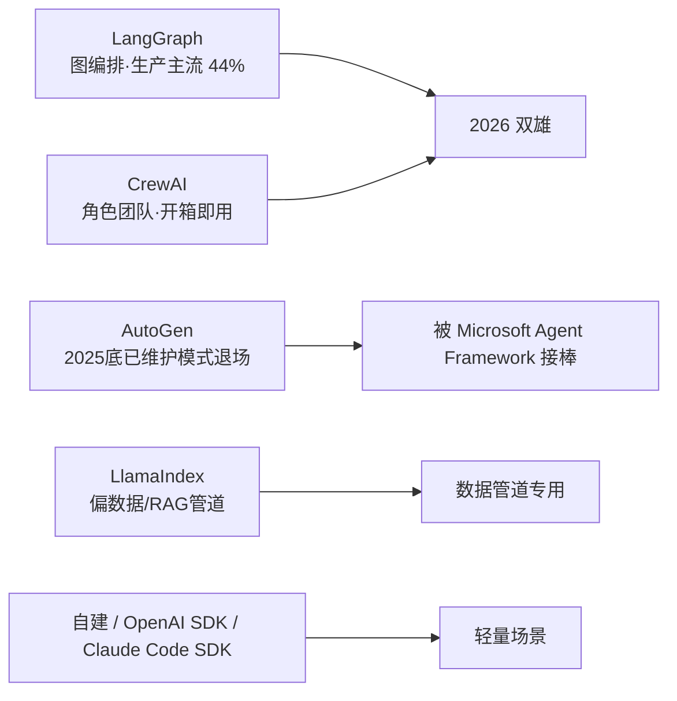

# 11.11 工具与框架选型(LangGraph / CrewAI / 自建)

> 卷:卷十一 · AI Agent Harness 与提示词工程
> 阅读时间:20min

---

## 引言:别盯着 Star 数选框架

2026 年 Multi-Agent 已成为 AI 落地标配,但"生产就绪"不等于"适合你"。同一个需求,选 LangGraph 写 200 行、CrewAI 写 30 行、自建写 50 行——差异巨大。这一章给 2026 年的选型判断。(呼应 11.3:框架是"可选加速器",不是"必须依赖"。)

---

## 一、2026 年框架格局(已洗牌)



**谁退场了**:AutoGen 在 2025 年底进入维护模式(不再接新功能),微软引导用户转向 Microsoft Agent Framework——它不是不行,而是"对等对话协商"在长任务可控性上不如专门做状态治理的框架。

---

## 二、主流方案对比

| 方案 | 心智模型 | 强项 | 代价 | 适合 |
|------|---------|------|------|------|
| **LangGraph** | 有向图(节点+状态流转) | 状态管理、checkpoint 回滚、人工审批、生产治理 | 学习曲线最陡 | 复杂流程、需治理的 Agent |
| **CrewAI** | 角色团队(研究员/分析/写手) | 开箱即用、代码少(30 行) | 细粒度可控性弱 | 快速搭多角色协作 |
| **LlamaIndex** | 数据管道/RAG | 检索、索引、数据接入强 | 不是通用 Agent 编排 | 知识库问答、RAG |
| **OpenAI/Claude Code SDK** | 轻量 SDK | 原生、可控、易上手 | 要自己搭循环/状态 | 简单 Agent、快速验证 |
| **Dify 等平台** | 低代码/可视化 | 拖拽搭流程、非程序员可用 | 定制受限 | 业务侧快速原型 |
| **自建** | 手写 run_agent 循环 | 零依赖、完全可控、可懂 | 造轮子、功能要靠自己 | 简单场景、追求可控 |

---

## 三、选型决策树

```
需求是什么?
├─ 复杂状态流转 + 回滚 + 人工审批 + 生产治理 → LangGraph
├─ 快速搭"多角色团队"协作、原型优先 → CrewAI
├─ 知识库问答 / RAG / 数据检索 → LlamaIndex(或 LangChain + 向量库)
├─ 简单单 Agent、要轻量可控 → 自建 loop / OpenAI/Claude Code SDK
├─ 业务侧低代码、非程序员 → Dify 等平台
└─ 拿不准 → 先自建最简 ReAct(11.2 的 10 行),跑通再决定要不要上框架
```

---

## 四、关键判断(呼应 11.3 的结论)

> **先懂原理,再选框架。** 前几章把"循环/状态/工具/上下文/容错"讲透后,你会发现:任何框架都是这些能力的封装。所以:

1. **简单场景别上重框架**:一个 `while + LLM + 工具` 循环能解决的,上 LangGraph 反而更复杂
2. **框架的价值在"状态/回滚/编排"**:当 Agent 需要 checkpooint 回滚、多分支、人工审批时,自建这些很痛苦,框架才有意义
3. **别追新**:AutoGen 的退场是教训——选"生态成熟、有真实生产案例"的,而非"最新最炫"的

---

## 五、小结

```
2026 格局:LangGraph(图编排,生产主流)/ CrewAI(角色团队,快速)/ AutoGen 退场 / LlamaIndex(RAG)
选型:复杂治理→LangGraph;快速协作→CrewAI;RAG→LlamaIndex;简单→自建/SDK;低代码→Dify
心法:先懂原理再选;简单别上重框架;选成熟生态别追新
```

---

## 六、面试/实践要点

**Q1:为什么 AutoGen 会"退场"?**

它强在"对等对话协商"(多个 Agent 互相聊),但长任务的**可控性、状态持久化、生产治理**不如专门做状态管理的框架。这是"技术可行"但"生产不友好"的典型案例——选型要看**生产治理能力**,不是看概念新颖。

**Q2:LangGraph 和 CrewAI 的本质区别?**

LangGraph 把 Agent 建模成**有向图**(节点=步骤,边=流转),强调状态管理、回滚、人工审批、生产治理; CrewAI 把 Agent 建模成**角色团队**(每个 Agent 有角色/目标),强调开箱即用、快速搭多角色协作。一个"重但可控",一个"轻但快"。

**Q3:什么场景应该"自建"而不是用框架?**

需求简单(单个 ReAct 循环、少数工具)、团队要**零依赖 + 完全可控 + 能完全理解行为**时,自建 10~50 行更划算。上框架的时机是:需要多 Agent 编排、checkpoint 回滚、复杂状态流转、人工审批等"工程化能力"时。

---

📎 参考:LangGraph/LangChain、CrewAI、LlamaIndex 官方文档,2026 年 Agent 框架横评(腾讯新闻/什么值得买)