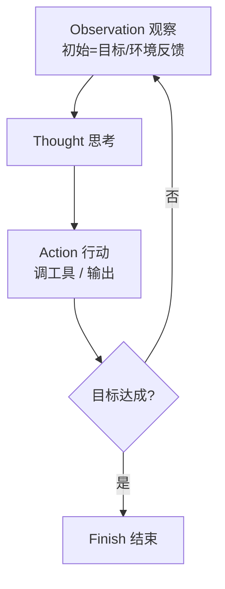

# 11.2 Agent 核心循环(ReAct / 规划-执行-观察)

> 卷:卷十一 · AI Agent Harness 与提示词工程
> 阅读时间:30min

---

## 引言:单次调用解决不了的问题,交给"循环"

聊天模型是"一问一答";Agent 是"**反复循环,直到目标达成**"。本章讲清经典范式 **ReAct** 与普遍结构:**观察 → 思考 → 行动**。

---

## 一、为什么需要循环

很多任务**一次 LLM 调用搞不定**:

- "找出最便宜的机票并订好"——要先搜、再比、再下单,中间结果决定下一步
- "写个能跑的爬虫"——要写、跑、看报错、改、再跑

单次调用只有一个回合;循环让模型"**边做边看结果、边调整**"。

---

## 二、ReAct:Reasoning + Acting 交替



```
Question: 明天上海的天气?
Thought: 我需要查天气,先调天气工具。
Action: get_weather(city="上海", date="明天")
Observation: {"多云", "18~25℃"}
Thought: 拿到答案,总结。
Action: finish(answer="明天上海多云,18~25℃")
```

**为什么 Thought 要在 Action 前写出来?** ① 让模型"先想再动",减少乱调工具;② **可解释可审计**;③ 中间推理写进上下文,有**自我纠错**效果。

---

## 三、通用结构:规划 → 执行 → 观察 → 反思

| 环节 | 做什么 | 典型实现 |
|------|--------|---------|
| **规划** | 拆子目标定步骤 | Plan-and-Execute |
| **执行** | 调工具产出动作 | tool call |
| **观察** | 拿结果看反馈 | 工具返回值/报错 |
| **反思** | 评估是否达成 | self-critique、验证器 |

> 掌握这四件套,你会发现 LangChain、AutoGPT、你自己的 harness,都是这个循环的不同封装。

---

## 四、循环必须解决的三个工程问题

1. **终止条件**:步数上限 + 模型显式"完成"信号 + 死循环检测
2. **状态传递**:模型无状态,每轮把"目标 + 已发生动作 + 观察"重组喂回
3. **错误再入循环**:工具报错作为 Observation 喂回,让模型自我修正,而非崩溃

```python
def run_agent(goal, tools, model, max_steps=20):
    context = [system_prompt, {"role": "user", "content": goal}]
    for step in range(max_steps):
        response = model.chat(context)
        if response.has_tool_call():
            result = tools.execute(response.tool_call())
            context.append({"role": "tool", "content": result})   # 观察再入
        else:
            return response.text
    raise Exception("未在步数内完成")
```

> 这个 10 来行的结构,就是**所有 Agent 的"心跳"**。理解它,任何框架都只是"变胖的它"。

---

## 五、小结

```
循环必要性:任务需"边做边看边调整"
ReAct:Thought→Action→Observation→循环→Finish
通用骨架:规划→执行→观察→反思
三工程点:终止条件 / 状态传递 / 错误再入(自我纠错)
```

---

## 六、思考题

**Q1:ReAct 里 Thought 和 Action 为什么要分开?**

Thought 是"内部推理",Action 是"对外动作"。分开让模型**先想再动**(减误操作)、**可审计**(看决策过程)、**可自我纠错**(推理进上下文,矛盾更易被发现)。

**Q2:Agent 陷入"反复调同一工具不推进",harness 怎么兜底?**

① 步数上限强制终止;② **循环检测**(连续 N 次动作相同则打断换策略);③ 把"已尝试且失败"记录喂回要求变更;④ 最终失败降级(返回部分结果/交还用户)。

**Q3:为什么单次 LLM 调用搞不定复杂任务?**

复杂任务需"**边做边看、边调整**":搜了才知道下一步、跑了才知道报错。单次调用只有一个回合;循环让模型能"看中间结果、持续调整"。

**Q4:通用循环四要素(规划/执行/观察/反思)各是什么?**

规划(拆目标定步骤)/ 执行(调工具产出动作)/ 观察(拿结果看反馈)/ 反思(评估是否达成、要不要调整)。所有 Agent 框架本质都是这个骨架的封装。

**Q5:为什么循环必须有终止条件?怎么设计?**

无终止条件会**无限循环烧 token**。设计:① 步数上限兜底;② 模型显式"完成"信号;③ 死循环检测(连续相同动作则打断)。

**Q6:"错误再入循环"是什么?为什么能自我纠错?**

工具报错不直接崩,而是**把错误作为 observation 喂回**,让模型看着错误修正参数/换策略。因为错误写进了上下文,模型能基于它调整——这是自我纠错的基础。

---

📎 参考:ReAct 论文(Yao et al.)、[Anthropic](https://www.anthropic.com/)《Building Effective Agents》、LangChain/LangGraph 文档