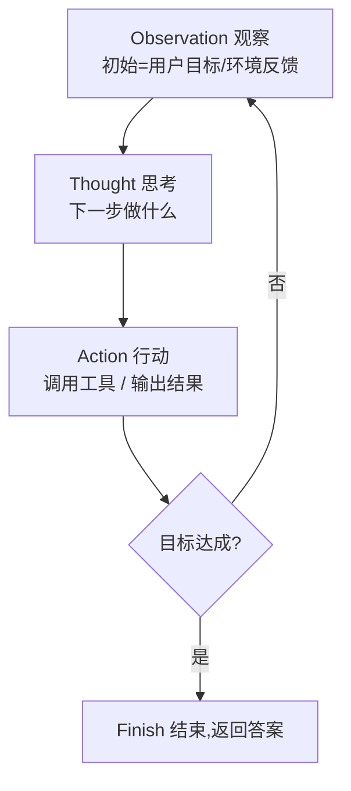

# 11.2 Agent 核心循环(ReAct / 规划-执行-观察)

> 卷:卷十一 · AI Agent Harness 与提示词工程
> 难度:⭐⭐⭐ 专家 | 阅读时间:30min

---

## 引言:单次调用解决不了的问题,交给"循环"

聊天模型是"一问一答";Agent 是"**反复循环,直到目标达成**"。本章讲清这个循环的经典形态 **ReAct**,以及它背后的普遍结构:**观察 → 思考 → 行动**。

---

## 一、为什么需要循环

很多任务**一次 LLM 调用搞不定**:

- "找出网上最便宜的机票并订好"——要先搜、再比、再下单,**中间结果决定了下一步**
- "写个能跑的爬虫"——要写代码、跑、看报错、改、再跑

单次调用只有一个回合;循环让模型能"**边做边看结果、边调整**"。

---

## 二、ReAct:Reasoning + Acting 交替

**ReAct** 是教科书式的 Agent 循环范式:让模型在**推理(Thought)**和**行动(Action)**之间交替:

```
Question: 明天上海的天气怎么样?
Thought: 我需要查天气。先调用天气工具。
Action: get_weather(city="上海", date="明天")
Observation: {"明天", "多云", "18~25℃"}
Thought: 已经拿到答案,可以总结了。
Action: finish(answer="明天上海多云,18~25℃")
```



**为什么 Thought 要在 Action 之前写出来?**

> ① 让模型"先想清楚再动手",减少乱调用工具;② **可解释、可审计**(你能看到它为什么这么做);③ 思考本身是"上下文里的中间推理",有**自我纠错**效果(写出来更容易发现矛盾)。

---

## 三、通用结构:规划 → 执行 → 观察(反思)

ReAct 之外,几乎所有 Agent 循环都能抽象成同一个骨架:

| 环节 | 做什么 | 典型实现 |
|------|--------|---------|
| **规划 Planning** | 拆子目标、定步骤 | 先列 plan,再逐步执行(Plan-and-Execute) |
| **执行 Acting** | 调用工具/产出动作 | tool call、代码执行 |
| **观察 Observing** | 拿结果、看反馈 | 工具返回值、报错信息、执行日志 |
| **反思 Reflecting** | 评估是否达成、要不要调整 | self-critique、验证器 |

```
目标 → 规划 → 执行 → 观察 → 反思 → (未达成)回到规划/执行 → … → 达成 → 结束
```

> 记住这四件套,你会发现 LangChain、AutoGPT、你自己的 harness,本质都是这个循环的不同封装。

---

## 四、循环必须解决的三个工程问题

### 1. 终止条件(否则会无限循环)

```python
while steps < max_steps:           # ① 上限步数
    ...
    if action == "finish": break   # ② 模型显式说"完成"
```

- **步数上限**是最基本的兜底
- 还要防"模型一直调用工具但不前进"的**死循环**(看 11.3 的循环检测)

### 2. 状态传递(每轮知道"进行到哪了")

循环的每一轮,都要把**目标 + 已发生的动作 + 观察**重新喂给模型——因为模型**无状态**(11.1)。这就是"上下文"里装的东西(11.4 展开)。

### 3. 错误的"再入循环"

工具报错、结果为空、格式不对 → **把错误本身作为 Observation 喂回**,让模型自我修正,而不是直接崩溃:

```
Observation: Error: get_weather 参数缺少 city
Thought: 我漏了 city,补上重试。
Action: get_weather(city="上海")
```

---

## 五、一个"最小可运行"的心智伪代码

```python
def run_agent(goal, tools, model, max_steps=20):
    context = [system_prompt, {"role": "user", "content": goal}]
    for step in range(max_steps):
        response = model.chat(context)            # 思 + 行
        if response.has_tool_call():
            result = tools.execute(response.tool_call())  # 真执行
            context.append({"role": "tool", "content": result})  # 观察再入
        else:
            return response.text                   # 模型认为完成
    raise Exception("未在步数内完成")
```

> 这个 10 来行的结构,就是**所有 Agent 的"心跳"**。理解它,再看任何框架都只是"变胖的它"。

---

## 六、小结

```
循环必要性:任务需"边做边看、边调整",单次调用不够
ReAct:Thought(思考)→ Action(行动)→ Observation(观察)→ 循环 → Finish
通用骨架:规划 → 执行 → 观察 → 反思
三个工程点:终止条件(步数上限)/ 状态传递(无状态,每轮重组)/ 错误再入循环(自我纠错)
```

---

## 七、思考题

**Q1:ReAct 里的 Thought 和 Action 为什么要分开?**

Thought 是"内部推理",Action 是"对外动作"。分开让模型**先想再动**(减少误操作)、**可审计**(能看到决策过程)、**可自我纠错**(推理写进上下文,矛盾更容易被下一轮发现)。

**Q2:如果 Agent 陷入"反复调用同一工具却不推进",harness 该怎么兜底?**

① **步数上限**强制终止;② **循环检测**(连续 N 次动作相同/结果相同则打断并提示换策略);③ 把"已尝试且失败"的记录作为观察喂回,要求变更方法;④ 最终失败则**降级**(返回部分结果/交还用户)。

---

**Q3:为什么单次 LLM 调用搞不定复杂任务?**

因为复杂任务需"边做边看、边调整":搜了才知道下一步、跑了才知道报错。单次调用只有一个回合;循环让模型能"**看中间结果、持续调整**"。

**Q4:通用循环的四要素(规划/执行/观察/反思)分别是什么?**

规划(拆目标定步骤)/ 执行(调工具产出动作)/ 观察(拿结果看反馈)/ 反思(评估是否达成、要不要调整)。所有 Agent 框架本质都是这个骨架的封装。

**Q5:为什么循环必须有终止条件?怎么设计?**

无终止条件会**无限循环烧 token**。设计:① 步数上限兜底;② 模型显式"完成"信号;③ 死循环检测(连续相同动作则打断)。

**Q6:"错误再入循环"是什么?为什么能自我纠错?**

工具报错不直接崩,而是**把错误作为 observation 喂回**,让模型看着错误修正参数/换策略。因为错误写进了上下文,模型能基于它调整——这是自我纠错的基础。

---

📎 参考:ReAct 论文(Yao et al.)、Anthropic《Building Effective Agents》、LangChain/LangGraph 文档