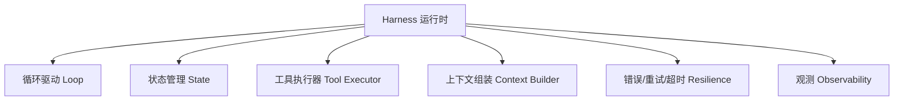
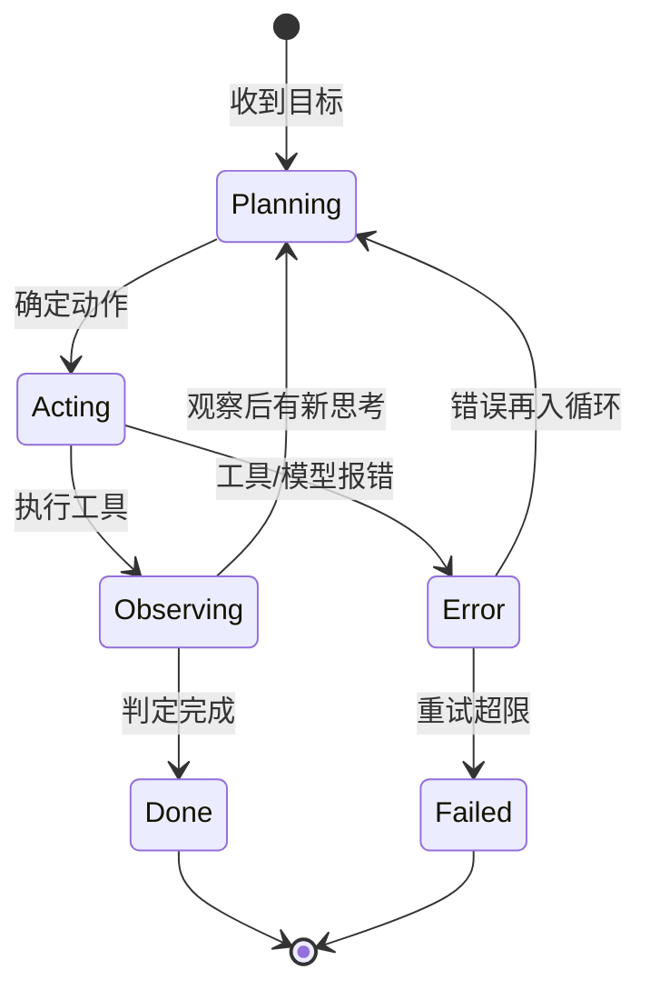

# 11.3 Harness 工程(运行时 / 状态机 / 错误恢复)

> 卷:卷十一 · AI Agent Harness 与提示词工程
> 难度:⭐⭐⭐ 专家 | 阅读时间:30min

---

## 引言:让模型成为"能持续运转的服务",靠的是运行时

聊到 Agent,多数人盯着模型和提示词,却忽略真正的硬功夫在 **Harness(运行时)**——它决定 Agent **能不能跑、会不会崩、崩了能不能恢复、跑得贵不贵**。

---

## 一、Harness 到底是什么

**Harness = 把 LLM 从"无状态函数"变成"有状态、可循环、可调用工具、可观测服务"的那层运行时。**

它至少包含这六块:



| 模块 | 职责 | 关键问题 |
|------|------|---------|
| **循环驱动** | 决定"下一轮做什么" | 终止条件、循环检测 |
| **状态管理** | 持久化对话/任务进度 | 会话存哪、怎么恢复 |
| **工具执行器** | 把模型的"动作"真正执行 | 权限、沙箱、参数校验 |
| **上下文组装** | 每轮喂给模型什么 | 洗词、裁剪、记忆(11.4) |
| **容错** | 超时/重试/降级 | 模型宕了、工具挂了怎么办 |
| **观测** | 日志/指标/追踪 | 怎么知道它"干得对不对" |

---

## 二、用"状态机"看 Agent

Agent 的一次执行,本质是一个**状态机**在各状态间迁移:



**为什么用状态机看?**

> ① **可显式建模"正常/错误/重试/终止"** 各条路径,不漏边界;② 崩溃后能知道"卡在哪个状态",便于**恢复**(从状态续跑,而非从头再来);③ 让 Agent 的"不可靠"变得**可管理**:每个状态都有明确的出口。

---

## 三、容错:Agent 工程的核心难点

LLM 与工具都**不可靠**,Harness 的第一要务是"扛住不可靠":

### 1. 超时(Timeout)

模型可能很慢、工具可能卡死,必须有超时:

```python
try:
    result = await tool.call(args, timeout=10)   # 工具超时
except TimeoutError:
    return {"error": "工具超时,请换参数重试"}
```

### 2. 重试(Retry)

**只重试"可能成功"的**:网络抖动、模型 5xx、限流。**不无脑重试**:参数错的工具调用,重试一万次也没用。

```python
for attempt in range(3):
    try:
        return await model.chat(ctx)
    except (RateLimitError, ServerError) as e:
        await sleep(backoff(attempt))   # 指数退避
```

### 3. 错误再入循环(Error → Observation)

工具报错**不直接让整个 Agent 崩**,而是把错误作为观察喂回(11.2),让模型自我修正:

```python
result = tool.execute(args)
if result.error:
    context.append({"role": "tool", "content": f"错误:{result.error}"})
    continue   # 让模型看着错误再决策
```

### 4. 降级(Fallback)

重试都不行 → **优雅失败**,而不是挂死:

- 返回"已尝试但未完成 + 部分结果"
- 换备用模型、换备用工具
- 交还用户人工介入

---

## 四、状态管理:模型无状态,Harness 要"有状态"

模型每次调用都**不记得上次**(11.1)。所以 Harness 必须自己管状态:

```python
session = {
  "id": "sess_123",
  "goal": "…",
  "messages": [...],     # 完整对话上下文
  "scratchpad": {...},   # 中间变量/计划
  "step": 12,            # 进行到第几步
}
```

- **持久化**:存数据库/文件,进程重启可**恢复**
- **可暂停续跑**:长任务中间能停、能接着来
- **多会话隔离**:不同任务互不污染

---

## 五、成本与安全(Harness 里的两个"看不见的手")

### 1. 成本控制

循环里的每一轮都在烧 token。Harness 要:

- **步数上限**(防止失控烧钱)
- **上下文裁剪**(不无限增长,token 才不爆炸)
- **模型分级**(简单步骤用便宜的小模型,难步骤再上大模型)

### 2. 安全边界

工具是 Agent 的"手脚",也是最危险的出口(11.5 展开):

- **权限最小化**:只给完成目标所需的最小权限
- **沙箱**:代码执行、文件操作要隔离
- **人为确认**:高风险动作(删、发、支付)前要人点头

> 核心原则:**模型不可信,工具不可不设防**。Harness 是"能力"与"安全"之间那道闸门。

---

## 六、为什么"框架(LangChain 等)"不是必需品

LangChain/AutoGen/OpenAgents 这些框架,本质是**把本章的六模块做成了现成组件**。理解 Harness 之后你会看到:

- **能用**:框架省了重复造轮子
- **能用但难控**:框架抽象层数多、行为黑盒,出了 bug 难排查
- **自己写**:一个 `run_agent` 循环(11.2 的伪代码)+ 状态 + 工具执行,往往就够用

> **务实的结论:先明白原理(本卷),再决定用框架还是自己写。** 底层逻辑通了,框架是"可选加速器",不是"必须依赖"。

---

## 七、小结

```
Harness = 让 LLM 变成"可运行 Agent"的运行时
六模块:循环/状态/工具执行/上下文组装/容错/观测
状态机视角:显式建模 正常·错误·重试·终止,可恢复
容错:超时→重试(退避)→错误再入循环→降级
额外职责:成本(步数/裁剪/分级)、安全(最小权限/沙箱/人审)
```

---

## 八、思考题

**Q1:harness 和"模型能力"分别决定 Agent 的什么?**

模型决定**上限**(会不会推理、懂不懂工具用法);harness 决定**下限与稳定**(能不能跑、会不会崩、崩了是否恢复、跑得贵不贵)。好模型配烂 harness,依然不可上线;好 harness 能把普通模型榨出可用价值。

**Q2:为什么"重试"不能无脑做?**

因为重试只对**可恢复的瞬时错误**(网络、限流、5xx)有意义;对**确定性错误**(参数错、权限不足、逻辑错)重试只会浪费成本和时间。原则:区分错误类型,瞬时错误才退避重试,确定性错误应把错误喂回让模型**换做法**或直接降级。

---

📎 参考:Anthropic《Building Effective Agents》、LangGraph 文档、各 Agent 框架源码(OpenAgents/langchain)