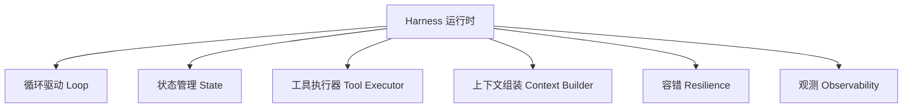
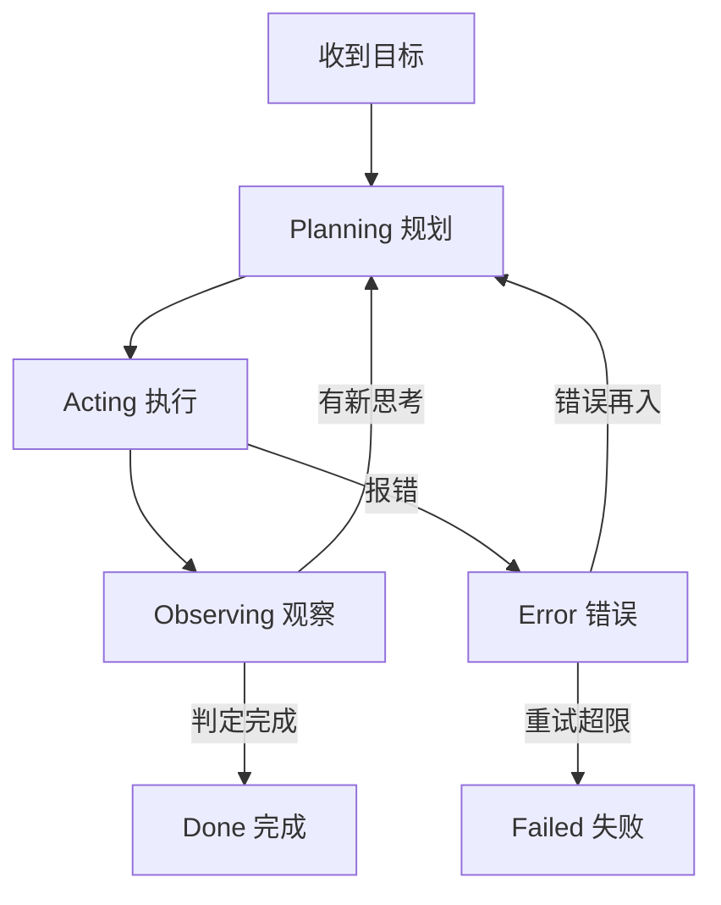

# 11.3 Harness 工程(运行时 / 状态机 / 错误恢复)

## 引言:让模型成为"能持续运转的服务",靠的是运行时

真正的硬功夫在 **Harness(运行时)**——它决定 Agent **能不能跑、会不会崩、崩了能否恢复、跑得贵不贵**。

---

## 一、Harness 到底是什么

**Harness = 把 LLM 从"无状态函数"变成"有状态、可循环、可调用工具、可观测服务"的那层运行时。**



| 模块 | 职责 | 关键问题 |
|------|------|---------|
| 循环驱动 | 下一轮做什么 | 终止、循环检测 |
| 状态管理 | 持久化进度 | 存哪、怎么恢复 |
| 工具执行器 | 真执行动作 | 权限、沙箱、参数校验 |
| 上下文组装 | 每轮喂什么 | 洗词、裁剪、记忆(11.4) |
| 容错 | 超时/重试/降级 | 模型/工具挂了怎么办 |
| 观测 | 日志/指标/追踪 | 怎么知道对不对 |

---

## 二、用"状态机"看 Agent



**为什么用状态机看?** ① 显式建模"正常/错误/重试/终止"不漏边界;② 崩溃后知道卡在哪个状态、可**从状态续跑**;③ 让"不可靠"变得**可管理**。

---

## 三、容错:Agent 工程核心难点

### 1. 超时 | 2. 重试(退避) | 3. 错误再入 | 4. 降级

```python
for attempt in range(3):
    try:
        return await model.chat(ctx)
    except (RateLimitError, ServerError):
        await sleep(backoff(attempt))   # 指数退避,越等越久
# 重试都不行 → 降级:返回部分结果/换备用模型/交还用户
```

> 原则:**只重试"可能成功"的瞬时错误**(网络/限流/5xx);确定性错误(参数错/权限不足)应把错误喂回让模型换做法,而非无脑重试。

---

## 四、状态管理:模型无状态,Harness 要有状态

```python
session = { "id": "sess_123", "goal": "...", "messages": [...], "step": 12 }
```

- **持久化**(数据库/文件,进程重启可恢复)
- **可暂停续跑**(长任务中途能停能续)
- **多会话隔离**

---

## 五、成本与安全

**成本三招**:步数上限(防失控烧钱)、上下文裁剪(防 token 爆炸)、模型分级(简单用便宜小模型,难步骤上大模型)。

**安全边界**:模型不可信,工具不可不设防——最小权限 + 沙箱 + 高风险(删/发/支付)人工确认。

---

## 六、为什么"框架"不是必需品

LangChain/AutoGen 本质是**把六模块做成现成组件**。理解 Harness 后你会看到:一个 `run_agent` 循环 + 状态 + 工具执行,往往就够用。

> **务实结论:先懂原理(本卷),再决定用框架还是自己写。** 框架是"可选加速器",不是"必须依赖"。

---

## 七、小结

```
Harness = 让 LLM 变成"可运行 Agent"的运行时
六模块:循环/状态/工具/上下文/容错/观测
状态机:显式建模 正常·错误·重试·终止,可恢复
容错:超时→重试(退避)→错误再入→降级
额外:成本(步数/裁剪/分级)、安全(最小权限/沙箱/人审)
```

---

## 八、思考题

**Q1:harness 和"模型能力"分别决定 Agent 的什么?**

模型决定**上限**(会不会推理、懂不懂工具);harness 决定**下限与稳定**(能不能跑、崩了是否恢复、贵不贵)。好模型配烂 harness 仍不可上线;好 harness 能把普通模型榨出可用价值。

**Q2:为什么"重试"不能无脑做?**

只对**可恢复的瞬时错误**(网络/限流/5xx)有意义;确定性错误(参数错/权限不足)重试只浪费成本。原则:区分错误类型,瞬时退避重试,确定性喂回换做法或降级。

**Q3:Harness 的六模块分别是什么?**

循环驱动 / 状态管理 / 工具执行器 / 上下文组装 / 容错(超时重试降级)/ 观测。是"把 LLM 变成可运行服务"的六块拼图。

**Q4:用状态机看 Agent 有什么好处?**

① 显式建模"正常/错误/重试/终止"路径不漏边界;② 崩溃后知道卡在哪个状态、可**从状态续跑**;③ 让"不可靠"变得可管理。

**Q5:为什么重试要"退避(backoff)"?**

瞬时错误(网络/限流)重试有意义,但立即连打会让**下游更堵/触发限流**;指数退避(越等越久)给系统恢复时间,是重试标准姿势。

**Q6:Agent 工程"成本控制"三板斧?**

① **步数上限**防无限循环烧钱;② **上下文裁剪**防 token 爆炸;③ **模型分级**——简单步骤用便宜小模型,难步骤再上大模型。

---

📎 参考:[Anthropic](https://www.anthropic.com/)《Building Effective Agents》、LangGraph 文档、各 Agent 框架源码(OpenAgents/langchain)