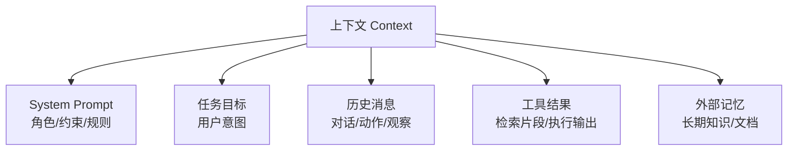

# 11.4 上下文工程(Context / 记忆 / 压缩 / RAG)

> 卷:卷十一 · AI Agent Harness 与提示词工程
> 难度:⭐⭐⭐ 专家 | 阅读时间:30min

---

## 引言:上下文窗口有限,"该放什么"是核心工程问题

LLM 的一切能力都建立在"上下文"之上(11.1),但上下文窗口**有限**。上下文工程(Context Engineering)要回答的就一句话:**在有限的窗口里,放哪些内容、以什么结构、按什么顺序,才能让 Agent 最优地完成目标。**

---

## 一、上下文是"稀缺资源"

OpenAI 在 harness-engineering 博客里反复强调一个前提:

> **"情境是一种稀缺资源。一个巨大的指令文件会挤掉任务、代码和相关文档——智能体要么会错过关键约束,要么开始针对错误的约束优化。"**

窗口是硬约束,放多了挤掉关键信息,放少了能力不够。所以"塞什么"本身就是最高层的设计决策。

**上下文通常由这些拼起来:**



---

## 二、核心原则:地图,而不是说明书

OpenAI 博客里最有名的一条教训:

> **"给 Codex 的是一张地图,而不是一本 1000 页的说明书。"**

他们试过"一个巨大的 AGENTS.md",结果失败,原因有四(极其精辟):

1. **挤占窗口**:大指令挤掉任务与代码 → 模型错过关键约束
2. **过多指导反无效**:当"一切都重要",就"一切都不重要"→ 模型变成**模式匹配**,而非**有意识导航**
3. **立即腐烂**:庞杂手册变成"过时规则的坟场",无人维护后悄悄变成麻烦源
4. **难以核实**:单个大 blob 无法做覆盖/新鲜度/交叉链接的机械检查 → 漂移不可避免

**正确做法:渐进式披露(Progressive Disclosure)**

```
一个小而稳的入口(地图,~100 行)
        ↓ 指向
更深层的真实信息源(docs/ 结构化目录,按需查阅)
```

> 类比:给新同事的不是全公司规章合订本,而是"一张入职地图 + 遇到问题去哪查"。Agent 同理:先给入口,再让它**按需去查**,而不是一次性灌满。

---

## 三、"不在上下文里的东西 = 不存在"

这是理解 Agent 局限性的关键一句(OpenAI 博客原文):

> **"从智能体的角度来看,它在运行时无法在上下文中访问的任何内容,都是不存在的。"**

含义:

- 存在你脑子里、聊天记录里、Google Docs 里的知识,Agent **统统看不见**
- 只有**喂进上下文**的,才是它可用的世界
- 所以 Agent 工程的一大工作,是**把隐性知识显性化、结构化、放进它能访问的地方**(代码仓库、docs、schema、计划文档)

> 这直接解释了为什么"代码仓库要作为记录系统(repo as record system)":把所有该知道的东西,用 Agent 能读、能查、能改的形式**沉淀在仓库里**,Agent 才真正"知道"。

---

## 四、记忆的三种形态(时间/性质分层)

Agent 的"记忆"不是一个东西,而是三层:

| 层 | 存什么 | 实现 | 生命周期 |
|----|--------|------|---------|
| **工作记忆** | 本轮对话、动作、观察 | 直接放上下文 | 一次会话 |
| **短期/会话记忆** | 多轮历史 | 上下文 + 会话存储 | 一个任务 |
| **长期记忆** | 跨会话的知识、偏好、事实 | 向量库 / 文档 / 数据库 | 持久 |

```python
# 长期记忆 = 检索增强(RAG):先把知识入库,用时"按相关度捞进上下文"
relevant = vector_db.search(query, top_k=5)   # 只取最相关的 5 段
context = system + relevant + user_question
```

> 为什么检索而非全塞?因为**窗口有限 + 相关性**。全塞塞不下,塞无关的还稀释注意力。RAG 的精髓就是"**用时按需检索**",是"地图而非说明书"在知识上的延伸。

---

## 五、压缩与裁剪:对抗窗口耗尽

长任务里上下文会越滚越大,必须**主动管理**:

| 手段 | 说明 |
|------|------|
| **摘要压缩** | 把已完成的步骤压缩成简短纪要,替换冗长历史 |
| **滑动窗口** | 只保留最近 N 条,更早的丢弃/摘要 |
| **选择性保留** | 关键结论、决策、报错**保留原文**,废话裁剪 |
| **分级模型** | 便宜的模型先做摘要,省 token |

> 原则:**保留"决策与结论",裁剪"过程噪音"**。一个任务的上下文管理质量,直接决定它能走多远而不崩、不贵。

---

## 六、小结

```
上下文工程 = 在有限窗口里决定"放什么、怎么组织、按什么顺序"

核心原则:
├─ 上下文是稀缺资源(放多了挤掉关键、稀释注意力)
├─ 地图而非说明书:渐进式披露(小入口 → 按需查深层)
├─ 不在上下文 = 不存在 → 知识要显性化、结构化、可检索
├─ 记忆三层:工作/短期/长期(RAG 按需检索)
└─ 压缩裁剪:保留决策结论,裁掉过程噪音
```

---

## 七、思考题

**Q1:为什么"一个巨大的指令文件"对 Agent 是反效果?**

因为它**挤占有限的上下文窗口**(挤掉任务与代码)、**稀释注意力**(什么都重要=什么都不重要,退化成模式匹配)、**容易腐烂**(过时规则堆成坟场)、**难核实**(大 blob 无法机械检查漂移)。所以要用"地图 + 渐进式披露",而非"1000 页说明书"。

**Q2:如何给 Agent 设计"长期记忆"?**

把知识**结构化、可检索地**存起来(向量库/文档/数据库),用时**按相关性检索 top-k 进上下文**(RAG),而不是全塞。配合"仓库作为记录系统":决策、计划、文档都版本化沉淀,Agent 用工具去查,而非靠一次灌满。

---

**Q3:什么是"渐进式披露"?为什么优于"一上来全塞"?**

先给一个小而稳的入口(地图),再让 Agent **按需去查**更深层信息。优于全量灌注:不挤窗口、不稀释注意力、不易腐烂、可逐步核责。

**Q4:"不在上下文的 = 不存在"这句话的含义与工程启示?**

Agent 只能看到喂进上下文的内容,你脑子里/Slack/文档里的它都看不见。启示:**把隐性知识显性化、结构化地沉淀到它可读的地方**(仓库/docs/schema)。

**Q5:记忆三层各是什么?RAG 属于哪层?**

工作记忆(本轮)、短期/会话记忆(一任务)、**长期记忆**(跨会话知识)。RAG 属于长期记忆——知识入库,用时按相关度检索进上下文。

**Q6:上下文"压缩/裁剪"的原则?**

**保留决策与结论,裁掉过程噪音**:已完成的步骤摘要化、滑动窗口只留最近、关键结论/报错保留原文。它决定任务能走多远而不崩、不贵。

---

📎 参考:OpenAI《harness-engineering》博客、Anthropic《Building Effective Agents》、LangChain Memory/RAG 文档