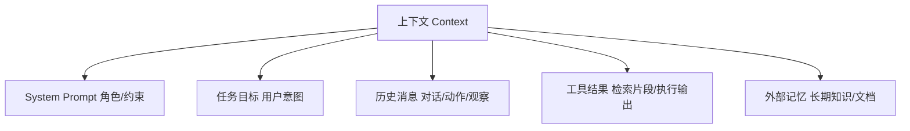

# 11.4 上下文工程(Context / 记忆 / 压缩 / RAG)

> 卷:卷十一 · AI Agent Harness 与提示词工程
> 阅读时间:30min

---

## 引言:上下文窗口有限,"该放什么"是核心工程问题

LLM 一切能力建立在上下文之上,但窗口**有限**。上下文工程回答一句话:**在有限窗口里,放哪些内容、以什么结构、按什么顺序,才能让 Agent 最优达成目标。**

---

## 一、上下文是"稀缺资源"

OpenAI harness-engineering 博客反复强调:

> **"情境是一种稀缺资源。一个巨大的指令文件会挤掉任务、代码和相关文档——智能体要么会错过关键约束,要么开始针对错误的约束优化。"**

窗口是硬约束,放多了挤掉关键信息,放少了能力不够。"塞什么"本身就是最高层设计决策。

**上下文组成:**



---

## 二、核心原则:地图,而不是说明书

> **"给 Codex 的是一张地图,而不是一本 1000 页的说明书。"**

巨大 AGENTS.md 失败的四个原因(精辟):

1. **挤占窗口** → 错过关键约束
2. **过多指导反无效** → "一切都重要=一切都不重要"→ 模式匹配而非导航
3. **立即腐烂** → 过时规则的坟场
4. **难以核实** → 大 blob 无法机械检查 → 漂移

**正确做法:渐进式披露(Progressive Disclosure)**

```
一个小而稳的入口(地图,~100 行)
        ↓ 指向
更深层信息源(docs/ 结构化目录,按需查)
```

---

## 三、"不在上下文里的东西 = 不存在"

> **"从智能体角度来看,它在运行时无法在上下文中访问的任何内容,都是不存在的。"**

- 你脑子里、聊天记录、Google Docs 里的知识,Agent **统统看不见**
- 只有**喂进上下文**的,才是它可用的世界
- 所以要把隐性知识**显性化、结构化、放进它能访问的地方**(仓库/docs/schema)——"仓库作为记录系统"

---

## 四、记忆三形态

| 层 | 存什么 | 实现 |
|----|--------|------|
| 工作记忆 | 本轮对话/动作/观察 | 直接放上下文 |
| 短期/会话 | 多轮历史 | 上下文 + 会话存储 |
| **长期记忆** | 跨会话知识/偏好 | 向量库/文档(RAG,检索增强生成) |

```python
relevant = vector_db.search(query, top_k=5)   # RAG:用时按相关度捞进上下文
context = system + relevant + user_question
```

> 为什么检索而非全塞?窗口有限 + 相关性。RAG 精髓 = "**用时按需检索**",是"地图而非说明书"在知识上的延伸。

---

## 五、压缩与裁剪

| 手段 | 说明 |
|------|------|
| 摘要压缩 | 完成步骤压缩成纪要 |
| 滑动窗口 | 只留最近 N 条 |
| 选择性保留 | 关键结论/决策/报错留原文 |
| 分级模型 | 便宜模型先摘要 |

> 原则:**保留"决策与结论",裁剪"过程噪音"**。

---

## 六、小结

```
上下文工程 = 有限窗口里决定"放什么、怎么组织、顺序"
原则:上下文稀缺 / 地图而非说明书(渐进式披露)/ 不在上下文=不存在 / 记忆三层 / 压缩裁剪
```

---

## 七、思考题

**Q1:为什么"一个巨大的指令文件"对 Agent 是反效果?**

它**挤占有限窗口**(挤掉任务与代码)、**稀释注意力**(什么都重要=什么都不重要)、**容易腐烂**(过时规则堆成坟场)、**难核实**(大 blob 无法机械检查漂移)。要用"地图 + 渐进式披露"。

**Q2:如何给 Agent 设计"长期记忆"?**

把知识**结构化、可检索地**存起来(向量库/文档/数据库),用时**按相关性检索 top-k 进上下文**(RAG),而非全塞。配合"仓库作为记录系统":决策/计划/文档版本化沉淀,Agent 用工具查。

**Q3:什么是"渐进式披露"?为什么优于"一上来全塞"?**

先给一个小而稳的入口(地图),再让 Agent **按需去查**更深层信息。优于全量灌注:不挤窗口、不稀释注意力、不易腐烂、可逐步核责。

**Q4:"不在上下文的 = 不存在"这句话的含义与工程启示?**

Agent 只能看到喂进上下文的内容,你脑子里/Slack/文档里的它都看不见。启示:**把隐性知识显性化、结构化地沉淀到它可读的地方**(仓库/docs/schema)。

**Q5:记忆三层各是什么?RAG 属于哪层?**

工作记忆(本轮)、短期/会话记忆(一任务)、**长期记忆**(跨会话知识)。RAG 属于长期记忆——知识入库,用时按相关度检索进上下文。

**Q6:上下文"压缩/裁剪"的原则?**

**保留决策与结论,裁掉过程噪音**:已完成的步骤摘要化、滑动窗口只留最近、关键结论/报错保留原文。它决定任务能走多远而不崩、不贵。

---

📎 参考:OpenAI《harness-engineering》博客、Anthropic《Building Effective Agents》、LangChain Memory/RAG 文档