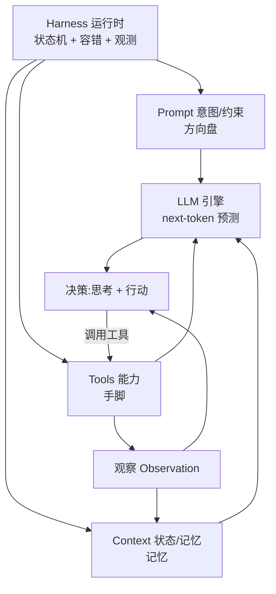

# 11.8 底层逻辑打通:统一框架

> 卷:卷十一 · AI Agent Harness 与提示词工程
> 难度:⭐⭐⭐ 专家(收束) | 阅读时间:30min

---

## 引言:七章之后,把它们焊成"一个模型"

前面七章分别讲了引擎、循环、运行时、上下文、工具、提示词。这一章把它们**收束成一个统一框架**,让你离开时脑子里只有一张图、一句话。

---

## 一、一张总图:Agent 的四要素 + 一个循环



**四个要素,对应一个朴素的比喻(11.1 埋下的伏笔):**

| 要素 | 比喻 | 负责什么 | 对应章节 |
|------|------|---------|---------|
| **LLM** | 发动机 | 只提供"预测下一个 token"的算力与智能 | 11.1 |
| **Prompt** | 方向盘 | 意图、约束、格式(往哪走、怎么走) | 11.6 / 11.7 |
| **Tools** | 手脚 | 碰触外部世界的能力 | 11.5 |
| **Context** | 记忆 | 状态、历史、检索来的知识 | 11.4 |
| **Harness** | 车身 + 车手 | 把这四者串成**可循环、可容错、可观测**的系统 | 11.2 / 11.3 |

---

## 二、一句话总结整个领域

> **Agent = 一个"有记忆、有手脚、有方向"的 next-token 预测器,被一个容错的循环(Harness)驱动着反复"思考→行动→观察",直到达成目标。**

拆开就是三个判断:

1. **本质**:LLM 只会预测下一个 token(11.1)——所有"智能"都是它的涌现
2. **放大**:给它工具(能做)、上下文(能记)、提示词(能引导),能力才被放大(11.4~11.7)
3. **收敛**:用 Harness 的循环 + 容错把它变成**可靠**的系统(11.2 / 11.3)

---

## 三、OpenAI 的视角:"人类掌舵,智能体执行"

OpenAI 那篇 harness-engineering 博客,给了这个领域一个更高维的定调:

> **"人类掌舵,智能体执行。"(Humans steer, agents execute.)**

它的完整推演链:

```
工程的主要工作,从"写代码" → 变成"设计环境、明确意图、构建反馈回路"
                                          (让 Agent 能可靠地工作)
```

**三个关键词正好映射本卷三块:**

| 博客关键词 | 本卷对应 | 含义 |
|-----------|---------|------|
| **设计环境** | 11.3 Harness + 11.4 上下文 | 给 Agent 一个"能读、能查、能改"的结构化世界(仓库即记录系统) |
| **明确意图** | 11.6/11.7 提示词 | 把目标、约束、验收标准讲清楚(地图而非说明书) |
| **构建反馈回路** | 11.2 循环 + 11.5 工具 | 让 Agent 能观察结果、自我纠错、循环推进 |

**它最硬的一句(收束点):**

> **"构建软件仍然需要纪律,但纪律更多地体现在支撑结构上,而不是代码上。保持代码库一致性的工具、抽象和反馈回路变得越发重要。"**

这句话反过来读就是本卷的全部:**Agent 工程的竞争力,不在模型,而在你为它搭建的"支撑结构"——Harness、上下文、工具、提示词。**

---

## 四、从"会用"到"会设计"的三个层次

| 层次 | 你在做什么 | 对应能力 |
|------|-----------|---------|
| L1 会调 | 写好 prompt,拿到好答案 | 11.6/11.7 |
| L2 会搭 | 给模型接工具、跑循环 | 11.2/11.5 |
| L3 会设计 | 设计环境、约束、反馈回路,让**一群** Agent 可靠协作 | 11.3/11.4 + 11.8 |

> 大多数人停在 L1(调 prompt);真正拉开差距的是 **L2 的循环 + L3 的环境设计**——这也是"harness engineering"这个词真正的分量所在。

---

## 五、落地清单:判断一个 Agent 系统靠不靠谱

用本卷的框架,快速评估任何 Agent 系统:

1. **循环有没有兜底?** 步数上限?终止条件?死循环检测?(11.2)
2. **容错是否分层?** 超时 → 退避重试 → 错误再入 → 降级?(11.3)
3. **上下文是否克制?** 地图还是说明书?渐进式披露?记忆分层?(11.4)
4. **工具是否设防?** 最小权限?沙箱?高风险人工确认?防注入?(11.5)
5. **输出是否可解析?** 锁格式?低温?结构化输出?(11.6)
6. **事实是否靠工具锚定?** 还是让模型"记"?(11.1/11.5)
7. **人是否在关键环上?** 人类掌舵、审关键决策?(11.8)

---

## 六、小结

```
统一框架:LLM(引擎)+ Prompt(方向盘)+ Tools(手脚)+ Context(记忆)
          └─ 由 Harness(车身/车手)串成"思考→行动→观察"的容错循环

一句话:Agent = 有记忆、有手脚、有方向的 next-token 预测器,被容错循环驱动直到达成目标

OpenAI 定调:人类掌舵,智能体执行
             → 工程重心 = 设计环境 + 明确意图 + 构建反馈回路
             → 纪律在"支撑结构",不在"代码"
层次:会调(prompt)< 会搭(循环/工具)< 会设计(环境/约束/反馈回路)
```

---

## 七、终章思考题

**Q1:用一段话向一个"只会用 ChatGPT 聊天"的人解释什么是 Agent。**

模型本身只会"接话"(预测下一个词)。Agent 是给这个模型装了**手脚(工具)、记忆(上下文)、方向盘(提示词)**,再套上一个**循环(反复"思考→行动→观察")**,让它从"只会聊天"变成"能查、能写、能执行、能自我纠错"的任务机器。

**Q2:为什么说"Agent 的竞争力在支撑结构,而非模型"?**

因为模型的**能力是外部的、大家都一样**(都能调同一个模型);真正决定一个 Agent 系统好不好用的是你**为它搭建的环境**:上下文怎么组织、工具怎么设防、循环怎么容错、反馈回路怎么建。模型决定上限,支撑结构决定**你能不能稳定地接近那个上限**——这正是 harness engineering 的意义。

**Q3:本卷的"一张图、一句话"分别是什么?**

**一张图**:LLM 引擎 + Prompt 方向盘 + Tools 手脚 + Context 记忆,被 Harness 的循环(思考→行动→观察)驱动。**一句话**:Agent 是一个有记忆、有手脚、有方向的 next-token 预测器,被容错循环驱动直到达成目标。

---

**Q4:四要素(prompt/context/tool/loop)各对应什么比喻?**

LLM=发动机、Prompt=方向盘、Tools=手脚、Context=记忆、Harness(循环)=车身+车手。前四者被 Harness 串成"思考→行动→观察"的循环。

**Q5:判断一个 Agent 系统靠不靠谱的 checklist(举几条)?**

① 循环有无兜底(步数上限/终止/死循环检测);② 容错是否分层(超时→退避→再入→降级);③ 上下文是否克制(地图而非说明书);④ 工具是否设防(最小权限/沙箱/人审);⑤ 事实是否靠工具锚定;⑥ 人是否在关键环上。

**Q6:"会调 / 会搭 / 会设计"三层分别是什么?**

L1 会调:写好 prompt 拿好答案;L2 会搭:给模型接工具、跑循环;L3 会设计:设计环境、约束、反馈回路,让一群 Agent 可靠协作。多数人停 L1,拉差距在 L2/L3。

---

📎 参考:OpenAI《harness-engineering》博客、Anthropic《Building Effective Agents》、本卷 11.1~11.7