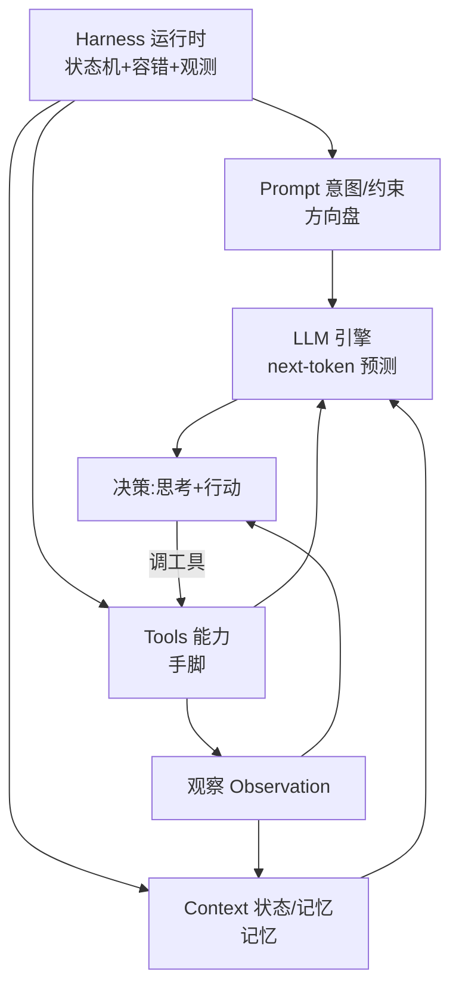

# 11.8 底层逻辑打通:统一框架

> 卷:卷十一 · AI Agent Harness 与提示词工程
> 阅读时间:30min

---

## 引言:七章之后,把它们焊成"一个模型"

前面七章讲了引擎、循环、运行时、上下文、工具、提示词。这一章把它们**收束成一个统一框架**,离开时脑子里只有一张图和一个概括。

---

## 一、一张总图:四要素 + 一个循环



| 要素 | 比喻 | 负责 | 章节 |
|------|------|------|------|
| LLM | 发动机 | next-token 算力与智能 | 11.1 |
| Prompt | 方向盘 | 意图/约束/格式 | 11.6/11.7 |
| Tools | 手脚 | 碰外部世界 | 11.5 |
| Context | 记忆 | 状态/历史/知识 | 11.4 |
| Harness | 车身+车手 | 串成容错循环 | 11.2/11.3 |

---

## 二、总结

> **Agent = 一个"有记忆、有手脚、有方向"的 next-token 预测器,被一个容错的循环(Harness)驱动着反复"思考→行动→观察",直到达成目标。**

三个判断:① 本质(只会预测 next token);② 放大(工具/上下文/提示词);③ 收敛(Harness 循环+容错变成可靠系统)。

---

## 三、OpenAI 的视角:"人类掌舵,智能体执行"

> **"人类掌舵,智能体执行。"(Humans steer, agents execute.)**

```
工程主要工作,从"写代码"→ 变成"设计环境、明确意图、构建反馈回路"
```

| 博客关键词 | 本卷对应 |
|-----------|---------|
| 设计环境 | 11.3 Harness + 11.4 上下文 |
| 明确意图 | 11.6/11.7 提示词 |
| 构建反馈回路 | 11.2 循环 + 11.5 工具 |

**最硬的一句(收束点):**

> **"构建软件仍然需要纪律,但纪律更多地体现在支撑结构上,而不是代码上。"**

反过来读 = 本卷全部:**Agent 工程的竞争力,不在模型,而在你为它搭建的"支撑结构"(Harness、上下文、工具、提示词)。**

---

## 四、从"会用"到"会设计"三层

| 层次 | 你在做什么 | 对应 |
|------|-----------|------|
| L1 会调 | 写好 prompt 拿好答案 | 11.6/11.7 |
| L2 会搭 | 接工具、跑循环 | 11.2/11.5 |
| L3 会设计 | 设计环境/约束/反馈回路,让一群 Agent 可靠协作 | 11.3/11.4/11.8 |

---

## 五、落地清单:判断 Agent 系统靠不靠谱

1. 循环有无兜底?2. 容错是否分层?3. 上下文是否克制?4. 工具是否设防?5. 输出是否可解析?6. 事实是否靠工具锚定?7. 人是否在关键环上?

---

---

**AI 原生前端(AI 生成 UI/代码,2026):**

AI 从"补全"进化为"**直接生成 UI/代码**":

- **v0**:自然语言描述 → 直接生成 React 组件(UI 原型)
- **Cursor**:AI 原生 IDE,Composer 跨文件修改
- **CodeBuddy**:Figma 设计稿 → 代码
- **Copilot / Claude Code / Codex**:代码补全、重构、多文件编辑

**趋势**:从"AI 辅助写码"→"**AI 原生开发**"(设计稿 → Design Tokens → 组件 → 页面全链路);前端因组件化/可视化,对 AI 接受度最高(84% 开发者常态用 AI)。

> AI 原生前端不是"替代人写码",而是"**把设计意图直接编译成可运行 UI**",人的角色转向"定义意图 + 校验结果"——这正是本卷"人类掌舵、智能体执行"在 UI 层的落地。

## 六、小结

```
统一框架:LLM(引擎)+Prompt(方向盘)+Tools(手脚)+Context(记忆),由 Harness 串成容错循环
Agent=有记忆、有手脚、有方向的 next-token 预测器,被容错循环驱动直到达成目标
OpenAI 定调:人类掌舵,智能体执行 → 纪律在支撑结构,不在代码
层次:会调(prompt)< 会搭(循环/工具)< 会设计(环境/约束/反馈回路)
```

---

## 七、终章思考题

**Q1:用一段话向"只会用 ChatGPT 聊天"的人解释什么是 Agent?**

模型本身只会"接话"(预测下一个词)。Agent 是给它装**手脚(工具)、记忆(上下文)、方向盘(提示词)**,再套一个**循环(反复思考→行动→观察)**,让它从"只会聊天"变成"能查、能写、能执行、能自我纠错"的任务机器。

**Q2:为什么说"Agent 的竞争力在支撑结构,而非模型"?**

模型能力是**外部的、大家都一样**;真正决定系统好不好用的是你**为它搭建的环境**:上下文怎么组织、工具怎么设防、循环怎么容错、反馈回路怎么建。模型决定上限,支撑结构决定**能否稳定接近上限**——这正是 harness engineering 的意义。

**Q3:本卷的"一张图和一个概括"分别是什么?**

**一张图**:LLM 引擎 + Prompt 方向盘 + Tools 手脚 + Context 记忆,被 Harness 的循环(思考→行动→观察)驱动。**概括**:Agent 是有记忆、有手脚、有方向的 next-token 预测器,被容错循环驱动直到达成目标。

**Q4:四要素(prompt/context/tool/loop)各对应什么比喻?**

LLM=发动机、Prompt=方向盘、Tools=手脚、Context=记忆、Harness(循环)=车身+车手。前四者被 Harness 串成"思考→行动→观察"的循环。

**Q5:判断 Agent 系统靠不靠谱的 checklist(举几条)?**

① 循环有无兜底(步数上限/终止/死循环检测);② 容错是否分层(超时→退避→再入→降级);③ 上下文是否克制(地图而非说明书);④ 工具是否设防(最小权限/沙箱/人审);⑤ 事实是否靠工具锚定;⑥ 人是否在关键环上。

**Q6:"会调 / 会搭 / 会设计"三层分别是什么?**

L1 会调:写好 prompt 拿好答案;L2 会搭:给模型接工具、跑循环;L3 会设计:设计环境、约束、反馈回路,让一群 Agent 可靠协作。多数人停 L1,拉差距在 L2/L3。

---

📎 参考:OpenAI《harness-engineering》博客、[Anthropic](https://www.anthropic.com/)《Building Effective Agents》、本卷 11.1~11.7