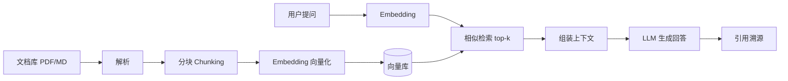

# 11.9 实战:从零搭一个 RAG 知识库问答 Agent

## 引言:把 11.4 的 RAG 落地成能跑的系统

前几章讲了原理,这一章把它落成一个**能实际运行的 RAG 知识库问答 Agent**——这是企业 AI 落地的最佳切入点,也和"个人知识库"天然契合:把一堆文档变成"能问答、带引用溯源"的系统。

---

## 一、整体架构



**关键认知:RAG 解决的是"模型不知道你的私有数据"——用检索把相关内容塞进上下文,让 LLM 基于它回答(呼应 11.1"事实靠检索锚定")。**

---

## 二、逐步实现(核心代码)

### 1. 文档解析 + 分块(Chunking)

```python
# 解析与分块:90% 的人栽在"分块不当"
def chunk_text(text, chunk_size=500, overlap=50):
    chunks = []
    for i in range(0, len(text), chunk_size - overlap):
        chunks.append(text[i:i + chunk_size])
    return chunks
```

> **分块是关键**:块太大 → 检索不准、噪声多;块太小 → 上下文断裂。常用 300~800 字 + 10% 重叠。

### 2. 向量化 + 入库

```python
# Embedding:把文本变成向量(选 bge/text-embedding 等)
def embed(texts):
    return embedding_model.encode(texts)   # 每段 → 一个稠密向量

# 存入向量库(milvus/qdrant/chroma/pgvector 任选)
vector_db.add(ids=ids, vectors=embeddings, metadata=chunks)
```

### 3. 检索 + 生成(带溯源)

```python
def answer(question, top_k=5):
    q_vec = embed([question])[0]
    hits = vector_db.search(q_vec, top_k=top_k)          # 相似检索

    context = "\n\n".join([h.text for h in hits])
    prompt = f"""基于以下资料回答问题,无法回答就说不知道:
资料:
{context}

问题:{question}
回答(并标注引用的资料编号):"""
    return llm.chat(prompt), hits                            # 返回回答 + 引用来源
```

---

## 三、四个关键决策点(踩坑)

| 决策 | 建议 | 坑 |
|------|------|----|
| **向量库选型** | 小项目 chroma/pgvector;规模大 milvus/qdrant | 别为 Demo 上重组件 |
| **分块策略** | 按语义/标题分,别按固定字数硬切 | 硬切会把一段话腰斩 |
| **Embedding** | 用与你语言匹配的模型(中文选 bge/多语种) | 用英文模型跑中文,检索全乱 |
| **检索质量** | top-k 3~8 + 相似度阈值过滤 | 无阈值会把无关内容塞进上下文 |

---

## 四、为什么"引用溯源"是必须的

> 没有溯源,用户无法验证答案真假(11.1 的幻觉问题)。生产级 RAG 一定要**返回"答案引用了哪些资料"**,甚至高亮原文——这是从"能答"到"可信"的分水岭。

---

## 五、小结

```
RAG 落地:文档 → 解析分块 → Embedding → 向量库 → 检索 → 组装上下文 → LLM 生成 → 溯源
关键决策:向量库选型 / 分块策略 / Embedding 语言匹配 / top-k + 阈值
铁律:必须引用溯源;分块别硬切;上下文只塞"检索到的相关内容"
```

---

## 六、面试/实践要点

**Q1:RAG 相比"把全部文档塞进长上下文"好在哪?**

长上下文虽大但① **成本高**(全量 token);② **噪声多**(无关内容稀释注意力);③ **超窗口**。RAG 按相关性只取 top-k,精准、便宜、可控(呼应 11.4"地图而非说明书")。

**Q2:为什么"分块"会影响最终回答质量?**

分块决定"检索的粒度":块太大会把相关和不相关内容混在一起,降低检索精度;块太小会切断语义,导致检索到"半句话"。好的分块 = 按语义边界(标题/段落)+ 适度重叠。

**Q3:怎么判断检索是否"检索对了"?**

用**检索评测**:准备一批"问题 → 标准答案 → 应命中的文档",看 top-k 里是否包含"标准文档"(Recall@k / MRR)。检索错,后面生成再强也白搭。

---

📎 参考:LlamaIndex/LangChain RAG 文档、Milvus/Qdrant 官方文档、掘金《Agent 开发实战:从 0 到 1 搭一个生产级 RAG Agent》