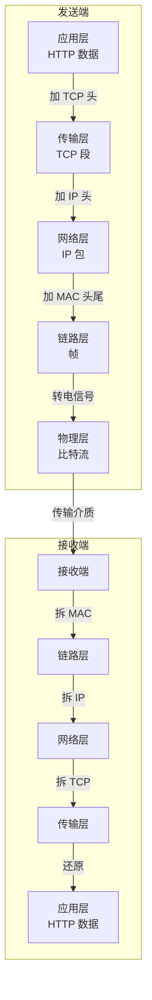

# 4.1 网络分层模型

> 卷:卷四 · 网络与通信
> 难度:⭐ 基础 | 阅读时间:15min | 状态:进行中

---

## 引言:一次请求,数据要"过五关"

你要理解 HTTP、IP、DNS 这些概念,最快的方式是先搭好"网络分层"这个框架。分层模型回答一个核心问题:**数据从 A 出发,经过哪些层、每层干了什么,最后到达 B。**

---

## 一、两套模型:OSI 七层 vs TCP/IP 四层

| OSI 七层 | TCP/IP 四层 | 职责 | 典型协议 |
|---------|-------------|------|---------|
| 应用层 / 表示层 / 会话层 | **应用层** | 面向用户的应用协议 | HTTP、DNS、FTP |
| 传输层 | **传输层** | 端到端可靠传输、端口 | TCP、UDP |
| 网络层 | **网络层** | 寻址、路由(找路径) | IP、ICMP |
| 数据链路层 / 物理层 | **网络接口层** | 相邻节点传输、物理信号 | 以太网、WiFi、MAC |

> **前端的关注点几乎全在「应用层」**(HTTP)。但理解下面几层,才能解释"为什么断网了看得到页面、为什么 IP 会变"这类问题。

---

## 二、核心思想:封装与解封装

发送时**逐层加"头"**,接收时**逐层拆"头"**——每层只关心自己这一层的协议,不管别的层。



**一个具体例子:给大洋彼岸发"你好"**

```
应用层:用 HTTP 把"你好"组织成报文
传输层:拆成段,加源/目标端口,做校验和流量控制
网络层:加源 IP 和目标 IP(负责"找到对方")
链路层:加源/目标 MAC(负责"下一跳给谁")
物理层:转成 0/1 电信号/光信号发出去
→ 对端反向逐层解封装,还原出"你好"
```

---

## 三、各层一句话记忆

| 层 | 关键词 | 打个比方 |
|----|--------|---------|
| 应用层 | **说什么** | 信的内容与格式 |
| 传输层 | **怎么可靠送达**(端口) | 快递公司(保不保价?编号?) |
| 网络层 | **送到哪**(IP) | 收件人地址 |
| 链路层 | **下一跳给谁**(MAC) | 每个中转点的交接 |

> 经典比喻:IP 是"邮编地址"(定位到城市),MAC 是"门牌号"(相邻设备),端口是"收件的具体人"(哪个程序)。

---

## 四、为什么分层(值得想明白)

1. **解耦**:每层独立演进(应用层可以换 HTTP/2,不碰底层 TCP)
2. **标准化**:不同厂商只要遵守层间接口就能互通
3. **可替换**:底层从网线换 WiFi,上层的 HTTP 无感知

> 这正是"**分层**"这个思想的价值——它不止在网络上,前端组件化、OSI 都是同一个道理:把复杂问题切成职责单一的层。

---

## 五、小结

```
网络分层(核心:封装 / 解封装)
TCP/IP 四层:应用层(HTTP)→ 传输层(TCP/UDP,端口)→ 网络层(IP,寻址)→ 链路/物理层(MAC/信号)

前端关注:应用层(HTTP);但换 IP/断网等现象要去下面几层找原因
```

---

## 六、面试题

**Q1:TCP 和 UDP 的区别?**

| | TCP | UDP |
|---|-----|-----|
| 连接 | 面向连接(三次握手) | 无连接 |
| 可靠性 | 可靠(重传、顺序) | 不可靠(可能丢/乱) |
| 速度 | 慢 | 快 |
| 场景 | HTTP、文件、邮件 | 视频通话、直播、游戏、DNS |

**Q2:浏览器断网后,为什么有时候还能"打开"页面?**

因为命中**浏览器 HTTP 缓存**(应用层就已经返回了缓存数据),根本没走到下面的传输层/网络层。只有缓存未命中、需要真网络请求时,才会因无网络而失败——这正好说明"分层:上层能兜底的,就不麻烦下层"。

---

📎 参考:MDN《网络如何工作》、RFC 1122、RFC 1123