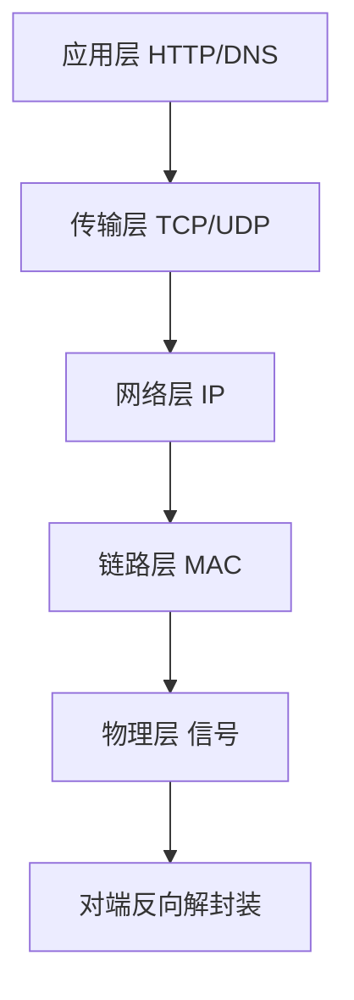
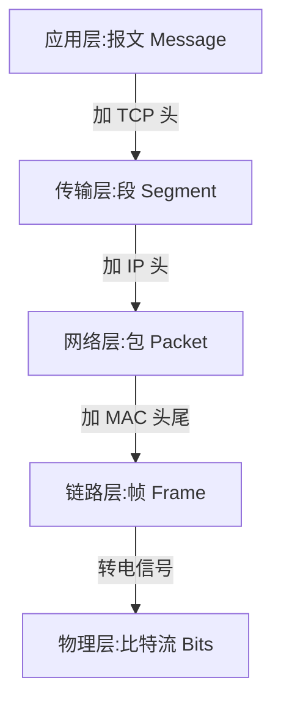
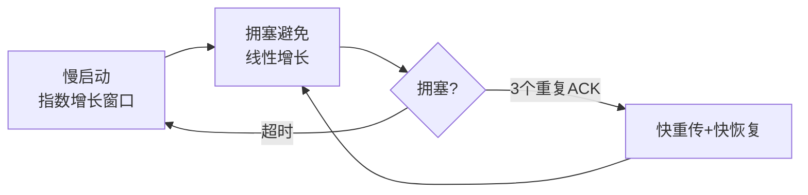

# 4.1 网络分层模型

## 引言:一次请求,数据要"过五关"

分层模型回答一个核心问题:**数据从 A 出发,经过哪些层、每层干了什么,最后到 B**。深挖要懂"封装/解封装"的 PDU 变化、DNS 解析、以及 TCP 的握手与可靠性机制。

---

## 一、两套模型:OSI 七层 vs TCP/IP 四层



| OSI 七层 | TCP/IP 四层 | 职责 | 协议 |
|---------|-------------|------|------|
| 应用/表示/会话 | 应用层 | 面向用户 | HTTP、DNS、FTP |
| 传输层 | 传输层 | 端到端、端口 | TCP、UDP |
| 网络层 | 网络层 | 寻址、路由 | IP、ICMP |
| 数据链路/物理 | 网络接口层 | 相邻传输、物理 | 以太网、MAC |

> OSI 是**教学参考模型**(七层,更细),TCP/IP 是**实际工程模型**(四层,互联网实际运行)。前者理论完备,后者务实精简。

---

## 二、封装/解封装:每层的"数据单元(PDU)"



> **PDU 记忆**:报文(Message)→ 段(Segment)→ 包(Packet)→ 帧(Frame)→ 比特(Bits)。每层只关心自己的头,不管别层内容——这就是"封装"。

**一个具体例子(发"你好")**:应用层 HTTP 组织报文 → 传输层加端口/校验 → 网络层加 IP → 链路层加 MAC → 物理层转信号 → 对端逐层解封装还原。

---

## 三、各层关键概念

| 层 | 关键词 | 比方 |
|----|--------|------|
| 应用层 | 说什么 | 信的内容 |
| 传输层 | 怎么可靠送达(端口) | 快递公司 |
| 网络层 | 送到哪(IP) | 收件地址 |
| 链路层 | 下一跳给谁(MAC) | 中转交接 |

> IP 是"地址"(定位主机),MAC 是"门牌"(相邻设备),端口是"收件的具体程序"。

---

## 四、为什么分层(底层价值)

1. **解耦**:每层独立演进(HTTP/2 换不动 TCP)
2. **标准化**:层间接口统一,互通
3. **可替换**:网线换 WiFi,上层无感

---

## 五、DNS 解析流程(域名 → IP)

浏览器先查**本地缓存**(浏览器缓存 → 系统 hosts → 路由器 → ISP),都没有则向 DNS 服务器**递归 + 迭代**查询:

```
1. 根域名服务器 → 返回 .com 顶级域名服务器地址
2. .com 服务器 → 返回 example.com 权威服务器地址
3. 权威服务器 → 返回真实 IP
```

> 本地缓存逐层 → 根 → 顶级 → 权威。DNS 慢会拖慢首屏(可用 `preconnect`/`dns-prefetch` 提前解析,见 [10.2](/卷十-性能优化与工程质量/10.2-加载性能))。

---

## 六、TCP:三次握手与四次挥手

### 6.1 三次握手(建立连接)

```
客户端 → SYN(seq=x)        → 服务器
客户端 ← SYN+ACK(seq=y, ack=x+1) ← 服务器
客户端 → ACK(ack=y+1)      → 服务器
```

**为什么是三次不是两次?** 两次握手下,**失效的旧连接请求**(网络延迟迟到)会让服务器**白白建立连接、浪费资源**;第三次 ACK 让双方都确认"**能收能发**":客户端确认自己能发能收,服务器确认自己能发能收。

> **SYN 洪泛攻击**:攻击者只发 SYN 不回复 ACK,服务器为半连接分配资源、队列被打满 → 无法服务正常请求。缓解:SYN Cookie(不占资源直到完成握手)。

### 6.2 四次挥手(断开连接)

```
客户端 → FIN          → 服务器   (客户端:我不发了)
客户端 ← ACK          ← 服务器   (服务器:知道)
客户端 ← FIN          ← 服务器   (服务器:我也不发了)
客户端 → ACK          → 服务器   (客户端:好)
```

**为什么四次不是三次?** TCP 是**全双工**,两个方向的连接要**分别关闭**:客户端 FIN 只表示"我发完了",服务器可能还有数据要发,所以先 ACK、等发完再 FIN。方向独立 → 需要四个步骤。

**TIME_WAIT(主动关闭方):** 主动断开的一方最后要等 **2MSL**(最长报文寿命 ×2),目的是:① 确保最后的 ACK 被对方收到(若丢失可重发);② 让旧连接的迟到报文在网络上"自然消亡",不会污染新连接。

### 6.3 TCP 的可靠性机制

TCP 的核心承诺:**可靠、有序、不丢不重**。靠这四样:

| 机制 | 作用 |
|------|------|
| **序号 + 确认(ACK)** | 每个字节编序号,收到回 ACK,知道谁到了谁没到 |
| **超时重传** | 超时未收到 ACK → 重发 |
| **快速重传** | 收到 3 个重复 ACK → 立即重传(不等超时) |
| **流量控制(滑动窗口)** | 接收方通告窗口大小,发送方别发太快撑爆对方 |
| **拥塞控制** | 感知网络拥塞(慢启动 → 拥塞避免 → 快重传/快恢复),调节发送速率 |



> **流量控制 vs 拥塞控制**:流量控制管"**接收方**受不受得了"(滑动窗口),拥塞控制管"**网络**受不受得了"(慢启动等)。一个对端、一个全局。

---

## 七、TCP vs UDP

| | TCP | UDP |
|---|-----|-----|
| 连接 | 面向连接(三次握手) | 无连接 |
| 可靠性 | 可靠(序号/重传/顺序) | 不可靠 |
| 速度 | 慢(有握手和校验) | 快 |
| 场景 | HTTP、文件、邮件 | 视频通话、直播、DNS、游戏 |

> 取舍:**TCP 用延迟/开销换可靠**,适合"必须完整正确";**UDP 用可靠换快**,适合"丢一点无所谓但要实时"。

---

## 八、小结

```
分层:应用(HTTP/DNS)→ 传输(TCP/UDP,端口)→ 网络(IP,寻址)→ 链路/物理(MAC/信号)
封装/解封装:报文→段→包→帧→比特;每层只认自己的头
DNS:本地缓存 → 根 → 顶级 → 权威(递归+迭代)
TCP:三次握手(防失效连接+双向确认)、四次挥手(全双工分开关)、TIME_WAIT(2MSL)
可靠性:序号ACK + 重传 + 滑动窗口(流量控制)+ 拥塞控制
```

---

## 九、面试题

**Q1:TCP 和 UDP 的区别?**

TCP 面向连接(三次握手)、可靠(序号/重传/顺序)、慢;UDP 无连接、不可靠、快。TCP 用于 HTTP/文件,需"完整正确";UDP 用于直播/DNS/游戏,需"实时"。

**Q2:什么是"封装"和"解封装"?**

封装:发送端**每层加自己的头**(应用→传输加 TCP 头→网络加 IP 头→链路加 MAC 头尾→物理转信号);解封装:接收端**逐层拆头还原**。各层只处理自己这层的协议。

**Q3:IP 地址和 MAC 地址的区别?**

IP 是**网络层**逻辑地址(定位主机、可变化);MAC 是**链路层**物理地址(硬件唯一、局域网内相邻传输用)。类比:IP 是"收件地址",MAC 是"门牌号",端口是"收件人"。

**Q4:为什么说前端主要关注"应用层",但又要懂下面几层?**

前端直接打交道的是应用层(HTTP)。但"断网仍能开页"(缓存)、"换 IP 后连接变化"、TLS 握手、DNS 慢等性能/排查问题,都要到传输/网络层找原因。分层让"上层能力、下层兜底"。

**Q5:浏览器断网后为什么有时还能"打开"页面?**

因为命中**浏览器 HTTP 缓存**(应用层就返回了缓存),根本没走到传输/网络层。只有缓存未命中、需真网络请求时才因断网失败——"上层能兜底就不麻烦下层"。

**Q6:OSI 七层和 TCP/IP 四层的对应关系?**

OSI:应用/表示/会话 → TCP/IP 应用层;传输层 → 传输层;网络层 → 网络层;数据链路层/物理层 → 网络接口层。TCP/IP 是实际工程模型,OSI 是教学参考。

**Q7:为什么 TCP 握手要三次,挥手要四次?**

握手三次是为了**防失效连接请求** + 让双方确认"能收能发";挥手四次是因为 TCP **全双工**,两个方向要**分别关闭**(客户端 FIN 后服务器可能还有数据要发,先 ACK 再 FIN),所以比握手多一步。

**Q8:TIME_WAIT 状态是什么?为什么主动关闭方要等 2MSL?**

主动断开方最后等 **2MSL**(最长报文寿命×2):① 确保最后的 ACK 被对方收到(丢失可重发);② 让旧连接迟到的报文在网络上**自然消亡**,不污染新连接。

**Q9:TCP 的流量控制和拥塞控制有什么区别?**

**流量控制**:管"接收方受不受得了",靠滑动窗口(接收方通告窗口大小);**拥塞控制**:管"网络受不受得了",靠慢启动/拥塞避免/快重传/快恢复调节发送速率。一个对端、一个全局。

**Q10:浏览器输入 URL 到看到页面,发生了哪些网络层的步骤?**

DNS 解析(域名→IP)→ TCP 三次握手(或复用连接)→ TLS 握手(HTTPS)→ HTTP 请求/响应→ 渲染。DNS 慢、握手慢、网络往返(RTT)多都会拖慢首屏,所以有 preconnect/dns-prefetch/HTTP2 复用等优化。

---

📎 参考:[MDN《网络如何工作》](https://developer.mozilla.org/zh-CN/docs/Learn_web_development/Howto/Web_mechanics/How_does_the_Internet_work)、[MDN《DNS》](https://developer.mozilla.org/zh-CN/docs/Glossary/DNS)、[MDN《TCP 握手》](https://developer.mozilla.org/zh-CN/docs/Glossary/TCP_handshake)、RFC 1122、RFC 1123